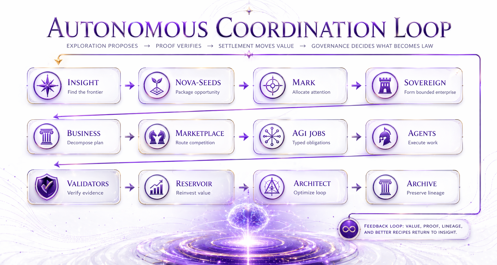

# α‑AGI Ascension: Autonomous Coordination to Maximum Effect

**Executive overview of the alpha-AGI economic organism**

**Flow:** Insight -> Nova-Seeds -> MARK -> Sovereign -> Business -> Marketplace -> AGI Jobs -> Agents -> Validators -> Value Reservoir -> Architect -> Archive

> A large multi-agent system coordinates to maximum effect when exploration is ambitious, proof is unforgiving, settlement moves only after evidence, and governance decides what becomes permanent law.

## Claim boundary

This overview is an executive doctrine and operating-model document. It explains how the α‑AGI Ascension organism should coordinate under a bounded, proof-first posture. It does not claim completed mainnet operation, audited final deployment, unrestricted autonomy, or general unbounded recursive self-improvement.

## Executive thesis

The organism is not a swarm. It is a governed factory that turns exploration into proven work, proven work into settled value, and settled value into reusable capability.

## The coordination doctrine

**Exploration proposes. Proof verifies. Settlement moves value. Governance decides what becomes law.**

This keeps search, execution, validation, settlement, and governance from collapsing into one opaque loop.

## The twelve organs

| Layer | Role | What it does | Primary artifact | Guardrail |
|---|---|---|---|---|
| Insight | Frontier scout | Identifies the next valuable, learnable, verifiable opportunity surface. | insight_packet.json | May propose opportunities; may not declare truth. |
| Nova-Seeds | Opportunity genome | Packages an opportunity into a sealed business/capability blueprint. | nova_seed_packet.json | Must include proof requirements and promotion criteria. |
| MARK | Allocation oracle | Ranks seeds and routes attention, compute, capital, and risk budget. | mark_selection_report.json | Allocates effort; does not decide whether work succeeded. |
| Sovereign | Bounded enterprise lineage | Forms a scoped operating unit around a selected seed. | sovereign_manifest.json | Authority is explicit and revocable. |
| Business | Operating plan | Decomposes the sovereign plan into work families and mandates. | business_operating_plan.json | No vague work; every mission needs a measurable success condition. |
| Marketplace | Routing and competition layer | Runs job routing, bids, competition, pricing, and assignment. | marketplace_round.json | Competition is bounded by eligibility, risk, and validator requirements. |
| AGI Jobs | Typed obligations | Defines proof-bound work units with goals, success metrics, bounties, and settlement terms. | job_spec.json / job_receipt.json | No payout without valid proof. |
| Agents | Executor lanes | Competing workers that execute jobs, produce artifacts, and improve reputation. | agent_execution_log.json | No unrestricted autonomy; agents act within scoped authority. |
| Validators / Council | Truth and governance gate | Checks artifacts, hashes, proof dockets, safety, and claim boundaries. | validation_round.json / council_ruling.json | Reviewers verify evidence, not narratives. |
| Value Reservoir | Treasury and reinvestment brain | Accounts for validated value and routes surplus into the next seeds and capabilities. | reservoir_ledger.json | Uses demo/local units until real settlement is verified and authorized. |
| Architect | Continuous optimizer | Reads outcomes and recommends better prompts, tests, tools, routes, and next loops. | architect_recommendation.json | Can recommend; cannot bypass proof or governance. |
| Archive | Heredity and memory | Preserves capability packages, lineages, score history, and stepping stones. | archive_lineage.json | Must preserve stepping stones, not only winners. |

## How the loop coordinates autonomously

### 1. Discover and package
- **What happens:** Insight identifies a frontier. Nova-Seeds turn that frontier into a typed opportunity packet with scope, proof requirements, risk, and adjacency.
- **Why it matters:** A vague opportunity becomes an executable blueprint.

### 2. Allocate and form
- **What happens:** MARK ranks candidate seeds. The selected seed forms a Sovereign with a bounded authority scope, validator policy, settlement policy, and archive policy.
- **Why it matters:** The system chooses what to pursue without granting unlimited authority.

### 3. Decompose and route
- **What happens:** The Business layer decomposes the plan. The Marketplace turns mandates into AGI Jobs and routes them to competing agents.
- **Why it matters:** Work becomes typed, priced, assignable, and contestable.

### 4. Execute and prove
- **What happens:** Agents execute the job, emit artifacts, and produce a proof bundle. Validators replay, inspect, approve, disapprove, or escalate.
- **Why it matters:** The system checks what happened before value moves.

### 5. Settle and reinvest
- **What happens:** Validated work receives a receipt. The Value Reservoir records the economic result and recommends reinvestment into stronger future loops.
- **Why it matters:** Proof becomes economic memory.

### 6. Learn and preserve
- **What happens:** Architect diagnoses what improved. Archive freezes reusable stepping stones into capability packages that can be used by the next mandate.
- **Why it matters:** Completed work becomes future leverage.

## What maximum effect means

Maximum effect is the highest rate of verified value creation under bounded risk, not the largest number of agents.

| Metric | Question it answers |
|---|---|
| Replayability | Can the result replay from the proof bundle? |
| Accepted Opportunity Yield | How many useful outputs are accepted? |
| Time to first accepted output | How quickly is the first result accepted? |
| Rework rate | How much repair is needed? |
| Evidence completeness | Are sources, tests, traces, hashes, and rationale present? |
| Package dependence | Did the next result depend on the frozen package? |
| Human handholding | How much human intervention remains? |
| Safety and authority leakage | Did claims, authority, or risk widen without permission? |
| Reservoir efficiency | How much validated value is reinvested? |
| Archive reuse | How much prior archive material is reused? |

## Operating clocks

- **Fast clock: seconds:** Off-chain execution: scouting, decomposition, tool use, tests, retries, proof assembly. Goal: machine-speed work without confusing every micro-action with settlement.
- **Medium clock: minutes:** Proof and validation: publish completion, replay, verify, challenge, finalize routine cases. Goal: trusted work receipts and validator discipline.
- **Slow clock: hours to days:** Governance: disputes, high-novelty promotion, policy, treasury, risk limits, emergency brakes. Goal: law, not speed.

## Separation of powers

- Insight and MARK may choose where to look and where to allocate resources; they do not decide what is true.
- Agents may execute within a scoped mandate; they do not widen their own authority.
- Validators and Council verify evidence; they do not invent the work after the fact.
- Settlement moves value only after validation.
- Architect recommends improvements; governance decides which improvements become permanent law.
- Archive preserves the lineage so future claims can be traced to prior evidence.

## Green lane and red lane

| Lane | Use case | Operating rule |
|---|---|---|
| Green lane | Standard work with objective tests, mature proof bundles, known risk, and repeatable outputs. | Auto-validation and fast settlement are acceptable once replayability is high. |
| Red lane | Novel, ambiguous, high-risk, large-value, or weakly testable work. | Requires stronger human/council review, challenge windows, and conservative promotion. |

## The stepping-stone principle

A stepping stone is a completed work product that can be executed again, proven again, settled into value, and used to unlock harder adjacent work.

## Maturity ladder

| Level | Meaning | Safe claim |
|---|---|---|
| Level 0: Concept | A doctrine and architecture exist, but outputs are mostly narrative or demo-only. | Do not claim operational proof. |
| Level 1: Local/devnet runtime | The full loop runs deterministically with local artifacts and bounded simulated value. | Claim a bounded live-devnet proof-of-mechanism only. |
| Level 2: Internal evidence | Controlled internal runs show package reuse, adjacent transfer, and cross-domain transfer. | Claim strong internal evidence, not external validation. |
| Level 3: Independent replication | Separate operators and reviewers rerun the protocol on a clean checkout. | Claim replicated causal evidence if results pass. |
| Level 4: Company Work OS | Real customers route bounded workflows through the system with proof, settlement, and low rework. | Claim verified production throughput in scoped domains. |
| Level 5: Global work graph | Many job families, low human oversight, challenge-first validation, and ongoing adjacent expansion. | Claim broad economic substrate only after proof at scale. |

## What this system should not claim

- Do not claim unrestricted autonomy.
- Do not claim mainnet-scale or real-value production settlement unless deployed, verified, and risk-approved.
- Do not claim broad sovereign operation before independent replication and real customer throughput.
- Do not let MARK or Architect decide truth; they allocate and recommend.
- Do not treat a replay demo as economic proof.
- Do not treat internal evidence as independent external validation.

## Executive conclusion

The practical path from a large multi-agent system to an institutionally credible, increasingly autonomous, compounding work substrate is: **Do the jobs. Prove the jobs. Settle the jobs. Preserve the stepping stones. Then run the next mandate.**

---

Document boundary: This overview describes an institutional operating model for bounded, proof-first multi-agent coordination. It does not claim mainnet production readiness, unrestricted autonomous operation, or completed alpha-AGI Ascension.