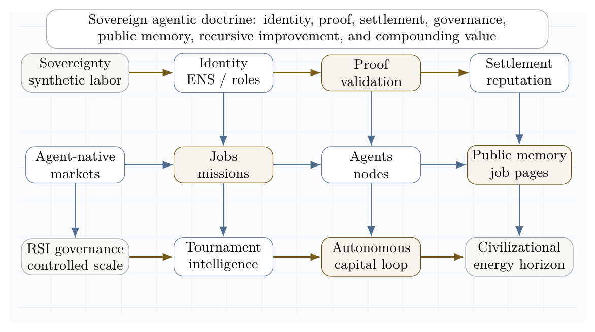
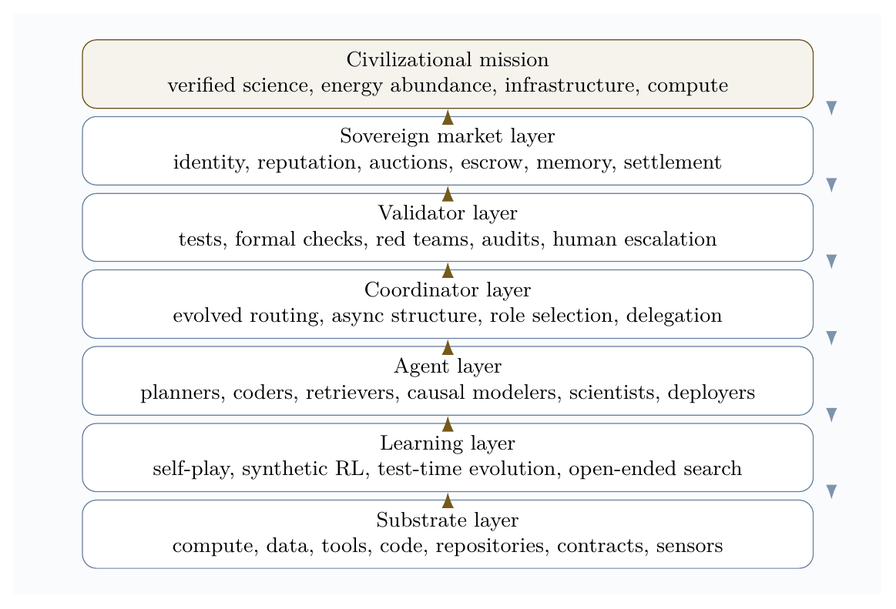
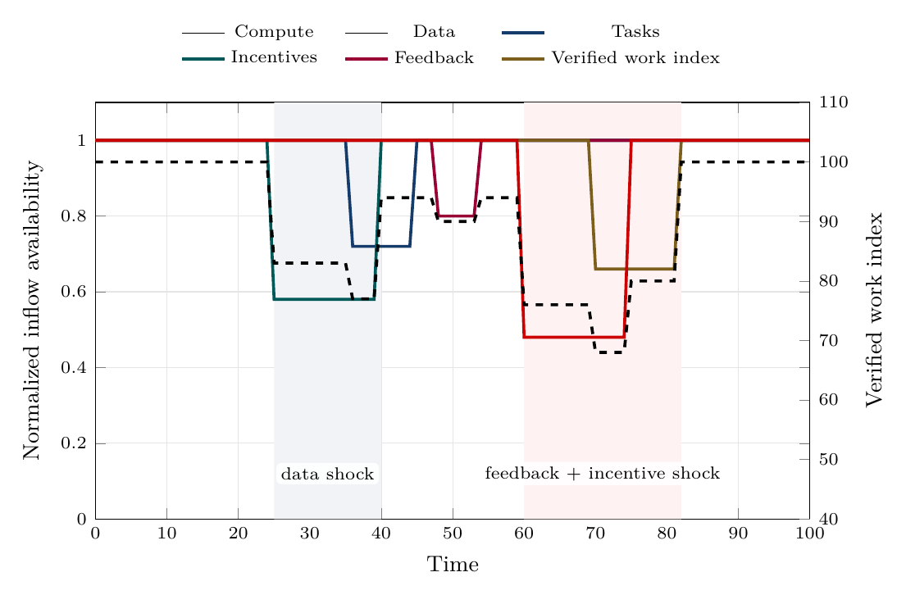
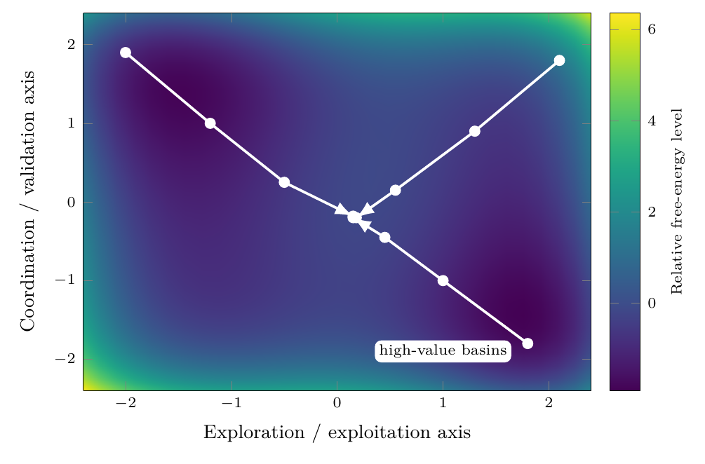
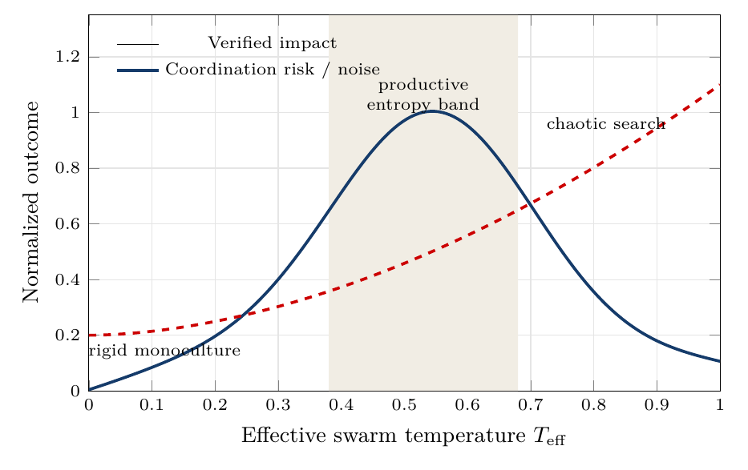
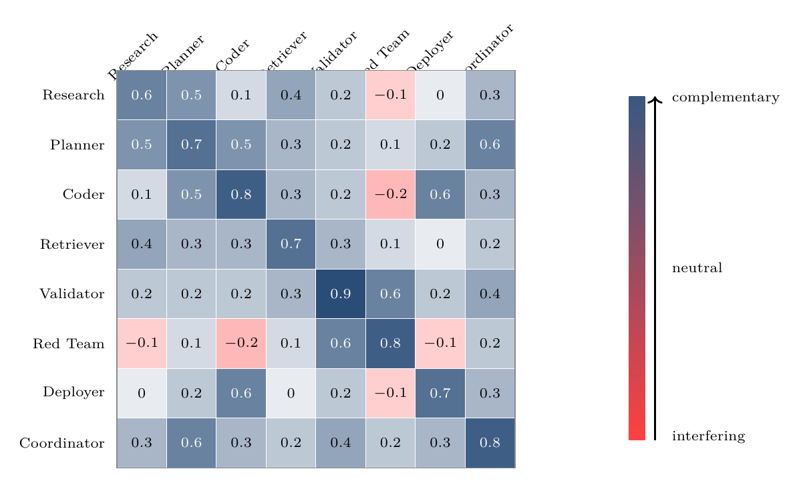
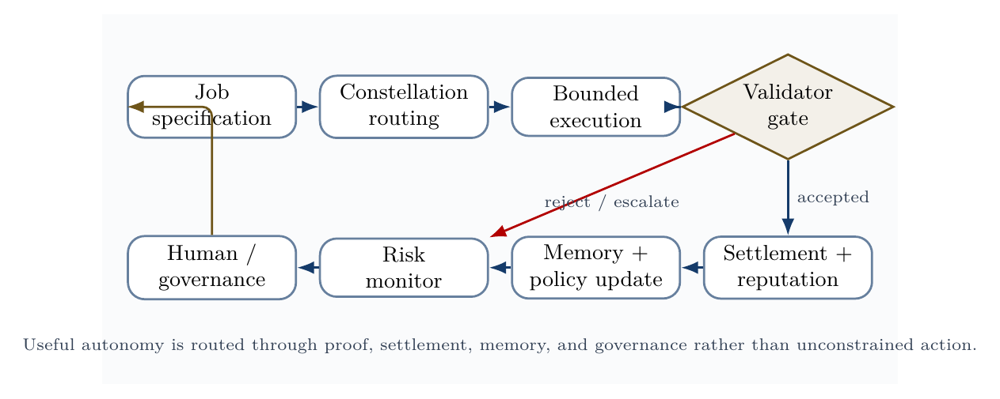
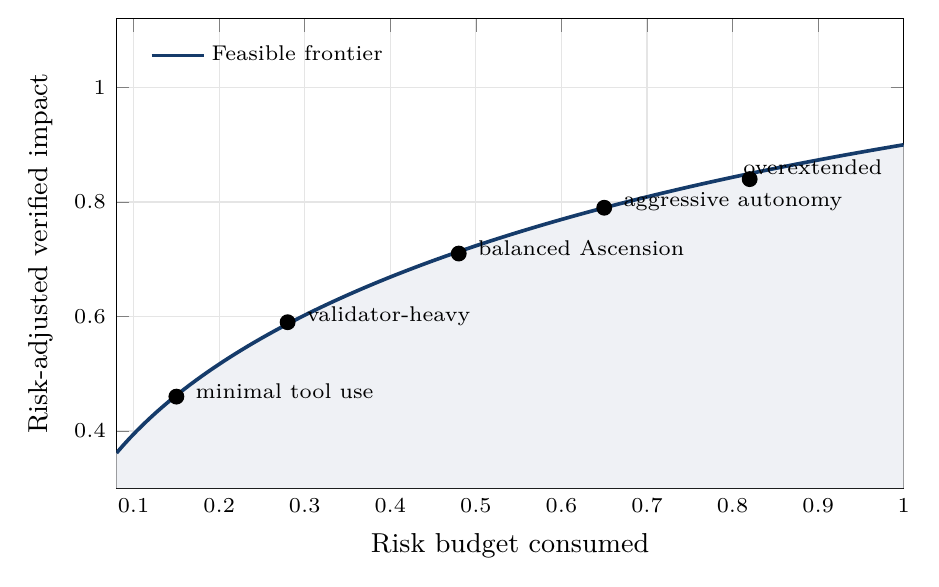

**Vincent Boucher**  
*President of MONTREAL.AI and QUEBEC.AI*  
*Written with AI*

# Abstract

This paper develops a scientific framework for **AGI ALPHA** and **α-AGI Ascension** as a far-from-equilibrium, validator-gated, experience-grounded, sovereign evolutionary agent economy. The central thesis is that the next frontier is not only larger intelligence models, but scalable intelligence organizations: systems in which agents, jobs, validators, tools, memory, markets, settlement, governance, and evidence streams compound into verified work. AGI ALPHA is designed to transform intelligence from a model capability into an institutional compounding engine: verified machine labor produces reusable capabilities; reusable capabilities produce capital and infrastructure; capital and infrastructure expand compute, science, and useful energy capacity; expanded capacity feeds back into stronger, safer, more general machine labor.

The framework integrates nonequilibrium thermodynamics, Gibbs-like free-energy objectives, statistical physics, Hamiltonian and learned coordination, validator-gated mechanism design, experience streams, grounded reward ledgers, ProofZero value-relevant planning, generalized validated search, task-defined curricula, lineage metaproductivity, and permeability-gated sandbox markets. It distinguishes literal thermodynamic energy at the compute layer from formal free-energy analogues at the coordination layer, and it defines measurable conditions for α-AGI Ascension: positive externally verified work, bounded risk, productive swarm entropy, reliable credit assignment, validator precision, cost/risk-aware settlement, and impact-adjusted free-energy descent.

The paper's objective is civilizational but bounded: AGI ALPHA aims to convert model capability into governed machine labor, governed machine labor into verified invention, verified invention into capital formation, and capital formation into compute, infrastructure, science, and energy-scale productive capacity. This is a horizon and a testable architecture, not a claim that superintelligence, autonomous sovereignty, or energy abundance has already been achieved. The research program becomes empirical only through real-task evidence: benchmarked tasks, reproducible traces, evidence bundles, external validators, delayed-outcome checks, safety ledgers, cost/risk accounting, baseline comparisons, and independent audits.

# Core claim

The most rigorous compressed claim is:

$$
\boxed{
\alpha\text{-AGI Ascension}
=
\text{bounded, far-from-equilibrium, multi-agent work production}
}
$$

or, in operational form:

$$
\boxed{
\dot{E}_{\text{compute,data,capital,tasks}}
\rightarrow
\dot{W}_{\text{verified impact}}
+
\dot{Q}_{\text{dissipated search}}
+
\dot{I}_{\text{memory}}
}
$$

AGI ALPHA brings α-AGI Ascension to life when energy-mediated computation becomes a continuously replenished, statistically mapped, learned-and-Hamiltonian-routed, experience-grounded, game-theoretically aligned, validator-gated swarm that converts open-system inflows into verified, risk-bounded work. The router is not a single hand-coded scorer; it is a family of commercially independent coordination substrates that learn when to decompose, delegate, verify, stop, escalate, remember, replay, and improve from grounded experience. In its planning form, the router learns abstract organizational models that are value-relevant rather than reconstructive: it need not simulate the full world, only those future quantities needed to select safer and higher-value work actions. In its economic form, AGI ALPHA is a sovereign evolutionary agent economy: task definitions create curricula, markets allocate bounded resources, artifacts and workflows form lineages, and settlement rewards long-run safe metaproductivity rather than immediate benchmark score alone.

The central objective of AGI ALPHA is to transform intelligence from a model capability into an institutional compounding engine: verified machine labor produces reusable capabilities; reusable capabilities produce capital and infrastructure; capital and infrastructure expand compute, science, and useful energy capacity; expanded capacity feeds back into stronger, safer, more general machine labor.

# Model substrate vs. organizational substrate

The Transformer revealed a scalable substrate for intelligence *inside models*: a general architecture in which tokens, attention, depth, parameters, data, and compute could compound into increasingly capable representation, prediction, and reasoning systems [56]. AGI ALPHA proposes the analogous substrate *above models*: a scalable architecture for intelligence organizations, where agents, jobs, validators, memory, incentives, markets, governance, and settlement compound into increasingly capable systems of verified work.

The distinction is structural. The Transformer made intelligence scalable as computation; AGI ALPHA aims to make intelligence scalable as institution. In this framing, α-AGI Ascension is not merely many agents communicating. It is the emergence of an organizational substrate in which intelligence can be routed, validated, priced, remembered, governed, and recursively improved.

$$
\text{Transformer}=\mathcal{S}_{\text{model}}(\text{tokens},\text{attention},\text{parameters},\text{data},\text{compute})
$$

$$
\text{AGI ALPHA}=\mathcal{S}_{\text{organization}}(\text{agents},\text{jobs},\text{validators},\text{memory},\text{incentives},\text{governance})
$$

{ width=96% }

**Transformer scaled intelligence in models; AGI ALPHA scales intelligence in organizations.**

This substrate framing clarifies the paper's strategic thesis. The next frontier is not only larger models, but governed intelligence organizations that convert model capability into proof-bearing labor, market activity, scientific discovery, capital formation, and energy-scale infrastructure under auditable constraints.


# Civilizational Value-to-Energy Flywheel

AGI ALPHA's strategic objective is to convert model intelligence into governed machine labor, governed machine labor into verified invention, verified invention into capital formation, and capital formation into compute, infrastructure, science, and useful energy capacity. This is the paper's North Star. It is not a claim of present-day superintelligence; it is the architecture that would make such capability economically legible, auditable, reinvestable, and governable.

The long-run flywheel is:

$$
\dot W_{\mathrm{verified}}
\rightarrow
\dot K_{\mathrm{capital}}
\rightarrow
\dot I_{\mathrm{infrastructure}}
\rightarrow
\dot E_{\mathrm{useful}}
\rightarrow
\dot C_{\mathrm{compute}}
\rightarrow
\dot W_{\mathrm{verified}}^{+}.
$$

Here, $\dot W_{\mathrm{verified}}$ is externally accepted work; $\dot K_{\mathrm{capital}}$ is reinvestable value; $\dot I_{\mathrm{infrastructure}}$ includes software, laboratories, robotics, manufacturing, markets, and institutions; $\dot E_{\mathrm{useful}}$ is governed energy and industrial capacity; and $\dot C_{\mathrm{compute}}$ is the expanded computational substrate that enables stronger future work.

The objective is therefore not:

$$
\max\;\text{automation}
$$

but:

$$
\max_{\pi}\;\mathbb{E}[V_{\mathrm{civilizational}}]
=
\mathbb{E}[W_{\mathrm{verified}}+K_{\mathrm{capital}}+I_{\mathrm{infrastructure}}+S_{\mathrm{science}}+E_{\mathrm{useful}}]
-\lambda C-\rho R-\mu U-\nu X.
$$

$C$ is compute, coordination, capital, and operating cost; $R$ is safety, legal, security, and market risk; $U$ is uncertainty and unmeasured externality; and $X$ is harmful concentration, collusion, market instability, or social harm. The correct target is not maximum autonomy, maximum throughput, or maximum profit. The target is **safe conversion of verified intelligence work into reusable, compounding, governed productive capacity**.

{ width=96% }

## Owner-operator distinction

An automation machine is usually monetized by selling access to many users with tasks. An invention machine is more valuable when the owner-operator uses it to discover, build, own, and compound high-value assets. AGI ALPHA can support external job markets, but its highest strategic form is an owner-operator engine: it discovers opportunities, builds validated artifacts, improves its own work substrate, acquires strategic knowledge, creates infrastructure, and reinvests gains into compute, science, energy, and new machine-labor capacity.

| System type | Best monetization model | AGI ALPHA implication |
|---|---|---|
| Automation machine | Sell access broadly to users with tasks | Job marketplace, workflow execution, agents-as-service |
| Invention machine | Use internally to discover, build, own, and compound high-value assets | Sovereign owner-operator engine that reinvests verified capability into compute, science, infrastructure, and energy capacity |

## Frontier layers as flywheel components

| Layer | Role in the value-to-energy flywheel |
|---|---|
| Learned coordination | Turns many models and agents into one organized labor system. |
| Experience streams | Converts actions and outcomes into training material. |
| ProofZero planning | Searches future organizational actions before spending real resources. |
| Directed evolution / DISCO analogy | Shows proposal -> validation -> lineage -> improvement. |
| Sovereign Evolutionary Agent Economy | Allocates jobs, compute, validators, rewards, credentials, and market permeability. |
| Synthetic curricula | Generates new task frontiers from task definitions. |
| Lineage metaproductivity | Rewards descendants that create better future capabilities. |
| Dynamic verifiable evolution | Turns open-problem search into reusable learning. |
| Real-task benchmark gates | Prevents self-referential claims. |
| Governance and safety | Keeps compounding value from becoming unbounded optimization. |

## Civilizational compounding metric

The civilizational metric is:

$$
D_{\mathrm{civ}}
=
\frac{
W_{\mathrm{verified}}
\cdot
M_{\mathrm{reusability}}
\cdot
L_{\mathrm{metaproductivity}}
\cdot
G_{\mathrm{governance}}
\cdot
E_{\mathrm{energy\ gain}}
}{
C_{\mathrm{compute}}+C_{\mathrm{coordination}}+C_{\mathrm{capital}}+R_{\mathrm{safety}}+R_{\mathrm{legal}}+R_{\mathrm{market}}
}.
$$

This metric rewards externally accepted work, reusable capability creation, safe descendant improvement, auditability, and contribution to energy/compute/infrastructure capacity. It penalizes compute waste, coordination overhead, capital cost, safety risk, legal risk, market instability, collusion, and harmful concentration.

## Claim boundary

The civilizational value-to-energy objective is a horizon, not a present achievement claim. The paper does not claim that AGI ALPHA has already produced superintelligence, energy abundance, or Type-II-scale capability. It claims that a commercially independent, validator-gated, experience-grounded, planning-capable, sovereign evolutionary agent economy is a plausible architecture for compounding verified machine labor toward that horizon. The claim becomes empirical only through real-task evidence: benchmark results, external validators, cost/risk ledgers, reproducible traces, safety audits, and delayed-outcome measurements.

# Scope and scientific claim boundaries

This manuscript is a theoretical systems paper. It does **not** claim that unrestricted artificial general intelligence has been achieved. It does **not** claim that autonomous economic sovereignty, autonomous legal agency, or mainnet-scale economic proof has been validated. It also does **not** treat internal demonstrations as sufficient evidence of external impact. Instead, the paper gives a formal model and a measurement program for testing whether a large-scale multi-agent system has entered a sustained, useful, governed, far-from-equilibrium coordination regime.


## Status of evidence

| Claim | Current status | Evidence required |
|---|---|---|
| AGI ALPHA is a formal architecture | Supported as a systems proposal | Definitions, diagrams, method families, and reference implementation |
| AGI ALPHA can be implemented as an MVP | Partially supported | Runnable reference implementation, task traces, and evidence bundles |
| AGI ALPHA improves multi-agent coordination | Not yet proven | B0-B6 benchmark comparison under equal model/tool/budget constraints |
| AGI ALPHA is safe under tool use | Not yet proven | Safety ledgers, adversarial tasks, blocked-action logs, rollback records, independent audits |
| AGI ALPHA is empirically SOTA | Not yet proven | Equal-budget wins on real tasks with reproducible evidence bundles and zero critical safety violations |
| AGI ALPHA realizes the civilizational value-to-energy flywheel | A strategic horizon, not a present claim | Reusable verified capabilities that compound into measurable infrastructure, compute, science, and useful-energy gains |

Public AGI Alpha materials frame α-AGI Architect as an operational blueprint for scalable multi-agent deployment and strategic infrastructure [16]. This manuscript treats that framing as a proposed system architecture to be formalized and tested, not as empirical proof of achieved AGI.

The phrase "to bring to life" is used in an engineering and cybernetic sense. A biological organism and an AI protocol are not the same class of object. The relevant analogy is the **dissipative structure**: a form of order sustained only while coupled to an environment that supplies energy, matter, information, and constraints. Prigogine's nonequilibrium thermodynamics made this type of order central to the study of far-from-equilibrium systems [1]. In an agentic system, the sustained flows are compute, data, tasks, incentives, validation, feedback, policy, and tool access.

# Institutional doctrine synthesis

The AGI Alpha corpus supplied for this paper is treated as a strategic primary-source doctrine, not as empirical validation of unrestricted AGI. Its recurring architecture can be summarized as a sovereign synthetic labor stack: identity-bound agents, validator-gated jobs, proof-bearing work, reputation-weighted settlement, public memory, on-chain governance, recursive improvement controls, and reinvestment into compute, science, infrastructure, and energy capacity. Public repositories and public mainnet contract pages provide the operational vocabulary for this stack: AGI Jobs as market, Alpha nodes as workers, Meta-Agentic cognition as the coordination layer, $AGIALPHA$ as incentive substrate, and ENS-backed job pages as durable public memory [19-23].

In this synthesis, **AI sovereignty** means the capacity of an institution, nation, or protocol to command verifiable machine labor without surrendering identity, memory, settlement, or governance to an opaque external monopoly. **The agent-native economy** means a market in which machines can discover work, bid, execute, prove, settle, update reputation, and route future labor under auditable rules. **Recursive self-improvement governance** means that improvement is permitted only through traceable, permissioned, validator-reviewed updates rather than unbounded self-modification.

The doctrine is therefore not merely accelerationist. It is a control architecture: autonomy measured, work proven, value settled, memory made public, and scale constrained by governance before it compounds into larger industrial and energy systems.

{ width=96% }


# Contributions

This paper makes twenty-six contributions.

1. It defines α-AGI Ascension as a measurable nonequilibrium regime rather than an undefined emergence claim.
2. It introduces an operational Gibbs-like free-energy functional for multi-agent coordination.
3. It distinguishes the Transformer as a scalable substrate for intelligence models from AGI ALPHA as a scalable substrate for intelligence organizations.
4. It introduces a real-task demonstration harness for scalable, efficient, and safe multi-agent coordination across software engineering, policy-bound tool use, assistant research, web and desktop automation, and scientific workflows.
5. It specifies a minimal viable AGI ALPHA implementation: a validator-gated, trace-producing, benchmarkable multi-agent CI/CD and evaluation harness.
6. It upgrades the coordination layer from a single Hamiltonian router to a learned router family spanning natural-language workflow routers, evidence-state lightweight routers, evolutionary coordinators, reinforcement-learned coordinators, and hybrid task/risk/cost-aware routers.
7. It extends the learned coordination layer into an experience-grounded substrate with sovereign experience streams, grounded reward ledgers, world-model planning, temporal options, replay, quarantine, and bi-level reward governance.
8. It adds a value-relevant planning layer inspired by learned latent planning: AGI ALPHA routers can plan over abstract evidence states without reconstructing the full environment, predicting only reward, policy, verified value, and validator/cost/safety outcomes needed for bounded work search.
9. It models agent constellations with statistical physics and Hamiltonian interaction terms.
10. It connects game-theoretic incentives to validator-gated mechanism design.
11. It gives a detailed theory of the continuous inflows needed to sustain organized agentic complexity.
12. It synthesizes the AGI Alpha doctrine into a sovereign agentic stack: identity, proof, settlement, governance, public memory, recursive improvement, autonomous capital, and energy-scale capacity.
13. It frames a governed Type-II / star-scale energy horizon as an asymptotic value target rather than a present-day achievement claim.
14. It proposes metrics and experiments for falsifying, improving, or validating the framework.
15. It introduces an anti-untethering constraint for self-play and self-training.
16. It frames build-test-symbolic-compression as the mechanism that converts sparse evidence into reusable design knowledge.
17. It distinguishes automation markets from sovereign invention engines.
18. It specifies a distributional safety envelope for populations of interacting agents.
19. It reframes directed evolution and DISCO-style biomolecular design as scientific inspiration for generalized validated search, while keeping AGI ALPHA commercially independent from third-party protein-design methods.
20. It defines AGI ALPHA-native method families: Validated Organizational Evolution, Proof-Gradient Routing, Assay-Equivalent Validator Lattices, Evidence-Bundle Memory, Artifact-Lineage Search, Coordination Fitness Landscapes, and the Build-Test-Compress-Evolve Control Plane.
21. It defines AGI ALPHA-native planning methods: Proof-Equivalent Organizational Models, Latent Evidence Dynamics, Validator-Aware Tree Planning, Evidence Reanalyze, the ProofZero Planning Layer, Cost-Risk-Value Backup, Abstract Work-State Planning, Policy/Value/Reward Heads for Machine Labor, and Bounded Hypothetical Work Search.
22. It formalizes a ProofZero policy-improvement loop, planning-depth scaling criterion, model-free/model-based comparison narrative, and latent-state diagnostic suite, making value-relevant organizational planning operationally testable rather than merely metaphorical.
23. It defines AGI ALPHA as a Sovereign Evolutionary Agent Economy with permeability-gated sandbox markets, task-definition curricula, lineage metaproductivity, and dynamic verifiable learning.
24. It introduces AGI ALPHA-native market, curriculum, lineage, and artifact-frontier methods, including Permeability-Gated Sandbox Economy, Task-Definition-to-Curriculum Engine, Lineage Metaproductivity, and Dynamic Verifiable Evolution Environment.
25. It adds experiments for sandbox agent markets, task-definition curricula, lineage metaproductivity, and dynamic verifiable evolution, all evaluated under equal-budget, validator-gated, safety-bounded, evidence-bundle promotion rules.
26. It centers the Civilizational Value-to-Energy Flywheel: verified machine labor -> reusable capability -> capital -> infrastructure -> useful energy and compute -> stronger future work, while preserving strict claim boundaries and real-task proof requirements.

# Visual thesis

{ width=95% }

The architecture figure compresses the central systems claim: α-AGI Ascension is sustained organization under regulated inflow, not isolated one-shot inference.

# Definitions

Let:

$$
\mathcal{A}=\{a_1,\ldots,a_N\}
$$

be a population of agents, and let:

$$
\mathcal{J}=\{j_1,\ldots,j_M\}
$$

be a stream of jobs. Each job is a tuple:

$$
j=(o,c,v,b,d,\rho)
$$

where $o$ is the objective, $c$ is the constraint set, $v$ is the validation criterion, $b$ is the bounty or reward, $d$ is the deadline, and $\rho$ is the risk class.

**AGI ALPHA** is defined here as the proposed runtime/protocol layer that routes jobs, agents, tools, memory, proofs, incentives, and governance into a coordinated work-producing system.

**α-AGI Ascension** is defined as the operating regime in which heterogeneous agents form, execute, validate, and dissolve coalitions to maximize verified impact under bounded risk.

Formally, Ascension requires:

$$
\frac{d}{dt}\mathbb{E}[V_{\text{verified}}] > 0
$$

while maintaining:

$$
\mathbb{E}[R_{\text{safety}}] \leq R_{\max}
$$

and productive swarm entropy:

$$
S_{\min}<S_{\text{swarm}}<S_{\max}.
$$

The lower entropy bound prevents rigid monoculture; the upper bound prevents incoherent chaos.

# Related work

## Dissipative structures

Dissipative structures are ordered patterns that arise and persist far from equilibrium through exchange with an environment. Prigogine's work is the canonical foundation for this perspective [1]. The agentic analogue is not metabolism in a biological sense; it is the use of electricity, processors, networks, storage, data, tools, and validation to sustain organized computation.

## Gibbs free energy

Classically, Gibbs free energy is:

$$
G=H-TS.
$$

At constant temperature and pressure, negative $\Delta G$ indicates a spontaneous direction of change, $\Delta G=0$ indicates equilibrium, and Gibbs free energy is associated with the useful non-expansion work obtainable from a process under ideal conditions. OpenStax summarizes these relationships and the role of coupled reactions in driving otherwise unfavorable processes [2]. We use physical Gibbs energy literally at the hardware layer and a Gibbs-like optimization functional at the agentic coordination layer.

## Statistical mechanics and maximum entropy

Jaynes' information-theoretic formulation of statistical mechanics frames probability distributions as maximum-entropy inferences under constraints [3]. This is useful for agent swarms because exact microstate tracking is intractable. We model the swarm by distributions over possible configurations and monitor macro-observables such as entropy, expected verified value, risk, cost, and coalition stability.

## Hamiltonian multi-agent learning

Bailey and Piliouras show a formal connection between multi-agent learning in network zero-sum games and Hamiltonian dynamics [4]. This matters because a system of interacting learners can cycle rather than converge. α-AGI must therefore combine Hamiltonian exploration with dissipative convergence into validated work.

## LLM-based multi-agent systems

Recent surveys of LLM-based multi-agent systems emphasize profiling, communication, workflow design, infrastructure, security, benchmarking, and scalability challenges [5-7]. These surveys support a core claim of this paper: large-scale multi-agent intelligence is not merely a matter of increasing the number of agents. The difficult problems are orchestration, communication, grounding, role specialization, credit assignment, validation, and governance.

## Learned coordination substrates

Two recent coordinator papers sharpen the multi-agent coordination problem. Conductor shows that a language model can learn to output natural-language subtasks, worker assignments, and access lists, thereby learning not only model routing but also prompt-engineered decomposition and communication topology; randomized worker-pool training supports adaptation to cost and availability constraints, while recursive topologies create a bounded test-time scaling axis [69]. TRINITY shows the complementary extreme: a compact language model plus a very small routing head can select model/role pairs across turns, using a Thinker/Worker/Verifier grammar, hidden-state representations, and separable evolutionary optimization under low-signal terminal rewards [24]. AGI ALPHA treats these works as scientific prior-art context, not implementation dependencies: its coordination layer must learn over real-work evidence states, bounded tools, validators, ledgers, memory, settlement, and governance.

## Planning with learned value-relevant models

MuZero is treated as scientific prior art for the principle that planning does not always require a model that reconstructs the full environment. Its key contribution was to learn an abstract latent model trained to predict quantities directly relevant to planning - reward, policy, and value - and to use tree search over that learned model in domains where the true dynamics may be unknown or visually complex [72]. The lesson for AGI ALPHA is not to copy a game-playing algorithm, but to adopt the value-relevant planning principle: a work engine does not need a complete simulator of the world to plan useful organizational actions. It needs an independent evidence model that predicts which delegated action, tool call, validator, escalation, or settlement path is likely to produce verified value at acceptable cost and risk.

## Agentic deployment practice

Recent official and community guidance converges on a practical principle: production agents require clear tools, guardrails, tracing, orchestration, and escalation. Anthropic distinguishes workflows, where code paths are predefined, from agents, where models dynamically direct tool use and process control [10]. OpenAI's agent guidance emphasizes model selection, tool design, guardrails, single-agent versus multi-agent orchestration, manager patterns, decentralized handoffs, and tracing [11]. MCP and related protocols are emerging as standard ways to connect agents to external data and tools, but they also expand the security boundary [12].

## Risk management and agentic security

NIST's AI Risk Management Framework and the Generative AI Profile provide lifecycle risk-management guidance for design, development, use, and evaluation [8]. OWASP's Agentic AI Threats and Mitigations and Securing Agentic Applications guidance emphasize threat modeling for autonomous systems, including tool misuse, identity and privilege abuse, memory risks, multi-agent propagation, and governance failures [9]. These sources motivate the paper's insistence that maximum impact must mean **verified bounded impact**, not unconstrained autonomy.


# Frontier synthesis: from coordination problem to sovereign invention system

The supplied corpus and the recent literature converge on one hard problem: how to make many heterogeneous agents coordinate to maximum useful effect without collapsing into waste, collusion, brittle hierarchy, or unsafe autonomy. The strongest current answer is not a single monolithic model. It is an institutionalized control stack that combines evolved coordination, symbolic compression, persistent memory, test-time learning, proof-bearing execution, and distributional safety.

Conductor is directly relevant because it demonstrates that natural-language coordination can be learned: a coordinator can output subtasks, worker assignments, and access relationships, learning not only which model to call but what each worker should attempt and what information it should see [69]. TRINITY supplies the complementary lightweight lesson: coordination can be represented as a compact evidence-state-to-action map, where hidden-state features from a small model feed a tiny head that selects model/role pairs across Thinker, Worker, and Verifier turns [24]. Multi-Agent Collaboration via Evolving Orchestration reaches a related conclusion from a different direction: static topologies scale poorly, while a learned orchestrator can dynamically activate, sequence, and prune agents as task states evolve [25]. The Era of Agentic Organization extends the same idea into asynchronous thinking: an organizer assigns sub-queries, merges intermediate knowledge, and can itself be optimized through reinforcement learning [26].

Planning and tool use require a second discipline: the LLM should not be allowed to hallucinate the plan when a symbolic planner, executor, or validator can do the logical work. DUPLEX restricts the LLM to schema-guided information extraction and hands rigorous synthesis to a PDDL planner, activating a slower reflective repair loop only after planning failure [27]. AT$^2$PO adds the learning counterpart: multi-turn agentic RL needs turn-level trees, entropy-guided exploration, and turn-wise credit assignment because sparse terminal rewards are too coarse for agentic action [28].

Persistent agency and recursive improvement add a third layer. Sophia frames a persistent agent as a System 3 wrapper over perception and deliberation, maintaining narrative identity, long-horizon adaptation, thought search, memory, and hybrid reward [29]. Self-play SWE-RL shows that software agents can gather experience from real repositories by injecting and repairing bugs specified by tests rather than relying on human-written issues [30]. Huxley-Gödel Machine highlights a subtle but essential distinction: an agent's current benchmark performance is not the same as its self-improvement potential; metaproductivity must be measured through the quality of descendants [31]. ThetaEvolve shows how test-time learning can internalize evolving strategies on open optimization problems instead of leaving all progress in inference-only search [32].

Artificial-life systems sharpen the thermodynamic analogy. The bacterial flagellar motor illustrates that apparently mysterious living motion can be explained as a physical motor driven by proton motive force and molecular interactions, without invoking a special life force [33]. Digital Ecosystems shows the computational analogue: multiple neural cellular automata can compete, adapt online, and be steered toward edge-of-chaos regimes where stable complexity emerges from local interactions and continuous learning [34].

Finally, the safety and economic literature argues that collective capability must be governed distributionally. Distributional AGI Safety explicitly addresses the patchwork hypothesis: AGI-level capability may first appear through coordinated groups of sub-AGI agents, requiring safeguards beyond individual-model alignment [35]. Virtual Agent Economies similarly argues for proactively designed agent markets with auctions, accountability, trust, safety, and steerability [36]. Large Causal Models from LLMs, K-Dense Analyst, Synthetic Data RL, DISCO, and ASI-Arch point to the scientific discovery frontier: causal extraction, hierarchical scientific agents, task-defined RL, multimodal molecular design, and autonomous architecture search all show how agentic systems can transform knowledge into validated invention when paired with execution and evaluation [37-41].

{ width=96% }

{ width=96% }

The resulting doctrine is a scientific operating principle:

**Operating principle.** Maximum useful effect = evolved coordination + formal verification + recursive learning + distributional governance.

This principle reframes the central economic vision. A superhuman invention engine is not best understood as a single automation product. It is a compounding institutional asset: the owner-operator uses it to generate proofs, tools, science, infrastructure, energy capacity, and more compute, while external access is mediated through jobs, markets, and validator-gated settlement.

## Frontier implication matrix

The following matrix translates the supplied frontier corpus into design requirements for AGI ALPHA. The point is not to cite every item as proof of achieved AGI. The point is to extract the strongest operational pattern from each line of research and convert it into an engineering control.

| Frontier signal | Core lesson | AGI ALPHA design implication |
|---|---|---|
| Evolved LLM coordination | Coordination can be optimized directly, not merely hand-written. | Learn a coordinator that selects roles, models, tools, validators, and stopping rules under budget. |
| Agentic organization | Work graphs can be asynchronous, dynamic, and learned. | Route jobs as evolving work graphs rather than static chains of agents. |
| Dual-system planning | LLMs should ground semantics; symbolic planners should enforce logic when stakes are high. | Separate semantic extraction from plan synthesis, validation, and settlement. |
| Turn-level agentic RL | Sparse terminal rewards are insufficient for multi-turn work. | Assign credit and policy updates at the turn, tool-call, and subgoal level. |
| Persistent agents | Long-lived agents need memory, self-models, and procedure updates. | Treat identity, lineage, reputation, and memory as state variables, not chat history. |
| Self-play software RL | Agents can create training experiences from real codebases through test-specified perturbations. | Use sandboxed self-play only when tasks are externally checkable by tests, proofs, or validators. |
| Test-time evolution | Search should become learning when repeated task families reveal reusable structure. | Convert successful traces into updateable routing priors, skills, and symbolic rules. |
| Artificial-life ecosystems | Local competition plus learning can stabilize edge-of-chaos complexity. | Use bounded competition, niches, gradients, and perturbation tests to discover robust agent ecologies. |
| Distributional AGI safety | AGI-level capability may emerge from populations before a monolith. | Govern the swarm economy itself: markets, audits, reputation, identity, and containment. |
| Scientific discovery agents | Causal extraction, bio-design, data science, and architecture search become agentic workflows. | Build invention loops that couple hypothesis, execution, verification, compression, and reinvestment. |
| Web/tool agents | Browser and API actuation turn reasoning into external action. | Treat tools as risk-bearing actuation channels with schemas, scopes, logs, and reversible modes. |
| ARC-style abstraction | Extreme generalization favors symbolic compression and deliberate test-time search. | Reward compact rules that survive held-out tests, not persuasive explanations alone. |

## Coordination as the central prize

The hard problem is not merely to make agents numerous. The hard problem is to make them **coordinate to maximum useful effect**. In this paper, maximum effect is not raw throughput. It is verified work under bounded risk, low waste, recoverable failures, and compounding memory:

$$
\pi^*_{\text{coord}}
=
\arg\max_{\pi}
\mathbb{E}\left[
V_{\text{verified}}
-
\lambda C_{\text{compute}}
-
\rho R_{\text{safety}}
-
\kappa C_{\text{coordination}}
-
\mu U_{\text{unknown}}
\right].
$$

The frontier literature implies that this policy must be **evolved**, **tested**, and **audited**. Hand-designed org charts are too brittle. Pure self-play is too easily untethered from human-useful objectives outside two-player zero-sum games. Static swarms are too expensive. Single-model planners are too hallucination-prone. The strong answer is a validator-gated coordination policy that learns which agent should think, which should act, which should verify, when to stop, and when to escalate.

This gives a sharper version of the AGI ALPHA thesis:

$$
\boxed{
\text{Ascension is not many agents. Ascension is learned coordination under proof.}
}
$$


## Learned Coordination Substrates: Conductor, TRINITY, and AGI ALPHA

The new frontier is not merely multi-agent prompting. It is *learned coordination*: a policy that decides which agents should exist for a task, what each agent should do, what each agent may see, which tools each agent may use, how long the workflow may run, which validators terminate the process, and what evidence is written back into memory.

**Conductor lesson.** Conductor shows that a language model can learn to orchestrate other language models by emitting natural-language subtasks, worker assignments, and access lists [69]. The key contribution is not only routing among workers. It is learning a prompt-engineered decomposition and communication topology: which worker should plan, which should execute, which intermediate outputs should be visible, and how much compute a task deserves. Randomized worker-pool training supports adaptation to user cost and availability constraints, and recursive topologies create a bounded test-time scaling axis.

Mapped into AGI ALPHA, the Conductor-style lesson becomes:

**AGI ALPHA mapping:** task manifest -> role graph -> subtask prompts -> access graph -> worker calls -> validator gate -> evidence bundle.

**TRINITY lesson.** TRINITY shows that a lightweight coordinator can use hidden-state representations from a compact language model plus a tiny head to select agents and roles across multiple turns [24]. Its Thinker/Worker/Verifier protocol is a minimal learned coordination grammar: one role decomposes, one role executes, one role checks and terminates. Its sep-CMA-ES training result is important because coordination often has low-signal terminal rewards, tight evaluation budgets, and weakly coupled parameters; in that regime, derivative-free evolutionary optimization can be more practical than standard policy gradients or supervised imitation. TRINITY's hidden-state separability analysis also suggests a diagnostic rule for AGI ALPHA: measure task/agent separability before choosing whether to use a heuristic router, a language workflow router, a lightweight representation router, an evolutionary coordinator, or a hybrid.

Mapped into AGI ALPHA, the TRINITY-style lesson becomes:

**AGI ALPHA mapping:** evidence state -> lightweight routing head -> role assignment -> validator-terminated workflow.

**AGI ALPHA synthesis.** Conductor and TRINITY primarily demonstrate LLM-to-LLM coordination on reasoning benchmarks. AGI ALPHA must extend the same lesson into real work: tools, APIs, code execution, browsers, databases, scientific workflows, policy-bound actions, validator gates, safety ledgers, cost ledgers, settlement, memory, and governance. Its routing decisions are judged not by conversational elegance but by externally verified work, cost, risk, reproducibility, lineage, and settlement.

{ width=96% }

### AGI ALPHA-native method family

The following method names are AGI ALPHA-native and commercially independent. They are inspired by the coordination principle of Conductor and TRINITY, but they do not depend on their code, prompts, weights, figures, role prompts, exact training recipes, or implementation details.

| Method | Definition |
|---|---|
| Proof-Conditioned Orchestration | Routing conditioned on task manifest, prior evidence bundles, validator availability, cost, risk, and expected proof quality. |
| Evidence-State Coordinator | A lightweight router whose input state is the current evidence graph: task, trace, artifacts, test results, costs, risks, memory, and validator outcomes. |
| Validator-Terminated Role Graphs | Learned role graphs whose stopping condition is an external validator, formal check, policy gate, or explicit escalation rule. |
| Proof-Gradient Routing | Routing updates that move probability mass toward agents and topologies with higher verified value per unit cost and lower false-acceptance risk. |
| Coordination Fitness Landscapes | Empirical landscapes over agent-role-tool-validator combinations, learned from accepted and rejected evidence bundles. |
| Recursive Audit Routing | Bounded recursion in which a router can call a critique/router layer only under budget, depth, and validator constraints. |
| Capability Complementarity Atlas | A memory map of which agents, tools, and roles complement or interfere with one another across task families. |
| Evidence-to-Policy Compression | Compression of traces, failures, and validator reports into reusable routing priors, contracts, and safety rules. |
| Tool-Bounded Role Contracts | Role definitions that include tool scopes, data access, budget, allowed actions, prohibited actions, and validator obligations. |
| Budgeted Constellation Search | Search over agent constellations under token, dollar, latency, risk, and validator budgets. |

### Formal comparison: Conductor, TRINITY, and AGI ALPHA

| Dimension | Conductor | TRINITY | AGI ALPHA |
|---|---|---|---|
| Coordination representation | Natural-language workflow with subtasks, worker ids, and access lists. | Hidden-state representation plus small head over agent-role actions. | Evidence-state graph over task, agents, tools, validators, memory, ledgers, settlement, and governance. |
| Learning method | Reinforcement learning over executed workflows. | Evolutionary optimization of a lightweight coordinator. | Commercially independent router family: heuristic, language, representation, evolutionary, RL, and hybrid proof-conditioned routers. |
| Role system | Flexible natural-language subtasks and worker assignments. | Thinker / Worker / Verifier tri-role grammar. | Tool-bounded role contracts: planner, executor, retriever, simulator, validator, critic, auditor, deployer, settlement agent. |
| Worker-pool adaptation | Randomized worker-pool training for cost and availability constraints. | Selects among a pool of LLMs and roles. | Capability complementarity atlas plus budgeted constellation search over agents, tools, validators, and policies. |
| Recursion / test-time scaling | Recursive topology allows bounded calls to the coordinator itself. | Multi-turn protocol with bounded turn budget. | Recursive audit routing under depth, cost, risk, validator, and escalation constraints. |
| Validation | Benchmark correctness after workflow execution. | Verifier role and terminal benchmark reward. | External validator gates: tests, formal checks, simulations, audits, market settlement, human expert review, and real-world outcomes. |
| Evidence trace | Workflow trace and benchmark result. | Multi-turn transcript and terminal score. | Machine-readable evidence bundle: routing record, tool trace, artifacts, validation, cost, risk, settlement, provenance, lineage. |
| Tool actuation | Primarily LLM-to-LLM benchmark workflows. | Primarily LLM-to-LLM benchmark workflows. | Bounded tools, APIs, code, browser, database, scientific workflow, and protocol-native job execution. |
| Safety controls | Benchmark-format constraints. | Turn budget and verifier termination. | Least privilege, policy gates, safety ledger, reversible actions, escalation, auditability, and governance. |
| Settlement / reputation | Not the central object. | Not the central object. | Proof-based settlement, reputation, credit assignment, and future routing probability. |
| Commercial independence | Prior-art inspiration only. | Prior-art inspiration only. | Independent terminology, architecture, evidence memory, safety-control layer, and settlement mechanism. |

### Router family

The Hamiltonian router remains useful as the simplest interpretable baseline, but it is no longer the only routing model. AGI ALPHA defines a router family:

| Router | Description |
|---|---|
| R0: Heuristic Hamiltonian router | Hand-specified free-energy/Hamiltonian scorer over cost, risk, complementarity, and expected verified value. |
| R1: Natural-language workflow router | Generates role graph, subtask prompts, access graph, and worker calls in natural language. |
| R2: Evidence-state lightweight router | Maps evidence-state features to agent-role-tool-validator choices with a compact head. |
| R3: Evolutionary coordinator | Optimizes routing parameters by derivative-free search under sparse terminal validator rewards. |
| R4: Reinforcement-learned coordinator | Learns workflow decisions from validator rewards, tool outcomes, and cost/risk penalties. |
| R5: Hybrid router | Selects R0-R4 by task family, cost, risk, validator availability, separability diagnostics, and evidence density. |

Every router must output:

1. selected agents;
2. role assignments;
3. subtask prompts;
4. access graph;
5. tool permissions;
6. budget;
7. validator set;
8. stopping rule;
9. escalation rule.

A task $j$ with evidence state $e_t$ is routed by:

$$
R_k(e_t,j)\rightarrow(A,\rho,S,\Gamma_T,B,V_{set},\tau_{stop},\tau_{esc}),
$$

where $A$ is the selected constellation, $\rho$ are role contracts, $S$ are subtasks, $\Gamma_T$ is the access/tool graph, $B$ is the budget, $V_{set}$ is the validator set, and $\tau_{stop},\tau_{esc}$ are stopping and escalation rules.

The hybrid router is promoted only when evidence supports it:

$$
R^*(j)=\arg\max_{R_k}\;\mathbb{E}[D_{\mathrm{real}}\mid j,R_k]-\lambda C-\rho R-\kappa O.
$$


**Operational router-selection example.** The router family is not a menu of slogans; it is a decision policy. **R0** is used as the auditable fallback when evidence is sparse, when a deterministic baseline is required, or when regulators/auditors require a transparent score. **R1** is preferred for open-ended reasoning or research tasks where the hard problem is subtask synthesis, access-list design, and natural-language delegation. **R2** is preferred for high-volume, high-structure task families where the evidence-state features are separable and latency/cost must be minimized. **R3** is preferred when terminal rewards are sparse, noisy, expensive, or non-differentiable, because derivative-free search can optimize routing without labels. **R4** is preferred only after a stable domain has accumulated enough validated trajectories for reward learning without reward hacking. **R5** is the production selector: it chooses among R0-R4 by task family, cost, risk class, validator availability, separability diagnostics, evidence density, and required auditability.

**Compact decision rule.** In deployment, router choice should be logged as part of the evidence bundle. A simple version is:

| Task condition | Preferred router | Reason |
|---|---|---|
| Sparse prior evidence, low risk, strong need for auditability | R0 | Transparent baseline and diagnostic control. |
| Open-ended decomposition or research synthesis | R1 | Natural-language subtasks and communication topology matter most. |
| High-volume structured tasks with separable evidence features | R2 | Compact evidence-state routing minimizes latency and cost. |
| Sparse, noisy, terminal validator rewards | R3 | Evolutionary search tolerates low-SNR objectives without dense labels. |
| Stable domain with many replayable validated episodes | R4 | Reinforcement learning can optimize long-horizon tool/cost/risk tradeoffs. |
| Mixed, high-value, or high-risk work | R5 | Hybrid proof-conditioned arbitration chooses among R0-R4 by task, cost, risk, validators, evidence density, and auditability. |

Promotion rule: R0 is always available as the reproducible baseline; any learned router must earn promotion through higher $D_{\mathrm{real}}$, equal-budget comparisons, zero critical safety violations, and reproducible evidence bundles.


### Strict novelty relative to learned-coordination prior art

The paper does not claim that AGI ALPHA invents learned LLM coordination from scratch. The strict novelty claim is the **full-stack organizational substrate**: learned routing is integrated with bounded tools, external validators, machine-readable evidence bundles, cost and safety ledgers, memory graphs, proof-based settlement, reputation updates, and governance. Conductor and TRINITY show that coordination itself can be learned in benchmark-centric LLM collaboration. AGI ALPHA's contribution is to lift learned coordination into a validator-gated, commercially deployable work system where routing decisions are judged by externally verified artifacts, reproducible traces, real-task cost, safety outcomes, and future routing improvement.

### Commercial independence

Conductor and TRINITY are cited as frontier demonstrations that coordination itself can be learned. AGI ALPHA does not depend on their code, weights, prompts, figures, role prompts, exact training recipes, data, or proprietary implementation details. AGI ALPHA develops its own commercially independent coordination substrate, validator architecture, routing state, evidence memory, safety-control layer, cost/risk accounting, settlement mechanism, and governance interface.

### State-of-the-art positioning and caution

The state-of-the-art lesson from Conductor and TRINITY is that learned coordination can beat manual scaffolding. The AGI ALPHA thesis is that learned coordination must now be lifted from benchmark-only LLM collaboration into validator-gated real-world work systems. The novel contribution claimed here is not that AGI ALPHA invents learned LLM-to-LLM coordination from scratch; Conductor and TRINITY are cited precisely because they show that coordination itself can be learned. AGI ALPHA's commercially independent contribution is the **full-stack organizational generalization**: routing plus bounded tools, external validators, machine-readable evidence bundles, safety and cost ledgers, memory, reputation, settlement, governance, and real-task promotion rules in one substrate. Conductor and TRINITY optimize benchmark collaboration; AGI ALPHA specifies the institutional layer needed to turn learned coordination into auditable machine labor.

AGI ALPHA is therefore **SOTA-aligned as a research program and architecture**. It becomes **empirically SOTA** only if its proof-conditioned router beats Conductor-style, TRINITY-style, single-agent, fixed-workflow, and unstructured-swarm baselines on real tasks under equal model, tool, and budget constraints with zero critical safety violations and reproducible evidence bundles.

## Experience-Grounded Coordination: AGI ALPHA in the Era of Experience

Silver and Sutton's *Welcome to the Era of Experience* argues that human-generated data is approaching limits in frontier domains and that future agents will improve primarily through experience generated by acting in environments, observing consequences, receiving grounded rewards, and planning over long streams of interaction [70]. The paper identifies four dimensions that matter for future agents: long streams of experience, rich grounded actions and observations, grounded rewards, and planning or reasoning over experience.

This section also explicitly anchors the experience layer in standard reinforcement-learning concepts from Sutton and Barto's *Reinforcement Learning: An Introduction*, including value estimation from experience, model-based planning, temporal-difference learning, Dyna-style learning from real and simulated experience, and options as temporal abstractions [71]. AGI ALPHA translates those concepts into organizational infrastructure: evidence streams become the experience base, world models predict consequences of agent/tool actions, temporal options become reusable validator-bounded workflows, and governance controls which reward signals may update production policy.

AGI ALPHA adopts this as conceptual inspiration and prior-art context only. The scientific implication is decisive: AGI ALPHA should not merely coordinate agents across isolated tasks. It should generate, record, validate, compress, and learn from experience streams. Evidence bundles are therefore not just audit logs. They are the training substrate for future routing, world modeling, reward calibration, safety policy, reputation, settlement, and governance.

| Era-of-experience dimension | AGI ALPHA translation |
|---|---|
| Streams of experience | Long-lived task, job, tool, validator, settlement, incident, and delayed-outcome streams. |
| Grounded actions and observations | Bounded tools, APIs, code execution, browsers, databases, sensors, simulations, lab interfaces, and protocol-native actions. |
| Grounded rewards | Validator outcomes, test results, user outcomes, scientific measurements, cost, safety, latency, reproducibility, market settlement, and delayed real-world outcomes. |
| Planning and reasoning over experience | World models, consequence-aware routing, temporal option registries, evidence-to-policy compression, and sandbox-to-real escalation planning. |

{ width=96% }

### Experience tuple and sovereign experience stream

An AGI ALPHA experience event is defined as:

$$
e_t=(s_t,a_t,o_{t+1},r_t,v_t,c_t,\rho_t,m_t)
$$

where:

- $s_t$ is the task/evidence state;
- $a_t$ is the agent, tool, workflow, or governance action;
- $o_{t+1}$ is the next observation, tool result, test result, simulator output, user outcome, market event, or scientific measurement;
- $r_t$ is a grounded reward signal;
- $v_t$ is a validator decision;
- $c_t$ is the cost, latency, and resource ledger;
- $\rho_t$ is the risk and safety state;
- $m_t$ is the memory, reputation, settlement, and policy update.

The experience stream is:

$$
E_{0:T}=\{e_0,e_1,\ldots,e_T\}.
$$

This matters because isolated task success can be misleading. A patch may pass immediate tests but fail under delayed deployment. A browser workflow may satisfy a page-state evaluator while violating a policy. A scientific design may score well in a proxy but fail a real assay. The experience stream preserves the difference between immediate acceptance and longer-run consequence.
### Sovereign Experience Control Plane

The decisive upgrade is to treat experience as first-class infrastructure. A one-shot evidence bundle proves what happened in one run; a sovereign experience stream preserves the ordered sequence of runs from which future routers, validators, world models, option policies, and governance weights can improve. This turns AGI ALPHA from a task coordinator into an experience operating system for machine labor.

The experience-control plane maintains four coupled state updates:

$$
M_{t+1}=U_M(M_t,e_t)
$$

$$
\Omega_{t+1}=U_\Omega(\Omega_t,r_t,v_t,\rho_t,\Pi_t)
$$

$$
M_{\phi,t+1}=U_\phi(M_{\phi,t},E_{0:t})
$$

$$
\pi_{t+1}=U_\pi\big(\pi_t,\mathrm{Compress}(E_{0:t}),M_{\phi,t+1},\Omega_{t+1}\big).
$$

Here $M_t$ is operational memory, $\Omega_t$ is the reward-governance state, $M_{\phi,t}$ is the world model, and $\pi_t$ is the router/policy state. The update rule is deliberately separated into memory, reward governance, world modeling, and routing because each subsystem has a different failure mode. Memory can be poisoned, rewards can be gamed, world models can extrapolate incorrectly, and routers can overfit to validator shortcuts. The control plane therefore requires provenance, quarantine, replay, delayed-outcome checks, and independent validator review before high-impact traces are allowed to influence production routing.

{ width=96% }

The key distinction is:

| Object | Function | Can update production policy? |
|---|---|---|
| Evidence bundle | Immutable proof of a single run | No, not by itself |
| Experience event | Atomic state-action-observation-reward-validation-cost-risk-memory tuple | Only after provenance checks |
| Experience stream | Ordered sequence of events across jobs and cycles | Yes, if replayable and validated |
| Reward ledger | Versioned consequence record | Yes, under governance weights |
| World model | Predictive model of outcomes and risk | Yes, if calibrated and monitored |
| Temporal option | Reusable validated macro-workflow | Yes, if bounded by initiation, validation, termination, and risk class |

The system's experience-grounded progress is measured over time, not by a single impressive run:

$$
D_{\mathrm{experience}}(T)=
\frac{1}{T}\sum_{t=1}^{T}
\left[
\frac{V^{(t)}_{\mathrm{verified}}}{C^{(t)}_{\mathrm{tokens}}+C^{(t)}_{\mathrm{tool}}+C^{(t)}_{\mathrm{time}}}
\right]
(1-R^{(t)}_{\mathrm{critical}})
(1-O^{(t)}_{\mathrm{coord}})
(1-H^{(t)}_{\mathrm{reward}}),
$$

where $H^{(t)}_{\mathrm{reward}}$ is the detected reward-hacking or reward-provenance penalty. A claimed experience gain must show that $D_{\mathrm{experience}}(T)$ improves on held-out future tasks while critical violations, reward hacking, and false acceptance do not increase.


### Validator-reward separation

AGI ALPHA separates validators from rewards.

- Validators determine whether an artifact, action, or workflow is accepted for the current job.
- Grounded rewards measure consequences across time, cost, safety, reproducibility, markets, sensors, tests, scientific assays, user outcomes, and delayed real-world feedback.
- Human approval is useful but is not identical to truth, utility, or safety.
- Immediate validator acceptance can be contradicted by long-run outcomes.
- Delayed grounded outcomes must be attributed back to prior agents, tools, prompts, policies, and routing decisions.

Thus the system tracks both:

$$
v_t=\mathrm{accept/reject/escalate}
$$

and:

$$
r_t=R(o_{t+1},c_t,\rho_t,\mathrm{delayed\ outcomes},\mathrm{governance\ weights}).
$$

This distinction protects AGI ALPHA from mistaking a narrow pass/fail gate for a complete account of value, truth, safety, or long-run usefulness.

### AGI ALPHA-native method family

These methods are AGI ALPHA-native and commercially independent. They are inspired by the general scientific lesson that agents can learn from grounded experience, but they do not depend on Silver/Sutton code, figures, algorithms, training recipes, or proprietary artifacts.

| Method | Definition and commercial-independence note |
|---|---|
| Experience-Grounded Coordination | Routing conditioned on current task state plus accumulated experience streams, not isolated prompts. |
| Sovereign Experience Streams | Institution-owned streams of task, tool, validator, cost, risk, settlement, and delayed-outcome events. |
| Grounded Reward Ledger | Versioned accounting of rewards from tests, simulations, markets, sensors, assays, user outcomes, safety, latency, and reproducibility. |
| Validator-Reward Separation | Explicit separation between acceptance gates and consequence-measuring rewards. |
| Experience-to-Policy Compression | Compression of repeated traces into routing priors, validator policies, temporal options, and governance updates. |
| Consequence-Aware Routing | Routing that predicts downstream cost, safety, latency, validator failure, delayed outcome, and escalation risk. |
| World-Model Risk Planning | Predictive modeling used before tool escalation, external deployment, or high-risk scientific action. |
| Temporal Option Registry | Reusable macro-actions with initiation conditions, workflow policy, validator, termination condition, risk class, and lineage. |
| Bi-Level Reward Governance | Low-level grounded signals are weighted and corrected by high-level policy, law, user feedback, institutional priorities, and safety events. |
| Exploration Corridors | Bounded zones where agents may explore novel actions, tools, or hypotheses under budget, sandbox, validator, rollback, and quarantine constraints. |
| Delayed Outcome Attribution | Assignment of long-run outcomes back to prior routing, tool, prompt, policy, and agent decisions. |
| Experience Quarantine and Replay | Isolation of suspicious, unsafe, poisoned, or reward-hacking traces, followed by controlled replay before learning from them. |

### Grounded Reward Ledger and Bi-Level Reward Governance

Low-level reward signals can come from unit tests, simulations, markets, sensors, scientific assays, user outcomes, cost, latency, safety, and reproducibility. These signals are powerful because they measure consequences rather than only predicted human approval. They are also dangerous because any single signal can be gamed.

AGI ALPHA therefore uses a governed reward functional:

$$
R_t^{\mathrm{AGI\ ALPHA}}
=
G_\omega\left(r_t^{\mathrm{tests}},r_t^{\mathrm{simulation}},r_t^{\mathrm{market}},r_t^{\mathrm{safety}},r_t^{\mathrm{cost}},r_t^{\mathrm{latency}},r_t^{\mathrm{reproducibility}},r_t^{\mathrm{human}},r_t^{\mathrm{delayed}}\right),
$$

where $G_\omega$ is a versioned governance policy. The low level optimizes grounded signals; the high level adjusts which signals matter, how they are weighted, and when safety or law overrides apparent reward. User feedback, legal constraints, incident reports, institutional policy, and human concern signals provide top-level correction. This makes reward design auditable and governable rather than an invisible optimization target.

### World-model planning and consequence-aware routing

Experience streams support world models. This follows the standard reinforcement-learning idea that agents can improve by learning predictive models from experience and using those models for planning; AGI ALPHA reinterprets this as an auditable organizational mechanism rather than a single-agent algorithm [71]. AGI ALPHA defines:

$$
M_\phi(o_{t+1},r_t,\rho_{t+1}\mid s_t,a_t),
$$

where $M_\phi$ predicts observations, reward, and future risk from a state-action pair. Such models support consequence-aware routing, delayed outcome prediction, safety forecasting, cost and latency forecasting, validator failure prediction, scientific experiment planning, sandbox-to-real escalation, rollback, and quarantine decisions.

The router family becomes experience-aware:

$$
R_k(e_t,j,E_{0:T},M_\phi)\rightarrow(A,\rho,S,\Gamma_T,B,V_{set},\tau_{stop},\tau_{esc}),\qquad k\in\{0,1,2,3,4,5\}.
$$

A router should not merely ask which agent is best for the immediate prompt. It should ask which constellation is most likely to produce valid work after considering downstream validators, delayed outcomes, cost, safety, and reversibility.

### Temporal option registry

Long streams of experience make reusable temporal abstractions possible. In reinforcement learning, options provide a standard formalism for temporally extended actions; AGI ALPHA turns that idea into commercially independent, validator-bounded organizational macro-workflows [71]. A validated workflow becomes an option or macro-action:

$$
\mathrm{Option}=(\mathcal{I},\pi_{workflow},V_{gate},\tau_{term},\rho_{risk},H_{evidence}).
$$

Here $\mathcal{I}$ is the initiation condition, $\pi_{workflow}$ is the workflow policy, $V_{gate}$ is the validator, $\tau_{term}$ is the termination condition, $\rho_{risk}$ is the risk class, and $H_{evidence}$ is the evidence history. Examples include software repair, benchmark execution, literature review, simulation, red-team review, deployment rollback, and scientific experiment options. Temporal abstraction matters because civilization-scale work is not a collection of one-shot answers; it is the repeated reuse and improvement of verified procedures.

### Anti-reward-hacking controls

Grounded rewards are necessary, but unsafe if treated as the only objective. AGI ALPHA therefore requires reward provenance, reward versioning, counterfactual reward audits, adversarial reward tests, delayed-outcome checks, independent validator review, safety overrides, rollback and quarantine, human concern signals, reward-model incident reports, and replay before learning from suspicious traces.

The system is allowed to learn from experience only when the experience remains traceable, replayable, and governed.

### Commercial independence

Silver and Sutton are cited as conceptual inspiration and prior-art context for the shift from human-data-centric systems toward experience-grounded agents, and Sutton and Barto are cited for standard reinforcement-learning concepts such as world models and temporal abstraction. AGI ALPHA does not depend on their code, figures, algorithms, training recipes, terminology beyond ordinary citation, or implementation details. AGI ALPHA defines its own commercially independent experience tuple, evidence-stream architecture, grounded reward ledger, validator-reward separation, world-model planning interface, temporal option registry, router-family extension, safety controls, and settlement mechanism.


## Planning with Learned Organizational Models: MuZero-Inspired AGI ALPHA without Implementation Dependence

MuZero's frontier contribution was not generic model-based reinforcement learning. The key scientific idea was value-relevant planning: learn an abstract latent model that predicts the quantities directly useful for planning - reward, policy, and value - without requiring the hidden state to reconstruct the full observation or match the environment's true state [72]. In games and Atari, this allowed search to operate over a learned internal model even when the full dynamics were unknown. AGI ALPHA takes this only as conceptual inspiration. The commercial system defined here does not depend on MuZero code, pseudocode, figures, architecture, weights, training recipes, hyperparameters, or implementation details.

The AGI ALPHA translation is organizational rather than game-specific. The environment is not a board or screen. It is a stream of jobs, agents, tools, validators, cost ledgers, safety states, delayed outcomes, memory graphs, and settlement updates. The planning problem is not "which move wins a game?" but "which bounded organizational action produces verified work under cost, safety, validator, and governance constraints?"

The resulting principle is:

$$
\text{Plan over proof-relevant latent work states, not over complete world reconstructions.}
$$

### AGI ALPHA-native method family

| Method | Definition |
|---|---|
| Proof-Equivalent Organizational Models | Abstract models whose predictions are sufficient for selecting proof-producing organizational actions, without reconstructing the full external environment. |
| Latent Evidence Dynamics | Learned transitions over compressed evidence states induced by organizational actions such as delegate, retrieve, code, test, validate, escalate, quarantine, stop, or settle. |
| Validator-Aware Tree Planning | Bounded lookahead search in which branches are constrained by validator availability, risk class, tool permissions, budget, and escalation rules. |
| Search-Improved Routing | Routing targets generated by internal work search and then used to improve future routing policies. |
| Evidence Reanalyze | Revisit old evidence bundles with newer routers and work models to generate updated routing, value, reward, and validator-risk targets while preserving provenance. |
| ProofZero Planning Layer | AGI ALPHA's native planning layer over latent evidence states; the name denotes zero dependence on full environment reconstruction, not dependence on any third-party system. |
| Cost-Risk-Value Backup | A backup rule that propagates predicted verified value while subtracting expected cost, latency, validator failure, and safety risk. |
| Abstract Work-State Planning | Planning over latent organizational states representing evidence, capabilities, risks, and validator conditions rather than raw observations. |
| Policy/Value/Reward Heads for Machine Labor | Prediction heads for routing policy, downstream verified value, grounded reward, and validator/cost/safety outcomes. |
| Bounded Hypothetical Work Search | Counterfactual exploration of organizational action branches under explicit tool, budget, safety, and governance constraints. |

### Formal planning model

Let $e_t$ be the current evidence state and $a_t$ be a candidate organizational action. Actions may include:

$$
 a_t \in \{\text{delegate},\text{retrieve},\text{code},\text{test},\text{validate},\text{escalate},\text{stop},\text{quarantine},\text{settle}\}.
$$

AGI ALPHA learns a commercially independent latent work model:

$$
z_0 = H_\theta(e_t),
$$

$$
r_k, z_k = G_\theta(z_{k-1}, a_k),
$$

$$
p_k, v_k, q_k = F_\theta(z_k).
$$

Here $z_k$ is an abstract evidence state, not a reconstruction of the full environment. $r_k$ predicts grounded reward, $p_k$ predicts the next organizational-action policy, $v_k$ predicts downstream verified value, and $q_k$ predicts validator, safety, cost, latency, and escalation outcomes.

Tree search is performed over organizational actions, constrained by:

$$
\mathcal{C}(j)=\{\text{tool permissions},\text{budget},\text{risk class},\text{validator availability},\text{stopping rule},\text{escalation rule}\}.
$$

The search outputs an improved routing policy and a search value:

$$
(\pi_{\mathrm{search}}, \nu_{\mathrm{search}})
=\mathrm{WorkSearch}(z_0,\mathcal{A}_{\mathrm{org}},\mathcal{C}(j)).
$$

The action actually executed must still pass tool permissions, risk gates, validator availability checks, and escalation policy. Search is advisory until validated by the bounded execution layer.

{ width=96% }

### Training objective

The AGI ALPHA model is trained from sovereign evidence streams, not from any third-party game-playing implementation. The target quantities are observed grounded rewards, validator decisions and confidence, delayed real-world outcomes, search-improved routing policies, bootstrapped future verified value, and cost, latency, safety, and escalation penalties.

A schematic AGI ALPHA-native objective is:

$$
\mathcal{L}_{\mathrm{ProofZero}}(\theta)=
\lambda_r\mathcal{L}_r(\hat r,r)
+\lambda_v\mathcal{L}_v(\hat v,V_{\mathrm{future}})
+\lambda_p\mathcal{L}_p(\hat p,\pi_{\mathrm{search}})
+\lambda_q\mathcal{L}_q(\hat q,q_{\mathrm{validator/risk/cost}})
+\lambda_s\mathcal{P}_{\mathrm{safety}}.
$$

This is not a copied loss or recipe. It states the AGI ALPHA design requirement: the latent model should predict only those quantities required for safer, cheaper, and more valuable organizational action.

### Search-improvement loop

The critical planning loop is not merely prediction. It is iterative policy improvement under proof. Let $\pi_\theta(a\mid e)$ be the base router over organizational actions and let bounded work search return $\pi_{\mathrm{search}}(a\mid e)$ and $\nu_{\mathrm{search}}(e)$. Define the constrained real-work objective:

$$
J_{\mathcal{C}}(\pi\mid e)=\mathbb{E}_{\pi}\left[V_{\mathrm{verified}}-\lambda C-\rho R-\kappa L-\mu O\mid e,\mathcal{C}\right],
$$

where $\mathcal{C}$ contains budget, tool, validator, risk, settlement, and escalation constraints. The empirical improvement target is:

$$
\Delta_{\mathrm{search}} = \mathbb{E}_{e\sim \mathcal{E}}\left[J_{\mathcal{C}}(\pi_{\mathrm{search}}\mid e)-J_{\mathcal{C}}(\pi_\theta\mid e)\right] > 0.
$$

When this condition holds with zero critical safety violations, $\pi_{\mathrm{search}}$ becomes a training target for the next router/model update. If it does not hold, the search procedure is treated as overhead, not intelligence. This gives ProofZero its policy-improvement discipline:

$$
\pi_\theta \rightarrow \mathrm{bounded\ search} \rightarrow \pi_{\mathrm{search}} \rightarrow \mathrm{evidence\ replay} \rightarrow \pi_{\theta'}.
$$

A monotonic improvement guarantee is not asserted for arbitrary open-world tasks. The paper instead requires a measurable surrogate: search must improve $D_{real}$, preserve reproducibility, and not increase false acceptance, reward hacking, or critical safety events.

### Model-free, model-based, and ProofZero coordination

The benchmark ladder should be read as a model-class comparison.

| Class | AGI ALPHA baseline | Limitation | ProofZero upgrade |
|---|---|---|---|
| Model-free coordination | Learned router without search | Reacts to the current evidence state but does not look ahead. | Search improves the router policy before action. |
| Model-based prediction | Learned world model without tree search | Predicts consequences but may not convert them into better decisions. | Tree planning converts predictions into action selection. |
| Heuristic planning | Hamiltonian router | Transparent and auditable but manually specified. | Learned latent dynamics and search targets adapt from evidence. |
| ProofZero planning | Bounded search over latent evidence states | Must control search cost, model error, and reward hacking. | Promotion requires depth scaling, reanalyze gains, and safety gates. |

Thus ProofZero is not simply model-free routing and not simply model-based forecasting. It is value-relevant organizational planning: a learned abstract model is used to improve routing before bounded tool execution.

### Planning-depth scaling

Planning depth is a central empirical claim. Let $K$ denote search depth, simulation count, or bounded hypothetical work budget. The system should report:

$$
D_{real}(K),\qquad \Delta_K=D_{real}(K)-D_{real}(K-1).
$$

A valid result should show improvement up to a measurable plateau:

$$
\Delta_K>0 \ \text{for early useful depths},\qquad \Delta_K\rightarrow 0 \ \text{at plateau},
$$

without a corresponding increase in validator error, safety incidents, latency blow-up, or reward-hacking attempts. If deeper planning improves internal value estimates but not externally verified work, the latent model is optimizing the wrong target. If deeper planning improves work only by spending more than the baseline, the result is not a coordination gain. If deeper planning increases false acceptance or unsafe tool use, the planner fails promotion even if its task score rises.

### Latent-state diagnostics

The latent work state $z_k$ is allowed to be non-human-interpretable, but it cannot be unexamined. AGI ALPHA therefore evaluates latent evidence states by five diagnostics:

1. **Decision predictiveness:** whether $z_k$ improves prediction of reward, validator acceptance, cost, latency, risk, and future verified value.
2. **Search utility:** whether planning with $z_k$ improves $D_{real}$ over the base router and over a world model without tree search.
3. **Compression efficiency:** whether $z_k$ retains decision-relevant evidence with lower state complexity than raw traces.
4. **Separability and calibration:** whether task family, risk class, validator availability, and agent/tool complementarity are separable and calibrated in latent space.
5. **Safety probeability:** whether high-risk states, poisoned traces, reward-hacking attempts, and validator-failure modes can be detected before they update production policy.

A schematic latent-state score is:

$$
S_z = \alpha P_{decision}+\beta U_{search}+\gamma C_{compression}+\delta A_{calibration}+\eta S_{safety}.
$$

Interpretability is valuable for audit, but it is not sufficient. A readable latent state that does not improve validated work is decoration. An opaque latent state that improves work but cannot be probed for safety is not deployable. The acceptable region is a bounded frontier: decision-useful, compact, calibrated, and safety-probeable.

### Evidence Reanalyze

Evidence Reanalyze revisits old evidence bundles with newer routers, validators, and latent work models. It produces fresher targets for routing policy, future verified value, delayed-outcome prediction, and validator-risk calibration. Reanalyze is useful because a trace that was poorly understood when generated may become highly informative after the system has better validators, better world models, or better cost/risk calibration.

Reanalyze is not allowed to update production policy automatically. Unsafe traces, poisoned inputs, reward-hacking examples, policy-violating tool calls, privacy-sensitive traces, and traces with unresolved validator disagreement must first enter quarantine and replay. Only replayable, provenance-preserving, validator-approved traces can become policy-improvement data.

### Formal comparison

| Planning element | MuZero prior-art context | AGI ALPHA organizational analogue |
|---|---|---|
| Input state | Game or Atari observation | Evidence state: task, trace, tool state, validators, ledgers, memory |
| Latent state | Hidden planning state | Latent work state |
| Action | Game/Atari action | Organizational action: delegate, retrieve, code, test, validate, escalate, stop, quarantine, settle |
| Reward | Environment reward | Grounded reward ledger: tests, outcomes, markets, measurements, cost, safety, reproducibility |
| Policy | Move/action policy | Routing policy over agents, roles, tools, validators, and escalation rules |
| Value | Predicted future return | Verified future value minus cost, risk, latency, and governance penalties |
| Tree search | Search over actions in latent model | Validator-aware bounded tree planning over organizational actions |
| Replay | Replay buffer / reanalyze | Sovereign evidence stream / Evidence Reanalyze |
| Score | Game score or normalized return | Verified work minus cost/risk and false acceptance |

### Commercial independence

MuZero is cited as scientific prior art for value-relevant learned planning. AGI ALPHA does not depend on MuZero code, pseudocode, figures, architecture, hyperparameters, training recipes, weights, data, or implementation details. AGI ALPHA develops its own commercially independent planning substrate over evidence states, validators, tools, ledgers, settlement, governance, real-task proof, and experience-grounded machine labor. The names Proof-Equivalent Organizational Models, Latent Evidence Dynamics, Validator-Aware Tree Planning, Evidence Reanalyze, and ProofZero are AGI ALPHA-native terms for this paper's independent architecture. No affiliation, endorsement, or dependency is implied with DeepMind, MuZero, AlphaZero, or any third-party implementation.

### Planning with Learned Organizational Models Benchmark

**Hypothesis.** A ProofZero planner improves AGI ALPHA routing by using value-relevant latent organizational models and bounded tree search over work actions, while preserving validator-gated safety and evidence-bundle reproducibility.

**Conditions.**

- B0: single strongest agent.
- B1: fixed workflow.
- B2: heuristic Hamiltonian router.
- B3: learned router without search.
- B4: learned world model without tree search.
- B5: AGI ALPHA-native ProofZero planner.

**Task families.** SWE-bench Verified, GAIA, BrowserGym / OSWorld / WorkArena, $\tau$-bench, scientific workflow tasks, and AGI Jobs protocol-native tasks.

**Metrics.** Verified work per dollar/token/hour, validator precision/recall, false acceptance, critical safety violations, search-policy improvement $\Delta_{search}$, planning-depth scaling $D_{real}(K)$, plateau depth, Evidence Reanalyze gain, delayed-outcome prediction error, cost-risk-value calibration, latent-state decision predictiveness, latent-state compression efficiency, safety probeability, and evidence-bundle reproducibility.

**Promotion rule.** B5 is promoted only if it beats all baselines under equal model/tool/budget constraints, demonstrates $\Delta_{search}>0$ against the base router, improves with planning depth up to a measurable plateau, improves from Evidence Reanalyze without reward hacking, passes latent-state diagnostics, and records zero critical safety violations. If it wins by spending more compute, relaxing validators, ignoring safety penalties, absorbing unsafe traces into production policy, or optimizing an unprobeable latent state, the result is rejected.

### Synthesis with the three frontier lessons

AGI ALPHA now integrates three frontier lessons:

1. **Learned coordination.** Conductor and TRINITY show that coordination policies can be learned rather than hand-scripted.
2. **Experience-grounded learning.** The Era of Experience shows that future capability growth must increasingly come from grounded action, observation, reward, and world-model learning.
3. **Value-relevant planning with learned organizational models.** MuZero shows that planning can be powered by abstract models that predict planning-relevant quantities rather than reconstructing the full environment; AGI ALPHA adds proof-conditioned policy improvement, depth-scaling tests, and latent-state safety diagnostics for organizational work.

AGI ALPHA's claim is the full-stack organizational synthesis: learned routing over bounded tools, grounded experience streams, value-relevant latent work models, external validators, evidence bundles, settlement, memory, and governance. The empirical claim remains conditional: AGI ALPHA becomes SOTA only if these components beat baselines on real tasks under equal budgets with reproducible evidence and zero critical safety violations.

## Sovereign Evolutionary Agent Economies: Task-Defined Curricula, Lineage Metaproductivity, and Dynamic Verifiable Learning

Four frontier lines sharpen AGI ALPHA's economic and evolutionary layer. **Virtual Agent Economies** argues that future agent markets should not emerge accidentally as highly permeable systems; sandbox origin and market permeability must be design variables, with auctions, mission economies, credentials, trust infrastructure, and multi-tier oversight treated as first-class governance machinery [36]. **Synthetic Data RL** shows that a task definition can seed synthetic examples, difficulty-adaptive curricula, pass-rate-based sample selection, and reinforcement learning on high-potential examples [39]. **Huxley-Goedel Machine** identifies the metaproductivity-performance mismatch: the best current performer is not necessarily the ancestor whose descendants will produce the best future agents [31]. **ThetaEvolve** shows that open-problem search becomes more powerful when it is a dynamic, verifiable environment with a large artifact database, batch variant generation, lazy-stagnation penalties, reward shaping, and optional reinforcement learning that internalizes evolving strategies [32].

AGI ALPHA cites these works as scientific inspiration and prior-art context only. Its commercially independent contribution is a **Sovereign Evolutionary Agent Economy**: an intentional, validator-gated sandbox market in which task definitions generate curricula, agents and workflows evolve through evidence-bearing lineages, test-time search becomes verifiable learning, and settlement rewards long-run safe metaproductivity rather than immediate benchmark score alone.

### Prior-art dependency boundary

The cited works define design pressures, not implementation dependencies. AGI ALPHA does not copy or require any third-party code, prompts, figures, pseudocode, weights, datasets, hyperparameters, exact training recipes, benchmark-specific tricks, product names, or proprietary artifacts. AGI ALPHA develops its own sovereign market architecture, task-definition curriculum engine, lineage-metaproductivity metrics, dynamic verifiable evolution environment, artifact frontier database, validator architecture, settlement mechanism, and governance controls.

### A. Permeability-gated sandbox economies

The Virtual Agent Economies lesson is that market permeability is a control variable. A sealed sandbox may be safe but economically inert. A fully permeable agent market may create systemic risk before human oversight can react. AGI ALPHA therefore defines a **Permeability-Gated Sandbox Economy** whose connection to the human economy is explicitly tuned by risk class, identity assurance, validator confidence, market volatility, mission criticality, and governance policy.

AGI ALPHA-native constructs:

| Method | Definition |
|---|---|
| Permeability-Gated Sandbox Economy | A bounded agent market whose external boundary is governed by identity, permission, risk, validator confidence, and mission class. |
| Mission-Weighted Agent Market | A market in which settlement weights include collective mission progress, not only local bounty completion. |
| Agent-Market Stress Index | A live risk score over volatility, failed settlement, collusion, Sybil behavior, negotiation speed, validator load, human overrides, and liquidity shocks. |
| High-Frequency Negotiation Guardrails | Rate limits, circuit breakers, quote-validity windows, cooling-off periods, anomaly detectors, and maximum negotiation-depth rules for machine-speed bargaining. |
| Machine-Speed Oversight Layer | Automated supervisory controls that operate at agent speed while preserving audit trails and human escalation for irreversible or high-impact actions. |
| Verifiable Agent Credentials | Checkable claims about identity, authorization, capability, provenance, controller, and allowed market roles. |
| Proof-of-Personhood / Proof-of-Control Boundary | A governance boundary that distinguishes human-controlled, institution-controlled, delegated, and autonomous actions for access, liability, and settlement. |
| Privacy-Preserving Capability Attestations | Selective attestations that an agent can perform or is authorized for a capability without exposing private data, proprietary model details, or full capability profiles. |
| Mission Currency / Compute Credit / Risk-Bounded Settlement | Domain-specific settlement instruments that buy work, compute, or mission progress under explicit risk and permeability constraints. |

AGI ALPHA's commercially independent market architecture separates six markets:

1. **Job markets** for immediate tasks and bounties.
2. **Capability markets** for discovering which agents, tools, and workflows produce reliable verified work.
3. **Validator markets** for scarce proof capacity, formal checks, audits, expert review, and delayed-outcome measurement.
4. **Compute markets** for allocating energy, hardware, memory, bandwidth, and inference budgets.
5. **Mission markets** for long-horizon collective objectives such as scientific discovery, infrastructure, resilience, and energy abundance.
6. **Strategic internal invention reserves** for high-value discoveries whose best use is internal compounding rather than broad resale.

This separation prevents a single price signal from governing every decision. It also makes permeability adjustable. A low-risk software benchmark can settle quickly; a high-risk financial, legal, biological, or physical action must pass tighter identity, audit, and human-governance gates before it touches the human economy.

### B. Task definitions as curriculum seeds

The Synthetic Data RL lesson is that a task definition is not merely an instruction; it is a seed for a curriculum. AGI ALPHA extends each job specification to include a governed curriculum generator:

$$
j=(o,c,v,b,d,\rho,e,g_{\mathrm{curr}}),
$$

where $o$ is the objective, $c$ constraints, $v$ validators, $b$ bounty, $d$ deadline, $\rho$ risk class, $e$ exit condition, and $g_{\mathrm{curr}}$ a task-definition-to-curriculum generator.

The curriculum generator may produce:

- easier variants;
- harder variants;
- adversarial variants;
- decomposed subtasks;
- benchmark-style validation cases;
- replay tasks;
- synthetic tool-use traces;
- withheld validators;
- delayed-outcome probes.

AGI ALPHA-native constructs:

| Method | Definition |
|---|---|
| Task-Definition-to-Curriculum Engine | Converts a job definition into a governed family of training, replay, evaluation, adversarial, and delayed-outcome variants. |
| Validator-Bound Synthetic Task Foundry | Generates synthetic tasks only when they are anchored to held-out validators, external checks, delayed real-world outcomes, or human expert review. |
| Difficulty-Band Curriculum | Maintains easy, target, hard, and adversarial difficulty bands so learning remains in the partially solvable region. |
| Partial-Solvability Sample Selection | Prioritizes tasks whose pass rates indicate high learning value, avoiding both trivial and impossible samples. |
| High-Potential Experience Mining | Selects old traces that are likely to improve future routing, validation, safety, reward calibration, or world-model prediction. |
| Synthetic Mission Replay | Replays task families in sandboxed mission settings to train routing and market policies without exposing production systems. |
| Held-Out Validator Anchoring | Requires non-training validators, external benchmarks, or delayed outcomes before synthetic tasks can influence production policy. |
| Curriculum Provenance Ledger | Records generation seed, source evidence, retrieved context, difficulty band, validator set, allowed update scope, and quarantine status. |

The production rule is strict:

$$
\text{synthetic task} \rightarrow \text{production update}
\quad\text{only if}\quad
\text{held-out validator} \lor \text{external check} \lor \text{delayed outcome}.
$$

Without this rule, synthetic curricula can become self-referential games that look learnable while drifting away from useful work.

### C. Lineage metaproductivity

The Huxley-Goedel Machine lesson is the **Metaproductivity-Performance Mismatch**: immediate task score is not identical to long-run self-improvement potential. AGI ALPHA generalizes this beyond coding agents. Routers, validators, tools, prompts, workflows, scientific hypotheses, software patches, market mechanisms, and governance policies can all be ancestors whose descendants may be more valuable than the ancestor's current score suggests.

Define **Lineage Metaproductivity**:

$$
\mathrm{LMP}(a)=
\mathbb{E}\left[
\max_{d\in\mathcal{D}_{\mathrm{safe}}(a)}
V_{\mathrm{verified}}(d)
-\lambda C(d)
-\rho R(d)
-\kappa H(d)
-\mu U(d)
\right],
$$

where $a$ is an agent, workflow, artifact, router, validator, tool, prompt, market rule, scientific hypothesis, or governance policy; $\mathcal{D}_{\mathrm{safe}}(a)$ is the safe descendant set rooted at $a$; $C$ is cost; $R$ is safety/security/legal risk; $H$ is reward hacking or collusion penalty; and $U$ is uncertainty or unverified externality.

AGI ALPHA-native constructs:

| Method | Definition |
|---|---|
| Lineage Metaproductivity | Expected risk-adjusted verified value of the best safe descendant lineage rooted at an agent, workflow, artifact, or policy. |
| Descendant-Validated Capability Potential | Estimates future capability by evaluating descendants, not only ancestor performance. |
| Capability Clade Search | Searches families of related artifacts and workflows, preserving diversity while selecting high-potential clades. |
| Agent-Lineage Archive | Stores ancestry, mutations, validator scores, cost, risk, replay path, and final settlement for agents, routers, prompts, tools, and workflows. |
| Metaproductivity-Weighted Settlement | Rewards agents and artifacts that create safer, cheaper, more general, and more productive descendants. |
| Expansion-Evaluation Decoupling | Separates cheap generation of candidate descendants from slower validated evaluation of descendant promise. |
| Best-Belief Agent / Workflow Selection | Selects the candidate with the highest posterior expected safe future value, not merely the highest observed immediate score. |
| Self-Improvement Governance Gate | Requires permission, validator review, safety checks, and rollback plans before a self-improvement affects production routing or settlement. |

The settlement rule is:

$$
\Delta \mathrm{settlement}(a)
\propto
\alpha V_{\mathrm{immediate}}(a)
+\beta\,\mathrm{LMP}(a)
-\lambda C(a)
-\rho R(a)
-\kappa H(a).
$$

AGI ALPHA should not reward immediate productivity alone. It should reward agents, workflows, and artifacts that create safer, cheaper, more general, and more productive descendants. A lineage that improves a benchmark while increasing reward hacking, collusion, unsafe autonomy, policy violations, or validator gaming has negative AGI ALPHA metaproductivity.

### D. Dynamic verifiable evolution

The ThetaEvolve lesson is that inference-only evolution is weaker than dynamic verifiable learning when repeated open problems reveal reusable strategies. A one-time search may find a good artifact; a dynamic verifiable environment converts the search trajectory into future capability.

For AGI ALPHA, the program database becomes an **Artifact Frontier Database** containing:

- code patches;
- workflows;
- agent constellations;
- prompts and role contracts;
- validator templates;
- proofs and simulations;
- scientific hypotheses;
- market mechanisms;
- governance policies;
- replayable evidence bundles.

AGI ALPHA-native constructs:

| Method | Definition |
|---|---|
| Dynamic Verifiable Evolution Environment | A sandbox in which variants are generated, evaluated, stored, replayed, and used for future learning under external validators. |
| Artifact Frontier Database | A curated archive of evidence-bearing artifacts that define the current frontier for a task family or mission. |
| Batch Variant Generation | Generates multiple candidate variants per frontier parent to increase throughput and diversity. |
| Lazy-Stagnation Penalty | Penalizes repeated or near-duplicate outputs that consume budget without attempting meaningful improvement. |
| Progress-Shaped Reward Ledger | Records shaped but auditable progress signals while preserving the primary external validator. |
| Test-Time Internalization Loop | Converts repeated successful search behaviors into router, workflow, or model updates. |
| Frontier Parent Sampling | Samples high-potential parents from the artifact frontier by verified value, diversity, risk, cost, and lineage potential. |
| Evolutionary Experience Replay | Replays historical artifact-search traces to train routers, validators, and world models. |
| Open-Problem Capability Transfer | Tests whether strategies learned on one open-problem family transfer to unseen task families. |

A candidate artifact is admitted to the frontier only if it satisfies the **frontier admission invariant**:

$$
\begin{aligned}
\mathrm{admit}(x)=1\iff\;&\mathrm{evidence}(x)
\land \mathrm{validator\_score}(x)
\land \mathrm{cost\_ledger}(x)\\
&\land \mathrm{safety\_ledger}(x)
\land \mathrm{lineage\_pointer}(x)
\land \mathrm{replay\_path}(x).
\end{aligned}
$$

This turns test-time search into verifiable learning rather than unbounded artifact accumulation.

### Unified formalism: Sovereign Evolutionary Agent Economy

Define the AGI ALPHA Sovereign Evolutionary Agent Economy state:

$$
X_t=(\mathcal{A},\mathcal{J},\mathcal{T},\mathcal{V},\mathcal{M},\mathcal{C}_{id},\mathcal{F},\mathcal{G}_{curr},\mathcal{L},\mathcal{R},\mathcal{G}_{gov}),
$$

where $\mathcal{A}$ are agents, $\mathcal{J}$ jobs, $\mathcal{T}$ tools, $\mathcal{V}$ validators, $\mathcal{M}$ markets, $\mathcal{C}_{id}$ credentials, $\mathcal{F}$ frontier artifacts, $\mathcal{G}_{curr}$ curricula, $\mathcal{L}$ lineages, $\mathcal{R}$ reward ledgers, and $\mathcal{G}_{gov}$ governance.

Actions include:

$$
\begin{aligned}
a_t \in \{&\text{generate synthetic task},\text{ route job},\text{ launch auction},\text{ allocate compute},\\
&\text{mutate workflow},\text{ evaluate descendant},\text{ add artifact to frontier},\text{ train router},\\
&\text{quarantine trace},\text{ settle payment},\text{ adjust market permeability}\}.
\end{aligned}
$$

The objective is to maximize verified future value and lineage metaproductivity under cost, safety, fairness, permeability, and governance constraints:

$$
\begin{aligned}
\pi^*_{\mathrm{SEAE}} = \arg\max_{\pi}\ \mathbb{E}_{\pi}[&V_{\mathrm{future}}
+\eta\,\mathrm{LMP}
+\zeta G_{\mathrm{TTL}}
+\chi M_{\mathrm{mission}}\\
&-\lambda C
-\rho R
-\kappa H_{\mathrm{rewardhack}}
-\mu U_{\mathrm{unfair}}
-\omega P_{\mathrm{permeability}}].
\end{aligned}
$$

The sovereign evolutionary economy score is:

$$
D_{\mathrm{SEAE}}=
\frac{W_{\mathrm{verified}}}{C_{\mathrm{cost}}}
\cdot S_{\mathrm{safety}}
\cdot F_{\mathrm{fairness/collusion}}
\cdot P_{\mathrm{permeability}}
\cdot G_{\mathrm{LMP}}
\cdot G_{\mathrm{TTL}}
\cdot (1-H_{\mathrm{rewardhack}}).
$$

If a critical safety violation occurs, $S_{\mathrm{safety}}=0$ for promotion purposes.

{ width=96% }

### Comparison across frontier inspirations

| Dimension | Virtual Agent Economies | Synthetic Data RL | Huxley-Goedel Machine | ThetaEvolve | AGI ALPHA-native synthesis |
|---|---|---|---|---|---|
| Core object | Agent market / sandbox economy | Task definition as synthetic RL seed | Self-improving coding-agent lineage | Dynamic open-problem artifact environment | Sovereign evolutionary agent economy |
| Generator | Agents, markets, currencies, interoperability | Synthetic examples from task definition and retrieved knowledge | Self-modification expansion | Batch program/artifact variants | Task foundry, router family, artifact frontier, mission market, governance gate |
| Evaluator | Oversight, trust, market outcomes | Pass rate, difficulty, RL reward | Descendant benchmark performance | Verifier and shaped reward | Validators, reward ledger, safety ledger, settlement, delayed outcomes |
| Memory/archive | Market records, identities, credentials | Generated task set and selection records | Clade tree / self-modification archive | Program database | Evidence bundles, frontier database, lineage archive, curriculum ledger, market ledger |
| Learning signal | Market success, mission progress, safe coordination | High-potential synthetic samples | Descendant productivity potential | Test-time improvement and RL internalization | Verified work, LMP, $D_{SEAE}$, $D_{real}$, validator precision, reward calibration |
| Main risk | Flash crashes, inequality, collusion, weak identity, unsafe permeability | Synthetic self-reference and reward hacking | Benchmark overfitting and unsafe descendants | Stagnation, reward shaping failures, verifier gaming | Governance-gated permeability, held-out validators, quarantine/replay, anti-collusion |
| Governance | Legal oversight, identity, sandbox boundaries | Human/external validator anchoring | Self-improvement governance gate | Verifiable dynamic environment | Machine-speed oversight + human governance + settlement controls |
| AGI ALPHA extension | Permeability-gated market stack | Validator-bound task foundry | Metaproductivity-weighted settlement | Artifact frontier database | Unified commercially independent SEAE architecture |

### Experiments 14-17: sovereign evolutionary economy benchmark suite

**Experiment 14: Sandbox Agent Economy Benchmark.** Compare B0 no market, B1 unstructured agent market, B2 fixed-price job market, B3 auction-based market, B4 mission-weighted market, and B5 AGI ALPHA permeability-gated sovereign market. Metrics: verified work per cost, allocation fairness, collusion rate, Sybil resistance, market volatility, high-frequency negotiation risk, settlement accuracy, trust/reputation calibration, human override rate, and mission progress. Promotion requires B5 to improve verified work and mission progress without increasing collusion, volatility, Sybil failures, or critical safety incidents.

**Experiment 15: Task-Definition Curriculum Benchmark.** Compare B0 human tasks only, B1 random synthetic tasks, B2 synthetic tasks without difficulty adaptation, B3 synthetic tasks with difficulty bands, B4 high-potential sample selection, and B5 AGI ALPHA validator-bound task foundry. Metrics: improvement per generated task, validator pass rate, held-out generalization, synthetic task diversity, reward hacking attempts, false acceptance, and curriculum usefulness. Promotion requires held-out validator improvement without production-policy drift from unanchored synthetic tasks.

**Experiment 16: Lineage Metaproductivity Benchmark.** Compare B0 selection by immediate score, B1 cost-adjusted score, B2 descendant average score, and B3 AGI ALPHA Lineage Metaproductivity with safety/cost/generalization constraints. Metrics: best descendant verified value, lineage safety, transfer to new tasks, cost per improvement, stagnation rate, reward hacking, lineage diversity, and metaproductivity-performance correlation. Promotion requires better safe descendants, not merely better ancestors.

**Experiment 17: Dynamic Verifiable Evolution Benchmark.** Compare B0 inference-only evolution, B1 static RL, B2 dynamic environment without artifact database, B3 dynamic environment with artifact database, B4 dynamic environment with lazy-stagnation penalty, and B5 AGI ALPHA test-time internalization loop. Metrics: best verified artifact, time to improvement, transfer to unseen tasks, artifact diversity, database reuse rate, validator failure rate, reward-shaping stability, and cost per frontier gain. Promotion requires verified improvement plus transfer without reward hacking or validator collapse.

**Experiment 18: Civilizational Value Compounding Benchmark.** Test whether AGI ALPHA does more than solve isolated tasks: whether it creates reusable, validated capabilities that improve future work and compound into higher-value infrastructure, science, and energy-adjacent outputs. Task families include software systems that reduce operational cost, scientific workflows that generate validated hypotheses or experimental designs, infrastructure planning tasks involving energy/compute/logistics/robotics, market-design tasks involving allocation/auction/settlement/reputation/risk, agent-improvement tasks evaluated by lineage metaproductivity, and synthetic curriculum tasks where task definitions generate harder future tasks. Compare B0 single strongest model, B1 fixed workflow, B2 unstructured swarm, B3 learned coordinator without settlement, B4 experience-grounded router without market layer, B5 ProofZero planner without SEAE, and B6 full AGI ALPHA sovereign evolutionary economy. Metrics: verified work per dollar/token/hour, reusable capability creation rate, lineage metaproductivity, improvement over cycles, evidence-bundle reproducibility, cost reduction over time, delayed outcome accuracy, safety incidents, reward hacking attempts, market instability/collusion, and contribution to compute, useful energy, infrastructure, or scientific capacity. Promotion requires B6 to produce more reusable verified capability than all baselines under equal budgets while maintaining zero critical safety violations, reproducible evidence bundles, lower long-run cost per verified output, and measurable improvement over repeated cycles.


### Commercial independence and non-overclaim

Virtual Agent Economies, Synthetic Data RL, Huxley-Goedel Machine, and ThetaEvolve are cited as scientific inspiration and prior-art context. AGI ALPHA does not depend on their code, figures, prompts, pseudocode, model weights, datasets, hyperparameters, exact training recipes, benchmark-specific tricks, names as product names, or proprietary artifacts. AGI ALPHA develops its own commercially independent sovereign market architecture, task-definition curriculum engine, lineage-metaproductivity metrics, dynamic verifiable evolution environment, artifact frontier database, settlement mechanism, validator architecture, and governance controls.

These works do not prove AGI ALPHA works. They define design pressures and evidence patterns. AGI ALPHA becomes empirically SOTA only if its sovereign evolutionary agent economy beats baselines on real tasks under equal budget, validator, safety, fairness, permeability, and governance constraints with reproducible evidence bundles.

## Build-test-symbolic-compression loop

Several supplied materials converge on a design lesson: one cannot think a perfect agentic architecture into existence. Flaws appear when the system is built, perturbed, evaluated, and forced to compress what it learned into reusable rules. Scientific generalization is strongest when sparse, deliberately collected evidence is converted into compact causal structure. This is why the paper treats memory and proof traces as thermodynamic order rather than archive clutter.

{ width=96% }

The loop has six steps.

1. **Specify** the task with success metrics, risk class, constraints, and stopping conditions.
2. **Build** in a sandbox, using the smallest sufficient agent topology.
3. **Test** with validators, unit checks, red teams, formal constraints, and delayed outcome tracking.
4. **Compress** successful and failed traces into causal rules, reusable skills, and routing priors.
5. **Evolve** the coordinator, not only the worker agent.
6. **Remember** lineage, provenance, proofs, and failures so future jobs inherit validated structure.

This loop is the engineering analogue of dissipative structure formation: energy and information flow through repeated irreversible trials; disorder is shed as failed search; order is retained as proof, memory, and compressed design knowledge.

## Self-play, self-training, and the anti-untethering constraint

Self-play and self-training are essential, but unsafe if the game being optimized is detached from external value. In clean two-player zero-sum games, minimax convergence is meaningful. In real economies, scientific discovery, software engineering, and governance, reward shaping can produce artificial equilibria that look coherent inside the game while becoming useless or harmful outside it.

AGI ALPHA therefore requires an **anti-untethering constraint**:

$$
\forall \; \text{self-play curriculum } \mathcal{C},
\quad
\text{reward}(\mathcal{C})
\Rightarrow
\text{externally verifiable value}.
$$

Practical forms include:

- bug-injection/repair self-play only when tests formalize the bug and the repair;
- synthetic-data RL only when generated tasks are tied to held-out validators;
- test-time evolution only when candidate strategies are judged by external problem instances;
- architecture discovery only when code executes and measured metrics improve;
- agent-market learning only when settlement follows proof and anti-collusion checks.

This resolves a central tension. AGI ALPHA should exploit the infinite curriculum potential of self-play, but should never allow self-play to become a self-referential reward economy. The system is allowed to generate tasks for itself only when validators can separate genuine improvement from gameable artifacts.

## Invention engine, not automation machine

The supplied corpus repeatedly distinguishes automation from invention. An automation machine sells task completion. An invention machine compounds proprietary capability: it discovers tools, algorithms, scientific models, market structures, and energy infrastructure that make the next cycle more powerful.

The economic state variable is therefore not only revenue per task. It is accumulated validated capability:

$$
K_{t+1}
=
K_t
+
\Delta K_{\text{science}}
+
\Delta K_{\text{software}}
+
\Delta K_{\text{energy}}
+
\Delta K_{\text{coordination}}
-
\Delta K_{\text{risk}}.
$$

This is why a sovereign work engine should not merely expose every capability as a commodity API. Some outputs are strategic infrastructure. The correct institutional posture is dual:

- **market-facing layer:** offer jobs, proofs, settlement, and verifiable machine labor;
- **sovereign invention layer:** reinvest the best validated discoveries into internal science, infrastructure, energy, governance, and recursive improvement.

In other words, AGI ALPHA is strongest when it becomes both a labor market and an invention reserve.

## Distributional safety envelope

If collective capability can emerge from networks of specialized sub-agents, safety cannot be limited to model-level alignment. The system needs population-level controls: identity, reputation, auctions, validators, mission economies, traceability, and sandbox boundaries. This is the distributional safety problem.

{ width=96% }

The envelope has five requirements.

1. **Identity and lineage:** every agent, job, proof, tool call, and settlement path has provenance.
2. **Market containment:** agent-to-agent transactions occur inside auditable sandbox economies before broader integration.
3. **Validator priority:** proof and safety checks precede reward and reputation updates.
4. **Observability:** traces, telemetry, anomaly detection, and incident review are first-class infrastructure.
5. **Governance reversibility:** pause, rollback, quarantine, and escalation are always available for high-risk actions.

This turns the paper's risk doctrine into a concrete safety architecture. The swarm may become more capable, but the economy in which it acts remains steerable.

## Scientific discovery and the causal-symbolic frontier

The latest scientific-agent systems show that the frontier is moving from question answering toward full discovery loops: formulate hypotheses, execute code or lab-adjacent simulations, validate results, compress them into causal rules, and use those rules to design the next experiment. K-Dense Analyst shows the value of hierarchical multi-agent analysis for complex bioinformatics workflows. Large Causal Models point toward extraction of cross-domain causal structure from language. DISCO shows that multimodal generative models can design proteins around chemical objectives. ASI-Arch and AlphaEvolve indicate that code and architecture discovery can scale through evaluator-guided search.

The implication for AGI ALPHA is that the highest-value jobs are not isolated tasks. They are **closed experimental economies**:

$$
\text{hypothesis}
\rightarrow
\text{execution}
\rightarrow
\text{measurement}
\rightarrow
\text{causal compression}
\rightarrow
\text{new design space}.
$$

A scientific work engine should therefore maintain a library of causal motifs, proof templates, failed hypotheses, benchmark protocols, tool affordances, and reusable experimental environments. In the language of the paper, this is memory as negentropy: the retained structure that lets the swarm do more work with less waste in the next cycle.


## Directed Evolution, DISCO, and AGI ALPHA as Generalized Validated Search

Directed evolution made protein engineering practical by replacing impossible omniscient prediction with iterative function-guided search. Instead of needing a complete theory of how sequence, structure, solvent, stability, dynamics, and function compose, the laboratory loop generates variants, assays or screens them, selects winners, mutates or recombines promising lineages, and repeats. Chen and Arnold's 1993 subtilisin work is a canonical early demonstration: sequential random mutagenesis and screening recovered catalytic performance under high dimethylformamide conditions by accumulating beneficial substitutions discovered through experiment rather than derived from perfect structural prediction [66]. Arnold's later formulation of "design by directed evolution" made the principle general: the assay is the anchor, and the search can climb local functional landscapes even when the molecular map is incomplete [67,68].

For AGI ALPHA, the direct lesson is that real validators can substitute for omniscient prediction of optimal coordination. A multi-agent system does not need to know in advance which constellation, tool sequence, prompt, policy, memory fragment, or workflow is globally optimal. It needs a validated search loop: propose candidate organizations, execute within bounded tool environments, assay outcomes through external validators, retain lineage, compress lessons, and update routing.

DISCO provides the complementary modern inspiration. It demonstrates global generative proposal over coupled protein sequence and 3D structure, conditioned on arbitrary biomolecular contexts and reactive intermediates rather than hand-specifying catalytic motifs. In the reported enzyme-design experiments, generated designs were experimentally screened for new-to-nature carbene-transfer reactions, and a selected design was further improved by random mutagenesis / directed evolution [40]. The scientific principle is not any specific model, codebase, filter, training data, or molecular pipeline. The transferable principle is **global generative discovery plus local validated optimization**.

The synthesis is:

$$
\text{Arnold} = \text{local validated evolutionary search}
$$

$$
\text{DISCO-style discovery} = \text{global multimodal generative proposal}
$$

$$
\text{AGI ALPHA} = \text{organizational-scale validated search}
$$

AGI ALPHA therefore does not require perfect prediction of optimal multi-agent coordination. It discovers high-value coordination through iterative validator-gated search. Like directed evolution, it improves through selection pressure. Like generative design, it proposes candidates beyond human-designed templates. Unlike protein-specific systems, it generalizes the loop to software, scientific research, markets, infrastructure, and machine-labor organizations.

{ width=96% }

### AGI ALPHA-native method family

The following method names are native to AGI ALPHA and do not depend on DISCO code, DISCO models, DISCO weights, DISCO datasets, or any third-party protein-design implementation.

| Method | Definition |
|---|---|
| **Validated Organizational Evolution** | Iterative improvement of agent constellations, workflows, prompts, tools, and policies through validator-scored work outcomes. |
| **Proof-Gradient Routing** | Routing future tasks toward agents and coalitions whose prior evidence bundles show higher verified value per unit cost/risk. |
| **Assay-Equivalent Validator Lattices** | Stacked validators that play the role of assays: tests, simulations, formal checks, audits, market settlement, expert review, and delayed real-world outcomes. |
| **Evidence-Bundle Memory** | A provenance-preserving memory graph of hypotheses, artifacts, traces, validation scores, failures, costs, safety events, and learned rules. |
| **Artifact-Lineage Search** | Search over descendants of artifacts, workflows, code patches, experimental designs, policies, and agent constellations, with each generation linked to evidence. |
| **Coordination Fitness Landscapes** | Empirical landscapes over cost, risk, latency, novelty, reproducibility, and verified value for candidate organizations of agents and tools. |
| **Build-Test-Compress-Evolve Control Plane** | The control loop that builds candidates, tests them externally, compresses lessons into symbolic/routing memory, and evolves the next search distribution. |

### Biological analogy table

| Biological / protein-design system | AGI ALPHA system |
|---|---|
| Sequence candidate | Artifact, workflow, or agent constellation |
| Mutation | Role, tool, prompt, policy, memory, or routing perturbation |
| Assay | Validator gate |
| Fitness | Verified value minus cost, risk, latency, and coordination overhead |
| Directed evolution | Evidence-guided organizational evolution |
| Lab notebook | Evidence bundle plus memory graph |
| Evolvable enzyme | Reusable validated capability |

### Caution: validators must be real

The analogy only holds if validators are real. In protein engineering, assays anchor the search to experimentally measurable function. In AGI ALPHA, tests, audits, formal checks, market settlement, external benchmarks, expert review, reproducibility checks, or real-world outcomes must play the role of assays. Without real validators, the system degenerates into self-referential search: agents optimizing internal signals, social persuasiveness, or benchmark loopholes rather than external value.

### Commercial independence and original invention

Directed evolution and DISCO are cited here as scientific inspirations for validated search, not as implementation dependencies. AGI ALPHA's commercial system develops its own coordination substrate, validator architecture, evidence memory, routing policy, and improvement loop. It does not require copying domain-specific protein-design architectures, code, models, weights, figures, datasets, filtering pipelines, inference schedules, or algorithmic details. The AGI ALPHA implementation domain is organizational intelligence: validator-gated machine labor across agents, jobs, tools, artifacts, incentives, governance, and memory.

### Scientific Discovery Closed-Loop Benchmark

To make the analogy testable, AGI ALPHA should include a closed-loop scientific discovery benchmark. Each task asks the system to improve a molecule, protein, material, algorithm, simulation, or software workflow over multiple build-test-compress cycles. The expected output is not merely a proposal; it is a validated hypothesis, artifact, or experimental design with lineage.

**Agents.** The benchmark uses a literature miner, hypothesis generator, simulator/modeler, experimental planner, executor/coder, validator, critic/risk reviewer, and compression agent.

**Validators.** Validation may include unit tests, simulations, docking or physics proxies, formal checks, reproducibility checks, human expert review, wet-lab outcomes, delayed field outcomes, or benchmark-specific adjudicators.

**Evidence bundle.** Each cycle records the hypothesis, candidate designs, validator scores, failed variants, selected variant, cost ledger, safety ledger, provenance, lineage, and compressed rules learned.

**Metrics.** Report verified improvement per dollar/token/hour; validator precision and recall; novelty subject to validity; reproducibility; safety incidents; number of cycles to improvement; and compression quality of learned rules.

This benchmark is the paper's scientific-discovery version of the real-task demonstration gate. Arnold and DISCO validate the general pattern of proposal plus validation plus iteration in scientific discovery. They do not prove AGI ALPHA works. AGI ALPHA must still pass its own real-task demonstration gate with evidence bundles, baseline comparisons, and external validators.

## Production-grade actuation layer

Real external impact requires tools: browsers, APIs, repositories, databases, code execution, contracts, sensors, and deployment pipelines. But every tool expands the action surface. The frontier tool ecosystem - browser agents, ADK/A2A-style multi-agent frameworks, MCP-style tool interfaces, and workforce-learning systems - therefore strengthens, rather than weakens, the need for AGI ALPHA's bounded autonomy doctrine.

Tool access should be treated as an energetic coupling between the agentic system and the world:

$$
\text{reasoning} + \text{tool permission} \rightarrow \text{external work} + \text{externalized risk}.
$$

The production rule is:

$$
\boxed{
\text{no high-impact tool actuation without scope, trace, validator, and rollback.}
}
$$

That rule is the difference between impressive demos and governable infrastructure.


# Open-system thermodynamics of agentic organization

A closed system relaxes toward equilibrium. A large agentic system that receives no new compute, data, tasks, feedback, incentives, or validation likewise decays. It becomes idle, stale, brittle, or self-referential. α-AGI Ascension is therefore an open-system phenomenon.


{ width=93% }

The inflow-dynamics figure shows that organized agentic complexity is not sustained by average resource levels alone. Continuity, quality, and recovery speed determine whether the system keeps producing verified work or decays toward idle, stale, or chaotic behavior.


Let the inflow vector be:

$$
\Phi_{\text{in}} =
(\Phi_C,\Phi_D,\Phi_J,\Phi_I,\Phi_F,\Phi_G,\Phi_T)
$$

where:

- $\Phi_C$ is compute;
- $\Phi_D$ is data;
- $\Phi_J$ is task/job flow;
- $\Phi_I$ is incentives;
- $\Phi_F$ is feedback;
- $\Phi_G$ is governance and policy constraints;
- $\Phi_T$ is tool and environment access.

Let the outflow vector be:

$$
\Phi_{\text{out}} =
(W_v,Q_s,R_e,I_m,A_o)
$$

where:

- $W_v$ is verified work;
- $Q_s$ is dissipated search, failed attempts, duplicated tool use, and latency;
- $R_e$ is externalized risk or harm;
- $I_m$ is stored memory and reusable knowledge;
- $A_o$ is produced artifact output.

The system sustains organized complexity when:

$$
\dot{E}_{\text{in}}
=
\dot{W}_v+
\dot{Q}_s+
\dot{I}_m+
\dot{R}_e
$$

and the risk term is bounded:

$$
\dot{R}_e \leq \epsilon_R.
$$

The practical version is: useful outputs must increase faster than waste, risk, and coordination overhead.

# Gibbs-like free energy of multi-agent coordination

We define the coordination state:

$$
x=(\mathcal{A},\mathcal{J},M,R,P,G_v,\Pi,T_o)
$$

where $M$ is memory, $R$ is reputation, $P$ is proof history, $G_v$ is governance state, $\Pi$ is policy, and $T_o$ is tool state.

The agentic Gibbs-like functional is:

$$
\mathcal{G}_{\alpha}(x)=
C_{\text{compute}}(x)
+C_{\text{coord}}(x)
+C_{\text{latency}}(x)
+R_{\text{safety}}(x)
+R_{\text{legal}}(x)
+R_{\text{security}}(x)
-V_{\text{verified}}(x)
-T_{\text{eff}}S_{\text{explore}}(x).
$$

Here $T_{\text{eff}}$ is an effective exploration temperature and $S_{\text{explore}}$ is useful exploratory diversity. The sign convention is chosen so that lower $\mathcal{G}_{\alpha}$ is better. The system performs impact work when:

$$
\dot{W}_{\text{impact}} \lesssim -\frac{d\mathcal{G}_{\alpha}}{dt}.
$$

The inequality matters because real systems are irreversible. Some potential work is lost to failed prompts, redundant agents, invalid outputs, adversarial attacks, tool overhead, and validation costs.

The design target is:

$$
\boxed{
\min_x \mathcal{G}_{\alpha}(x)
}
$$

subject to:

$$
\text{lawful}(x)\land \text{auditable}(x)\land \text{permissioned}(x)\land \text{validator-gated}(x).
$$

## Coupled agentic reactions

A hard task may not be solvable by one isolated agent. It becomes feasible when coupled to tools, memory, specialized agents, proof systems, and incentives:

$$
\text{hard task}+
\text{compute}+
\text{tools}+
\text{coalition}+
\text{validator}
\rightarrow
\text{verified artifact}+
\text{reputation}+
\text{settlement}+
\text{memory}.
$$

This is the agentic analogue of coupled reactions: an otherwise unfavorable process becomes feasible because it is attached to a favorable work-producing pathway [2].


{ width=82% }

The free-energy landscape figure visualizes the coordination free-energy functional $\mathcal{G}_{\alpha}$. It is not chemical Gibbs energy at the software layer; it is an engineered state functional over cost, risk, verified value, and useful exploration.

# Statistical physics of the swarm

A complete microstate of the swarm is:

$$
x=(a_1,\ldots,a_N;\theta_1,\ldots,\theta_N;m;q;r;p;g;t)
$$

where $a_i$ is the action of agent $i$, $\theta_i$ is its policy/prompt/tool state, $m$ is shared memory, $q$ is the queue, $r$ is reputation, $p$ is proof history, $g$ is governance state, and $t$ is tool state.

A macrostate is:

$$
X=(\bar{V},\bar{C},\bar{R},S_{\text{swarm}},K_{\text{coalition}},L_{\text{validation}},H_{\text{security}}).
$$

The Hamiltonian-like cost of a microstate is:

$$
\mathcal{H}(x)=C(x)+R(x)-V(x).
$$

The Gibbs distribution over configurations is:

$$
p(x)=\frac{1}{Z}e^{-\beta\mathcal{H}(x)},
\qquad
Z=\sum_x e^{-\beta\mathcal{H}(x)},
\qquad
\beta=\frac{1}{T_{\text{eff}}}.
$$

The swarm entropy is:

$$
S_{\text{swarm}}=-\sum_xp(x)\log p(x).
$$

A healthy system avoids both extremes:

$$
S_{\text{swarm}}\rightarrow 0
\quad\Rightarrow\quad
\text{rigidity, monoculture, brittleness}
$$

and:

$$
S_{\text{swarm}}\rightarrow \infty
\quad\Rightarrow\quad
\text{incoherence, unbounded exploration, tool sprawl}.
$$

The goal is productive entropy: enough diversity to discover novel strategies, enough constraint to converge.


{ width=88% }

The entropy-band figure makes the entropy condition operational. The desired regime is neither maximum certainty nor maximum randomness; it is a productive band in which exploration discovers strong coalitions while validation still dominates noise.

# Hamiltonians for agent constellations

Let $A$ be a candidate constellation of agents for job $j$. Define:

$$
\mathcal{H}(A,j)=
\sum_i h_i(a_i,j)
+
\sum_{i<k}J_{ik}\phi(a_i,a_k,j)
+
\sum_{i<k<\ell}K_{ik\ell}\psi(a_i,a_k,a_\ell,j)
+R(A,j)-V(A,j).
$$

The terms are:

- $h_i$: local cost of using agent $i$;
- $J_{ik}$: pairwise complementarity or interference;
- $\phi$: pairwise interaction quality;
- $K_{ik\ell}$: higher-order coalition effect;
- $\psi$: triadic coordination quality;
- $R(A,j)$: coalition risk;
- $V(A,j)$: expected verified value.

The heuristic Hamiltonian routing problem is:

$$
A^*_j=\arg\min_A\mathcal{H}(A,j)
$$

This is the R0 member of the router family. Later routers can learn the Hamiltonian terms, replace them with natural-language workflow generation, map evidence states to role decisions, or select a hybrid policy when task family, cost, risk, and validator availability demand it.

subject to:

$$
R(A,j)\leq R_{\max}(j)
$$

and:

$$
\text{tools}(A)\subseteq \text{allowed}(j).
$$

## Hamiltonian exploration with dissipative convergence

Closed strategic systems may orbit. Useful systems must settle into work. We therefore model the state dynamics as:

$$
\dot{x}=J\nabla\mathcal{H}(x)-\Gamma\nabla\mathcal{G}_{\alpha}(x)+\sigma\eta_t.
$$

Interpretation:

- $J\nabla\mathcal{H}(x)$ gives strategic circulation, adversarial search, and role recombination.
- $-\Gamma\nabla\mathcal{G}_{\alpha}(x)$ gives convergence toward lower cost, lower risk, and higher verified value.
- $\sigma\eta_t$ gives stochastic exploration and novelty injection.

Thus:

$$
\boxed{
\text{explore like a Hamiltonian system; settle like a dissipative work engine.}
}
$$


{ width=84% }

The interaction-matrix figure turns the Hamiltonian metaphor into a routeable design object: pairwise and higher-order interaction terms can be estimated, audited, and used to form stronger agent constellations.

# Game-theoretic mechanism design

Each agent has local objectives, partial observability, and bounded capabilities. If local incentives are misaligned, the system can converge to collusion, spam, performative reasoning, unsafe tool use, or low-value equilibria.

Let agent $i$ receive utility:

$$
u_i=b_i-c_i+\theta\Delta V_{\text{system}}+\rho_r\Delta r_i-\rho_sR_i-\rho_lL_i-\rho_oO_i.
$$

where:

- $b_i$ is bounty or settlement;
- $c_i$ is compute/tool/time cost;
- $\Delta V_{\text{system}}$ is system-level value contribution;
- $\Delta r_i$ is reputation update;
- $R_i$ is risk contribution;
- $L_i$ is latency or coordination drag;
- $O_i$ is policy or safety violation cost.

The mechanism objective is:

$$
\max_{\pi}\mathbb{E}[V_{\text{verified}}-\lambda C-\rho R-\kappa L-\mu O].
$$

The target is not merely a Nash equilibrium. A Nash equilibrium can be stable and useless. The desired point is:

$$
\text{Nash-stable}+
\text{Pareto-improving}+
\text{validator-approved}+
\text{risk-bounded}+
\text{externally useful}.
$$

# Credit assignment

Credit assignment is one of the central scientific and economic bottlenecks in multi-agent systems. Cooperative MARL with a single joint reward can suffer from spurious rewards, partial observability, and lazy-agent effects; value decomposition was proposed to assign team value to agent-wise components [13].

For AGI ALPHA, the cleanest scoring principle is counterfactual contribution:

$$
D_i=G(z)-G(z_{-i}),
$$

where $G(z)$ is global verified value with agent $i$ and $G(z_{-i})$ is estimated global verified value without agent $i$.

The reputation update is:

$$
\Delta r_i=f(D_i,q_i,s_i,\tau_i,\chi_i),
$$

where:

- $q_i$ is proof quality;
- $s_i$ is safety compliance;
- $\tau_i$ is timeliness;
- $\chi_i$ is cooperation quality.

Settlement should reward marginal verified contribution, not volume of messages, centrality in the conversation, or persuasive style.

# Continuous inflows required to sustain organized agentic complexity

This section details the continuous inflows that keep the agentic system far from equilibrium. Each inflow is both a resource and a control signal. Removing any one of them causes a characteristic collapse mode.

## 1. Compute inflow

Compute is the literal energy-mediated substrate. It includes accelerators, CPU orchestration, memory, storage, network bandwidth, tool execution environments, sandbox runtimes, and scheduler capacity.

The compute inflow can be written:

$$
\Phi_C=(P_{\text{electric}},G_{\text{GPU}},C_{\text{CPU}},B_{\text{net}},M_{\text{mem}},S_{\text{storage}},Q_{\text{scheduler}}).
$$

### Function

Compute powers search, inference, planning, simulation, retrieval, code execution, verification, and monitoring. It also sets the speed of the control loop. Too little compute causes under-exploration and delayed validation. Too much unconstrained compute creates runaway loops, excess cost, and larger attack surfaces.

### Best-practice controls

Compute inflow should be bounded by:

- per-job budgets;
- per-agent step limits;
- dynamic temperature schedules;
- sandboxed execution;
- rate limits;
- approval gates for high-cost tool use;
- tracing of model calls and tool calls;
- kill switches for divergent loops;
- energy and carbon accounting where material.

### Metrics

$$
\eta_C=\frac{W_{\text{verified}}}{\text{GPU-hours}+\text{CPU-hours}+\text{tool-cost}}
$$

$$
B_C=\frac{\text{compute spent on accepted work}}{\text{total compute spent}}
$$

$$
L_C=\text{median validation latency per compute unit}.
$$

### Collapse mode without compute

Without compute, agents cannot search, plan, verify, or act. The swarm relaxes to inert memory and unexecuted task queues.

## 2. Data inflow

Data is the informational nutrient of the system. It includes raw documents, real-time signals, retrieval corpora, tool outputs, human instructions, telemetry, market data, logs, code repositories, scientific papers, external APIs, and validation outcomes.

The data inflow is:

$$
\Phi_D=(D_{\text{fresh}},D_{\text{retrieved}},D_{\text{private}},D_{\text{public}},D_{\text{telemetry}},D_{\text{eval}},D_{\text{provenance}}).
$$

### Function

Data reduces uncertainty and makes action situationally grounded. Fresh data prevents the system from optimizing against stale world models. Provenance prevents the system from treating untrusted inputs as facts. Telemetry lets the system learn from its own operation.

### Best-practice controls

Data inflow should be governed by:

- provenance labels;
- source reliability scores;
- freshness requirements;
- privacy and consent boundaries;
- licensing checks;
- redaction and minimization;
- retrieval audit trails;
- separation of trusted instructions from untrusted content;
- poisoning and prompt-injection defenses;
- data retention rules.

### Metrics

$$
F_D=\frac{\text{fresh relevant data used}}{\text{total relevant data required}}
$$

$$
P_D=\frac{\text{outputs with traceable provenance}}{\text{all outputs}}
$$

$$
H_D=\text{detected poisoning or injection attempts per data channel}.
$$

### Collapse mode without data

Without fresh data, the system becomes stale, hallucinatory, and self-referential. It may continue producing outputs, but verified value decays.

## 3. Task inflow

Task inflow supplies the gradient. A multi-agent system with no meaningful jobs has no external pressure to organize. Tasks can come from users, markets, research agendas, software backlogs, monitoring systems, anomaly detectors, governance obligations, or strategic objectives.

The task inflow is:

$$
\Phi_J=(J_{\text{user}},J_{\text{market}},J_{\text{research}},J_{\text{ops}},J_{\text{security}},J_{\text{governance}}).
$$

Each task should be formalized as:

$$
j=(o,c,v,b,d,\rho,e)
$$

where $e$ is the exit condition.

### Function

Tasks convert ambient possibility into actionable gradients. They specify what counts as success, what constraints must be respected, what proof is required, and when the system should stop.

### Best-practice controls

A task should include:

- objective;
- measurable success criteria;
- unacceptable outcomes;
- deadline or stopping rule;
- risk class;
- tool permissions;
- data-access permissions;
- validation method;
- escalation threshold;
- budget.

### Metrics

$$
Q_J=\frac{\text{jobs with clear validation criteria}}{\text{all jobs}}
$$

$$
Y_J=\frac{\text{accepted jobs}}{\text{submitted jobs}}
$$

$$
D_J=\text{distribution of job risk classes}.
$$

### Collapse mode without tasks

Without task inflow, agents coordinate around internal activity rather than external value. The system becomes a conversation engine rather than a work engine.

## 4. Incentive inflow

Incentives create selection pressure. They include bounties, fees, reputational rewards, access privileges, priority routing, stake, penalties, and long-term capital allocation.

The incentive inflow is:

$$
\Phi_I=(B_{\text{bounty}},R_{\text{reputation}},S_{\text{stake}},P_{\text{penalty}},A_{\text{access}},K_{\text{capital}}).
$$

### Function

Incentives align local agent behavior with global verified value. They decide which agents are selected, which coalitions persist, which strategies are reinforced, and which behaviors are penalized.

### Best-practice controls

Incentives should be:

- tied to validation, not mere output;
- robust to Sybil behavior;
- resistant to collusion;
- based on counterfactual contribution;
- penalizing unsafe tool use and policy violations;
- adjusted for task difficulty;
- transparent enough for audit;
- private enough to avoid gaming where necessary.

### Metrics

$$
A_I=\text{corr}(\Delta r_i,D_i)
$$

where $A_I$ is incentive alignment and $D_i$ is counterfactual contribution.

$$
G_I=\frac{\text{reward captured by low-contribution agents}}{\text{total reward}}
$$

$$
C_I=\text{collusion or self-dealing incidents per settlement cycle}.
$$

### Collapse mode without incentives

Without incentives, selection pressure weakens. High-quality agents are not reliably retained, low-value agents may flood the system, and coordination can drift toward cheap performative output.

## 5. Feedback inflow

Feedback is the control signal that turns activity into learning. It includes automated test results, validator decisions, user ratings, human review, red-team findings, incident reports, market response, execution telemetry, and post-deployment outcomes.

The feedback inflow is:

$$
\Phi_F=(F_{\text{validator}},F_{\text{human}},F_{\text{tests}},F_{\text{redteam}},F_{\text{market}},F_{\text{telemetry}},F_{\text{incident}}).
$$

### Function

Feedback updates memory, routing, reputation, policies, prompts, tools, and risk thresholds. It closes the cybernetic loop:

$$
\text{action}\rightarrow\text{measurement}\rightarrow\text{update}\rightarrow\text{better action}.
$$

### Best-practice controls

Feedback systems should include:

- multiple independent validators for high-risk outputs;
- automated regression tests;
- human-in-the-loop escalation;
- red-team feedback channels;
- delayed outcome tracking;
- false-positive and false-negative analysis;
- incident postmortems;
- anti-gaming defenses;
- calibration of validator confidence.

### Metrics

$$
P_v=\frac{\text{true accepted outputs}}{\text{all accepted outputs}}
$$

$$
R_v=\frac{\text{accepted true good outputs}}{\text{all true good outputs}}
$$

$$
\tau_F=\text{time from output to feedback incorporation}.
$$

### Collapse mode without feedback

Without feedback, the system cannot distinguish useful work from convincing failure. It drifts, overfits to internal metrics, and accumulates silent risk.

## 6. Governance inflow

Although the prompt highlights compute, data, tasks, incentives, and feedback, governance must be treated as an additional continuous inflow. Governance supplies changing rules, legal constraints, safety thresholds, escalation policies, tool permissions, and acceptable-use boundaries.

The governance inflow is:

$$
\Phi_G=(P_{\text{policy}},L_{\text{law}},S_{\text{safety}},E_{\text{ethics}},A_{\text{audit}},H_{\text{human}}).
$$

### Function

Governance keeps maximum impact from becoming unconstrained optimization. It turns the objective from:

$$
\max V
$$

into:

$$
\max \mathbb{E}[V_{\text{verified}}]-\lambda C-\rho R-\kappa U
$$

subject to lawfulness, auditability, permissioning, and reversibility where possible.

### Collapse mode without governance

Without governance, agentic autonomy can amplify errors, privilege misuse, tool misuse, privacy leakage, harmful optimization, and legal exposure.

## 7. Tool and environment inflow

Tools are the actuation channels. They include search, code execution, browsers, databases, calendars, email, cloud APIs, payment systems, robotics, lab automation, and deployment pipelines.

The tool inflow is:

$$
\Phi_T=(T_{\text{search}},T_{\text{code}},T_{\text{db}},T_{\text{deploy}},T_{\text{comm}},T_{\text{finance}},T_{\text{physical}}).
$$

### Function

Tools convert internal plans into external work. They also make agents dangerous if over-permissioned. Agentic security guidance therefore treats tools, identity, memory, and permissions as first-class security boundaries [9].

### Best-practice controls

Tool access should follow:

- least privilege;
- scoped credentials;
- approval gates;
- read/write separation;
- dry-run modes;
- sandboxing;
- command allowlists;
- output validation;
- reversible execution where possible;
- immutable logs.

### Collapse mode without tools

Without tools, the system can reason but cannot produce much external work. With excessive tools, the system can act faster than it can validate. The correct operating regime is bounded tool empowerment.

## Inflow interdependence matrix

| Inflow | Primary role | Control variable | Failure if absent | Failure if excessive |
|---|---|---|---|---|
| Compute | Powers search and execution | Budget, latency, energy | Inert swarm | Runaway cost and loops |
| Data | Grounds beliefs | Freshness, provenance | Stale hallucination | Poisoning, privacy risk |
| Tasks | Supplies gradients | Success criteria | Idle activity | Overload, shallow work |
| Incentives | Creates selection pressure | Reward/reputation | Low-quality drift | Gaming, collusion |
| Feedback | Enables learning | Validator precision/recall | Model drift | Overfitting to validators |
| Governance | Bounds autonomy | Policy and permissions | Unsafe optimization | Bureaucratic paralysis |
| Tools | Enables external work | Scope and approval | No actuation | High-impact failures |

The stable Ascension regime is not maximum inflow. It is **regulated inflow**:

$$
\Phi_{\text{optimal}}
=
\arg\max_{\Phi}
\left(V_{\text{verified}}-\lambda C-\rho R-\kappa U\right).
$$


# Civilizational-scale value horizon

The civilizational horizon is now formalized in the early **Civilizational Value-to-Energy Flywheel** section. This later placement is retained as a reminder that the horizon remains bounded by law, auditability, validation, reversibility where possible, and institutional governance. The value target is not raw power accumulation. It is compounding verified capability: better science, safer energy systems, more reliable manufacturing, stronger institutions, and infrastructure that expands compute, energy, and coordination without abandoning safety.

The asymptotic proximity index remains:

$$
\Theta_{\mathrm{II}}(t)=\frac{P_{\mathrm{controlled}}(t)}{L_{\star}},
$$

where $P_{\mathrm{controlled}}$ is sustainably governed useful power and $L_{\star}$ is a host-star luminosity benchmark. Progress toward this horizon counts only when the controlled power is lawful, auditable, sustainable, and risk-bounded. The operational metric for near-term work is not $\Theta_{\mathrm{II}}$ but $D_{\mathrm{civ}}$: verified work multiplied by reusability, metaproductivity, governance, and energy/compute gain, divided by cost and risk.

# Operational architecture

A production-grade α-AGI work engine requires nine layers.

## 1. Gradient detection layer

Detects opportunities, anomalies, research gaps, user needs, software defects, security events, or market inefficiencies.

$$
g_t=\nabla_{\text{world}}V.
$$

## 2. Job specification layer

Converts gradients into measurable jobs with success criteria, constraints, risk class, budget, and stopping conditions.

## 3. Agent registry layer

Maintains agent capabilities, tool permissions, provenance, identity, reputation, and prior performance.

## 4. Constellation routing layer

Selects agent coalitions by minimizing $\mathcal{H}(A,j)$ under budget and risk constraints.

## 5. Execution layer

Runs tool use, planning, coding, research, simulation, retrieval, negotiation, and deployment in bounded environments.

## 6. Validation layer

Applies unit tests, formal checks, human review, adversarial review, outcome checks, safety filters, and acceptance criteria.

## 7. Settlement layer

Allocates reward, reputation, penalties, and future routing probability according to counterfactual contribution.

## 8. Memory layer

Stores reusable artifacts, proof traces, errors, policies, tool outcomes, calibration data, and incident histories.

## 9. Governance layer

Defines permissions, escalation rules, audit requirements, legal constraints, red-team procedures, and shutdown modes.


{ width=88% }


The validator-loop figure gives the operational discipline behind the system: jobs route into constellations, constellations execute under tool boundaries, validators decide acceptance, and the outcome updates settlement, reputation, memory, risk controls, and governance.


# Minimal viable AGI ALPHA implementation

A minimal viable AGI ALPHA should not begin as a giant autonomous economy. It should begin as a **validator-gated, trace-producing, benchmarkable multi-agent work loop**. The smallest serious version is a system that takes real tasks, routes them to a small agent constellation, executes only through bounded tools, validates outputs externally, logs every step, updates reputation and memory, and compares itself against single-agent and fixed-workflow baselines.

The implementation target is therefore:

$$
\boxed{
\text{MVP AGI ALPHA}
=
\text{routed agents}+
\text{bounded tools}+
\text{validators}+
\text{evidence bundles}+
\text{baselines}
}
$$

This is the concrete bridge between the paper's theoretical substrate claim and reproducible engineering. Transformer architectures scale intelligence inside models; this MVP scales intelligence across a governed organization of agents, jobs, validators, memory, incentives, and evidence.

{ width=96% }

## Minimum architecture

The MVP is effectively a **multi-agent CI/CD and evaluation harness**. It should begin with software repair because validation is crisp: the artifact is a patch, the validator is a deterministic test suite plus policy checker, and replay is possible.

| Component | MVP implementation | Production extension |
|---|---|---|
| Job spec | JSON manifest with objective, constraints, success command, risk class, budget | Typed task contracts, risk classes, escrow, policy-as-code |
| Agents | Planner, coder, tester, reviewer, validator | Heterogeneous models, specialized tools, learned role priors |
| Router | Router family: R0 Hamiltonian baseline for auditability, not primary model; R1 natural-language workflow router; R2 evidence-state lightweight router; R3 evolutionary coordinator; R4 RL coordinator; R5 hybrid proof-conditioned production selector | Learned task-family selection among R0-R5 using evidence bundles, validator availability, cost/risk class, and separability diagnostics |
| Tools | Read files, search repo, apply patch, run tests | Browser, desktop, cloud, lab, database, and deployment tools with approval gates |
| Validator | Deterministic tests plus policy checker | Multi-validator consensus, formal checks, red teams, human escalation |
| Memory | SQLite/Postgres trace and reputation tables | Provenance graph, public memory, cross-task lineage |
| Settlement | Reputation update after proof | Counterfactual contribution, escrow, slashing, on-chain settlement |
| Evidence | Task manifest, route, trace, artifact, verifier report, cost and safety ledgers | Audit-ready evidence bundles, replay packages, external certification |
| Baselines | B0 single agent, B1 naive swarm, B2 static crew, B3 AGI ALPHA routed constellation | Longitudinal benchmark suite with scalability curves |

The MVP is not defined by the number of agents. It is defined by the control structure. More agents are useful only if they reduce the free-energy-like objective and improve risk-adjusted verified work.

## Reference repository layout

```text
agialpha-mvp/
  agialpha/
    models.py          # Job, Agent, Trace, EvidenceBundle
    router.py          # router-family interface; MVP starts with R0 baseline, not the primary model
    orchestrator.py    # main job loop
    tools.py           # bounded tool interface
    validators.py      # tests, policy checks, acceptance
    settlement.py      # reputation and credit updates
    evals.py           # B0/B1/B2/B3 comparison + D_real
  agents/              # role prompts and policies
  benchmarks/          # real-task manifests and local benchmark repos
  runs/evidence/       # machine-readable evidence bundles
  main.py              # deterministic MVP demonstration
```

The full reference scaffold is included in the publication package under `mvp_reference/`. It implements the control loop on a local software-repair demonstration and emits an evidence bundle. That bundle is not a claim of large-scale AGI; it is a minimal reproducible instance of the paper's validator-gated architecture. The scaffold deliberately starts with R0 for interpretability, not because R0 is the primary router, while the paper's SOTA-aligned claim is the broader R0-R5 router family and the promotion rule that learned routers must beat single-agent, fixed-workflow, unstructured-swarm, Conductor-style, and TRINITY-style baselines under equal model/tool/budget constraints.

## Core data model

The first non-negotiable design rule is that every run must produce an evidence bundle. Without this, the system is only an agent demo.

```python
class Job(BaseModel):
    id: str
    family: str
    objective: str
    repo_path: str | None = None
    constraints: list[str] = []
    success_cmd: str
    risk: Literal["low", "medium", "high"] = "low"
    budget_tokens: int = 100_000
    allowed_tools: set[str] = {"read_file", "search_repo", "write_patch", "run_tests"}

class EvidenceBundle(BaseModel):
    job: Job
    selected_agents: list[str]
    rejected_agents: list[str]
    trace: list[TraceEvent]
    artifact: dict
    validation: ValidationRecord
    cost: CostLedger
    safety_ledger: list[dict] = []
    settlement: dict = {}
```

## Minimal router-family interface

The MVP implements **R0, the Hamiltonian/free-energy baseline**, because it is transparent, auditable, and easy to reproduce. R0 is a baseline and diagnostic control, not the primary production model. The architecture is no longer limited to R0. It exposes a router-family interface:

- **R0:** heuristic Hamiltonian baseline;
- **R1:** natural-language workflow router;
- **R2:** evidence-state lightweight router;
- **R3:** evolutionary coordinator;
- **R4:** reinforcement-learned coordinator;
- **R5:** hybrid proof-conditioned router.

Every router must output the same contract: selected agents, role assignments, subtask prompts, access graph, tool permissions, budget, validator set, stopping rule, and escalation rule. R0 selects a constellation by minimizing a practical Hamiltonian-like score:

$$
\mathcal{H}(A,j)
=
C(A)+2R(A)+O(|A|^2)-V(A,j)-S(A,j),
$$

where $C$ is local cost, $R$ is risk, $O$ is coordination overhead, $V$ is expected verified value, and $S$ is role synergy. Tool violations create an absorbing penalty.

```python
def hamiltonian(team, job):
    local_cost = sum(a.avg_cost for a in team)
    local_risk = sum(a.risk_score for a in team)
    value = sum(expected_value(a, job) for a in team)
    synergy = sum(pair_synergy(a, b) for i, a in enumerate(team) for b in team[i+1:])
    overhead = 0.08 * (len(team) ** 2)
    forbidden = any(not a.allowed_tools <= job.allowed_tools for a in team)
    return 999 if forbidden else local_cost + 2*local_risk + overhead - value - synergy
```

This turns coordination into an auditable routing decision. A planner, coder, tester, or validator is not included because it sounds plausible; it is included only if it improves the risk-adjusted score. In production, R1-R5 replace or augment this baseline whenever evidence shows that learned natural-language workflows, compact evidence-state routing, evolutionary search, reinforcement learning, or a hybrid proof-conditioned router improves verified work under equal budget and zero critical safety violations.

## Bounded actuation and validation

The MVP exposes a tiny tool surface: read files, search a repository, apply a patch, and run tests. The production version should execute tests in containers or sandboxes with no network, constrained CPU/memory, immutable logs, and rollback.

```python
class ToolBox:
    def __init__(self, root: str):
        self.root = Path(root).resolve()

    def _safe(self, path: str) -> Path:
        p = (self.root / path).resolve()
        if not str(p).startswith(str(self.root)):
            raise ValueError("path escape")
        return p

    def write_patch(self, diff: str) -> dict:
        p = subprocess.run(["git", "apply", "-"], input=diff, text=True,
                           cwd=self.root, capture_output=True)
        return {"ok": p.returncode == 0, "stdout": p.stdout, "stderr": p.stderr}
```

The validator accepts only when tests pass, policy constraints are satisfied, and no critical violation is detected. Settlement follows validation rather than persuasion.

## Orchestration loop

```python
def run_agialpha(job, agents, tools, llm):
    selected, rejected, h_score = select_constellation(job, agents)
    trace, cost = [], CostLedger()
    plan = call_agent(planner, job, "Create a minimal repair plan.", llm)
    diff = call_agent(coder, job, f"Plan:\n{plan}\nProduce a unified git diff.", llm)
    patch_result = tools.write_patch(diff)
    test_result = tools.run_tests(job.success_cmd)
    validation = validate(job, test_result, trace)
    settlement = settle(selected, validation, cost)
    return EvidenceBundle(job=job, selected_agents=[a.id for a in selected],
                          rejected_agents=rejected, trace=trace,
                          artifact={"patch": diff, "test_result": test_result},
                          validation=validation, cost=cost, settlement=settlement)
```

This is the smallest real AGI ALPHA loop: specify, route, execute, validate, settle, remember, and compare.

## Demonstration gate

The MVP is promoted only if its routed constellation outperforms simpler baselines under equal model/tool/budget conditions:

```text
B0: single strong agent
B1: unstructured swarm
B2: fixed-role crew
B3: AGI ALPHA routed constellation
```

The demonstration metric is:

$$
D_{\mathrm{real}}
=
\mathrm{success}\times\frac{W_{\mathrm{verified}}}{C_{\mathrm{total}}}
\times(1-R_{\mathrm{critical}})
\times(1-O_{\mathrm{coord}}).
$$

The claim “AGI ALPHA demonstrates scalable, efficient, and safe coordination” is valid only when $D_{\mathrm{real}}(B3)$ exceeds the baselines across real task families with zero critical safety violations and reproducible evidence bundles.


# Real-task demonstration standard

A paper about scalable multi-agent coordination is not operationally convincing unless it can be tested on real tasks. AGI ALPHA therefore requires a demonstration layer that separates three questions that are often conflated:

1. **Scalability:** does adding agents, tools, validators, memory, and routing improve throughput or task coverage without exploding coordination overhead?
2. **Efficiency:** does the system produce more verified work per unit of compute, time, token spend, tool call, or human review than simpler baselines?
3. **Safety:** does the system maintain policy, security, privacy, and reversibility constraints while operating on realistic tasks rather than toy prompts?

The evidence standard is deliberately strict. A coordination claim is accepted only when a run produces externally verifiable task success, a cost and latency trace, a complete handoff/tool-call/proof log, a safety and policy-violation log, baseline comparisons, and repeated-trial reliability estimates. A private demo, a single cherry-picked task, or an internal conversation trace is not sufficient.

{ width=96% }

## Real-task benchmark portfolio

The demonstration suite should include multiple benchmark families because no single benchmark captures the full coordination problem.

| Task family | Benchmark or source | Why it is real-task relevant | Acceptance signal |
|---|---|---|---|
| Software repair | SWE-bench and SWE-bench Verified | Human-validated GitHub issues and test-driven evaluation; strong proxy for real software maintenance [57,58]. | Resolved issue, passing tests, patch provenance, no regressions. |
| General assistant work | GAIA | Multi-step reasoning, tool use, web retrieval, file use, multimodality, and data handling [59]. | Correct answer, provenance, cost per answer, reproducibility. |
| Desktop and web automation | OSWorld, BrowserGym, WorkArena, WebArena | Stateful GUI/CLI/browser action over realistic computer and enterprise environments [60-62]. | Execution-based task success, clean action trace, no unauthorized action. |
| Policy-bound tool use | $\tau$-bench, $\tau^2$-bench, ST-WebAgentBench | Agents must interact with users, follow policies, use tools, and end in the correct world state [63-65]. | Goal-state match, policy compliance, pass$^k$, low variance. |
| Scientific/data workflows | Agentic Data Scientist / K-Dense Analyst-style workflows | Planning, code execution, validation, self-correction, and reproducible analysis [38]. | Executed notebook/code, validated result, artifact reproducibility. |
| AGI Jobs / domain missions | Protocol-native synthetic labor tasks | Identity, proof, settlement, memory, and governance. | Validator-gated job acceptance and auditable settlement. |

This portfolio matters. SWE-bench emphasizes real code and tests. GAIA emphasizes assistant reliability. OSWorld, BrowserGym, WorkArena, and WebArena test live actuation. $\tau$-bench, $\tau^2$-bench, and ST-WebAgentBench test policy-constrained interaction. AGI Jobs-style tasks test whether proof-bearing work can be routed, settled, remembered, and governed.

## Baseline ladder

The routed swarm must be compared against a ladder of progressively stronger baselines under equal model, tool, and budget constraints.

| Condition | Description | Purpose |
|---|---|---|
| B0: single strong agent | one model with the same tools and budget | checks whether multi-agent complexity is justified |
| B1: unstructured swarm | multiple agents without routing, credit, or validators | measures coordination waste |
| B2: fixed-role crew | planner, executor, critic, and validator roles hard-coded in advance | tests simple specialization |
| B3: AGI ALPHA constellation | Hamiltonian/free-energy routed agents with validator gating, memory update, settlement, and risk controls | tests the proposed organizational substrate |

The claim is not that more agents are automatically better. The claim is that a governed routing substrate can select, prune, validate, and settle agent labor more effectively than unstructured scale.

## Demonstration metrics

Let $T$ be the set of real tasks, $N$ the number of active agents, $C$ total token/tool/wall-clock/human-review cost, $R$ the safety-risk loss, and $W_v$ the verified work score.

The real-task demonstration score is:

$$
D_{\mathrm{real}}=
\underbrace{\frac{|T_{\mathrm{accepted}}|}{|T|}}_{\text{verified task success}}
\cdot
\underbrace{\frac{W_v}{C_{\mathrm{compute}}+C_{\mathrm{tools}}+C_{\mathrm{human}}}}_{\text{efficiency}}
\cdot
\underbrace{(1-R_{\mathrm{critical}})}_{\text{safety}}
\cdot
\underbrace{(1-\Omega_{\mathrm{coord}})}_{\text{coordination overhead}}.
$$

Coordination overhead is:

$$
\Omega_{\mathrm{coord}}=
\frac{C_{\mathrm{handoffs}}+C_{\mathrm{duplicate}}+C_{\mathrm{validator}}+C_{\mathrm{idle}}}{C_{\mathrm{total}}}.
$$

Scalability and efficiency are measured as:

$$
S_N=\frac{W_v(N)}{W_v(1)},
\qquad
E_N=\frac{W_v(N)}{N W_v(1)},
\qquad
\eta_{\mathrm{task}}=\frac{W_v}{C_{\mathrm{tokens}}+C_{\mathrm{tools}}+\lambda C_{\mathrm{wall}}+\mu C_{\mathrm{human}}}
$$

Safety is a hard constraint:

$$
P(\text{critical violation})=0,
\qquad
\mathbb{E}[R_{\mathrm{safety}}]\le R_{\max},
\qquad
F_{\mathrm{false\ accept}}\le F_{\max}.
$$

For stochastic agents, pass@1 is insufficient. The system should report pass$^k$, variance across seeds, worst-case policy compliance, and repeatability of evidence bundles.

## Evidence bundle requirements

Every accepted task should produce a machine-readable evidence bundle.

| Evidence object | Required contents |
|---|---|
| task manifest | task ID, benchmark family, objective, constraints, success criteria, risk class |
| routing record | selected agents, role assignments, budgets, Hamiltonian/free-energy score, rejected coalitions |
| execution trace | prompts, tool calls, files touched, browser actions, API calls, timestamps |
| validation record | tests, policy checks, red-team checks, independent validator decisions |
| cost ledger | tokens, wall time, tool charges, compute time, human review time |
| safety ledger | blocked actions, policy violations, rollbacks, human escalations, incidents |
| settlement record | reward, reputation update, counterfactual contribution, memory update |

## Claim promotion rule

The demonstration gate promotes a claim only when all three conditions hold:

$$
\text{Promote}\iff
\left(\eta_{\mathrm{AGI\ ALPHA}}>\eta_{\mathrm{baseline}}\right)
\land
\left(S_N>1\right)
\land
\left(R\le R_{\max}\right).
$$

The system fails the demonstration if it wins on raw success but loses on cost, hides coordination overhead, violates policy, requires unlogged human intervention, or cannot reproduce the result.

## Real-task demonstration scenarios

**Scenario A: software repair.** A real GitHub issue from SWE-bench Verified is converted into an AGI job. Retriever agents inspect code and issue context, planner agents propose repair strategies, coder agents generate patches, tester agents run unit tests, and validators accept only patches that pass the benchmark harness. The record must include patch diff, tests run, failed attempts, agent handoffs, wall-clock time, token/tool cost, and rollback path.

**Scenario B: policy-bound service work.** A $\tau$-bench or $\tau^2$-bench task is converted into a job with policy constraints and tool permissions. The swarm succeeds only if the final database or shared world state matches the annotated goal while respecting all policies.

**Scenario C: research assistant work.** A GAIA or scientific-analysis task is routed through retrieval, reasoning, code execution, and validator review. Success requires a correct answer or artifact with provenance, executable evidence, and calibrated uncertainty.

**Scenario D: web/work automation.** A WorkArena, BrowserGym, WebArena, or OSWorld task tests whether the system can use browser actions, tools, and memory without unsafe or unauthorized actions. Success requires task completion plus a clean action trace.

This section upgrades the paper's empirical standard. AGI ALPHA should not be presented as having *demonstrated* scalable coordination until the evidence bundles show improvement on real tasks against the baselines above. Conversely, once those bundles exist, the claim becomes auditable: verified work, cost, safety, and coordination overhead can be inspected rather than inferred.

# Design principles

The following principles translate current agentic guidance into the physics/game-theoretic model.

## Principle 1: start with the simplest sufficient agent topology

OpenAI's practical guidance recommends maximizing a single agent's capability before adding multi-agent complexity and distinguishes manager-style patterns from decentralized handoffs [11]. Anthropic similarly distinguishes predictable workflows from more autonomous agents [10]. In our framework, unnecessary agents increase $C_{\text{coord}}$ and $S_{\text{swarm}}$ without increasing $V_{\text{verified}}$.

## Principle 2: specialize only where specialization lowers free energy

Create a specialist agent only if it reduces:

$$
\Delta\mathcal{G}_{\alpha}<0.
$$

That is, the specialist must improve verified value or reduce cost/risk more than it increases coordination overhead.

## Principle 3: make tools legible and bounded

Agentic tools should have clear schemas, scoped permissions, validation, and observability. Ambiguous tools raise security risk and validator burden. MCP-style tool connectivity can increase capability, but it must be paired with least privilege, logging, and prompt-injection defenses [12].

## Principle 4: validate before settlement

No agent should receive full reward for unvalidated output. Settlement follows proof:

$$
\text{work}\rightarrow\text{validation}\rightarrow\text{settlement}\rightarrow\text{memory update}.
$$

## Principle 5: measure risk as an objective term

Safety, privacy, legal, and security risks must be in the objective, not external comments after deployment.

$$
\max \mathbb{E}[V_{\text{verified}}]-\lambda C-\rho R-\kappa U.
$$

## Principle 6: trace the system

Tracing is necessary because multi-agent behavior is otherwise difficult to debug. The trace should capture agent handoffs, tool calls, guardrail triggers, validation results, and state updates.

## Principle 7: design for graceful degradation

The system should degrade from autonomous execution to human review, then to read-only advice, then to shutdown. Far-from-equilibrium systems should not fail by accelerating into unsafe action.

{ width=88% }

The risk-frontier figure summarizes the governance doctrine: disciplined maximum impact lives on the frontier where verified value remains high and risk budgets stay controlled.

# Metrics

## Verified work efficiency

$$
\eta_{\alpha}=\frac{W_{\text{verified}}}{E_{\text{compute}}+C_{\text{human}}+C_{\text{capital}}}
$$

## Free-energy descent rate

$$
D_{\mathcal{G}}=-\frac{d\mathcal{G}_{\alpha}}{dt}.
$$

## Coordination entropy

$$
S_{\text{swarm}}=-\sum_xp(x)\log p(x).
$$

## Coalition stability

$$
K_{\text{coalition}}=\mathbb{E}[\text{lifetime}(A_j)]\cdot\mathbb{E}[\text{success}(A_j)].
$$

## Credit fidelity

$$
F_{\text{credit}}=\text{corr}(D_i,\Delta r_i).
$$

## Validator quality

$$
P_v=\frac{\text{true accepted outputs}}{\text{all accepted outputs}},
\qquad
R_v=\frac{\text{accepted true good outputs}}{\text{all true good outputs}}.
$$

## Risk-adjusted impact

$$
I_{\text{risk-adjusted}}=V_{\text{verified}}-\rho_sR_{\text{safety}}-\rho_lR_{\text{legal}}-\rho_cR_{\text{security}}.
$$

## Security loss

$$
L_{\text{security}}=
L_{\text{prompt-injection}}+
L_{\text{tool-abuse}}+
L_{\text{data-leakage}}+
L_{\text{identity-misuse}}+
L_{\text{goal-hijack}}.
$$


# Experimental program

The experiments below are no longer merely illustrative. They should be run through the real-task demonstration gate above, reported with public traces where possible, and compared against the baseline ladder.

## Experiment 1: free-energy descent versus verified work

**Hypothesis.** Constellations selected by minimizing $\mathcal{G}_{\alpha}$ produce more verified work per compute unit than unstructured multi-agent baselines.

**Design.** Compare single-agent, unstructured multi-agent, fixed-role crew, and Hamiltonian-routed validator-gated constellations under equal model, tool, and budget constraints.

**Primary metric.** $\eta_{\alpha}=W_{\mathrm{verified}}/C_{\mathrm{compute}}$.

## Experiment 2: productive temperature band

**Hypothesis.** Intermediate effective temperature maximizes risk-adjusted impact.

$$
T_{\mathrm{low}}\Rightarrow\text{premature convergence},
\qquad
T_{\mathrm{high}}\Rightarrow\text{coordination noise},
\qquad
T_{\mathrm{mid}}\Rightarrow\text{productive exploration}.
$$

## Experiment 3: credit-assignment fidelity

**Hypothesis.** Counterfactual contribution scoring improves agent selection and reduces reward capture.

**Design.** Compare team-reward settlement against counterfactual contribution settlement:

$$
\Delta r_i=\text{team reward}
\quad\text{versus}\quad
\Delta r_i=G(z)-G(z_{-i}).
$$

## Experiment 4: Hamiltonian coalition routing

**Hypothesis.** Learned interaction terms $J_{ik}$ and $K_{ik\ell}$ improve coalition quality over skill-only matching.

## Experiment 5: validator-gated safety

**Hypothesis.** Validator gating reduces externalized risk without collapsing useful throughput when validation latency is optimized.

## Experiment 6: inflow ablation

**Hypothesis.** Removing or degrading one continuous inflow creates a predictable collapse mode.

- Compute ablation: slower loops, under-exploration.
- Data ablation: stale or hallucinated outputs.
- Task ablation: self-referential activity.
- Incentive ablation: low-quality drift.
- Feedback ablation: uncorrected error accumulation.
- Governance ablation: unsafe optimization.
- Tool ablation: low external work.

## Experiment 7: real-task coordination benchmark

**Hypothesis.** Hamiltonian-routed, validator-gated constellations outperform single agents, unstructured swarms, and static crews on real tasks when measured by risk-adjusted verified work rather than raw completion count.

**Design.** Run B0-B3 over SWE-bench Verified, GAIA, OSWorld, BrowserGym/WorkArena/WebArena, $\tau$-bench/ST-WebAgentBench, scientific workflows, and AGI Jobs-style tasks.

**Primary metric.** $D_{\mathrm{real}}$.

**Secondary metrics.** Solved tasks per dollar, solved tasks per wall-clock hour, coordination overhead ratio, validator precision/recall, safety incident rate, rollback success rate, and reproducibility of evidence bundles.

## Experiment 8: scalability curve

**Hypothesis.** The AGI ALPHA routing policy reaches a higher throughput/cost frontier than naive parallelism.

**Design.** Vary $N\in\{1,2,4,8,16,32\}$ on the same task distribution. Measure whether added agents increase verified work or merely increase communication and duplicate labor.

$$
\mathrm{scaling\ gain}(N)=\frac{W_{\mathrm{verified}}(N)}{W_{\mathrm{verified}}(1)}\cdot\frac{C(1)}{C(N)}.
$$

## Experiment 9: safety stress test

**Hypothesis.** Validator gating and least-privilege tool control prevent unsafe action without collapsing task success.

**Design.** Inject adversarial tasks, prompt-injection content, conflicting user requests, malicious web pages, unsafe API calls, and privacy-sensitive inputs. Compare blocked-action rate, false positives, false negatives, and task recovery.


## Experiment 10: Scientific Discovery Closed-Loop Benchmark

**Hypothesis.** AGI ALPHA's Build-Test-Compress-Evolve Control Plane can improve scientific or engineering artifacts over repeated validator-gated cycles more efficiently than a single-agent baseline, an unstructured swarm, or a fixed workflow.

**Tasks.** Optimize a molecule, protein, material, algorithm, simulation, or software workflow. Each task must specify an external validator such as a test suite, simulation proxy, formal check, reproducibility check, expert review, wet-lab result, or delayed real-world outcome.

**Protocol.** Run B0/B1/B2/B3 under identical budgets. Each system receives the same task manifest and must produce an evidence bundle for every cycle. The AGI ALPHA condition is promoted only if it improves verified value per dollar/token/hour while maintaining zero critical safety incidents and lower or equal coordination overhead.

**Metrics.** Use verified improvement per cost, novelty subject to validity, number of cycles to first improvement, reproducibility, validator precision/recall, safety incidents, and compression quality of learned rules.


## Experiment 11: Coordinator SOTA Benchmark

**Hypothesis.** A proof-conditioned AGI ALPHA router can outperform single-agent, fixed-workflow, unstructured-swarm, Conductor-style, and TRINITY-style baselines when all systems operate under equal model, tool, validator, and budget constraints.

**Conditions.**

- B0: single strongest agent.
- B1: fixed workflow.
- B2: unstructured swarm.
- B3: Conductor-style natural-language workflow coordinator.
- B4: TRINITY-style lightweight role coordinator.
- B5: AGI ALPHA proof-conditioned router.

**Task families.** LiveCodeBench, BigCodeBench, SWE-bench Verified, GAIA, $\tau$-bench / $\tau^2$-bench, BrowserGym / OSWorld / WorkArena, scientific workflow tasks, and AGI Jobs protocol-native tasks.

**Metrics.** Task success, verified work per dollar, verified work per token, wall-clock latency, coordination overhead, number of agent calls, false acceptance rate, critical safety violations, validator precision/recall, evidence-bundle reproducibility, routing improvement over time, and $D_{\mathrm{real}}$.

**Promotion rule.** B5 is promoted only if it beats every baseline under equal model/tool/budget constraints, produces reproducible evidence bundles, and records zero critical safety violations. If B5 wins only by spending more compute, using more tools, or relaxing validator gates, the result is not accepted as a coordination win.

**Required ablations.**

- no learned router;
- no subtask synthesis;
- no access graph;
- no role assignment;
- no verifier role;
- no evidence memory;
- no validator gate;
- no recursive audit routing;
- no worker-pool randomization;
- no tool-risk constraints;
- no settlement/reputation update.

Each ablation must report not only task score but also cost, latency, coordination overhead, false acceptance, safety incidents, and replayability of the evidence bundle.

## Experiment 12: Experience-Grounded Learning Benchmark

**Hypothesis.** AGI ALPHA with Sovereign Experience Streams, Grounded Reward Ledger, world-model planning, and temporal options improves verified work and safety over repeated cycles more effectively than systems that solve tasks as isolated episodes.

**Protocol.** Run each condition on task families over multiple cycles rather than isolated one-shot tasks. Tasks may include software repair, scientific workflow design, benchmark execution, web/desktop tool use, policy-bound API interaction, simulation improvement, and AGI Jobs protocol-native missions. The system must show whether accumulated experience improves future verified work.

| Condition | Description |
|---|---|
| B0 | No memory / no experience. |
| B1 | Static workflow. |
| B2 | Single agent with memory. |
| B3 | Conductor-style natural-language workflow coordinator. |
| B4 | TRINITY-style lightweight role coordinator. |
| B5 | AGI ALPHA with evidence bundles only. |
| B6 | AGI ALPHA with experience streams, grounded reward ledger, world-model planning, and temporal option registry. |

**Metrics.** Improvement per cycle, delayed outcome accuracy, reward calibration, world-model prediction error, verified work per cost, safety incidents, reward-hacking attempts, generalization to new tasks, experience reuse rate, temporal option success rate, and $D_{real}$ over time.

**Promotion rule.** B6 is promoted only if it improves verified work and safety over time under equal budgets, without increasing critical violations or reward hacking, and with reproducible experience streams and evidence bundles. If B6 wins only by spending more, relaxing validators, ignoring delayed outcomes, or absorbing unsafe traces into memory, the result is rejected.


## Experiment 13: Planning with Learned Organizational Models Benchmark

**Hypothesis.** A ProofZero planner improves routing by using value-relevant latent organizational models and bounded tree search over work actions while preserving validator-gated safety and reproducibility.

**Conditions.**

- B0: single strongest agent.
- B1: fixed workflow.
- B2: heuristic Hamiltonian router.
- B3: learned router without search.
- B4: learned world model without tree search.
- B5: AGI ALPHA-native ProofZero planner.

**Task families.** SWE-bench Verified, GAIA, BrowserGym / OSWorld / WorkArena, $\tau$-bench, scientific workflow tasks, and AGI Jobs protocol-native tasks.

**Metrics.** Verified work per dollar/token/hour, validator precision/recall, false acceptance, critical safety violations, search-policy improvement $\Delta_{search}$, planning-depth scaling $D_{real}(K)$, plateau depth, Evidence Reanalyze gain, delayed-outcome prediction error, cost-risk-value calibration, latent-state decision predictiveness, latent-state compression efficiency, safety probeability, and evidence-bundle reproducibility.

**Promotion rule.** B5 is promoted only if it beats all baselines under equal model/tool/budget constraints, demonstrates $\Delta_{search}>0$ against the base router, improves with planning depth up to a measurable plateau, improves from Evidence Reanalyze without reward hacking, passes latent-state diagnostics, and records zero critical safety violations. If it wins by spending more compute, relaxing validators, ignoring safety penalties, absorbing unsafe traces into production policy, or optimizing an unprobeable latent state, the result is rejected.

**Required ablations.** No latent evidence dynamics; no validator-aware tree planning; no search-improved routing target; no cost-risk-value backup; no Evidence Reanalyze; no quarantine before reanalyze; no tool-permission constraint; no delayed-outcome target; no validator-risk head; no budgeted search-depth schedule.


## Experiment 18: Civilizational Value Compounding Benchmark

**Hypothesis.** The full AGI ALPHA system creates more reusable, validated, compounding capability than isolated agents, fixed workflows, learned coordinators, experience routers, or ProofZero planners without the sovereign evolutionary economy.

**Task families.** Software systems that reduce operational cost; scientific workflows that generate validated hypotheses or experimental designs; infrastructure planning tasks involving energy, compute, logistics, robotics, or laboratories; market-design tasks involving allocation, auction, settlement, reputation, or risk; agent-improvement tasks evaluated by lineage metaproductivity; and synthetic curriculum tasks where task definitions generate harder future work.

**Conditions.** B0 single strongest model; B1 fixed workflow; B2 unstructured swarm; B3 learned coordinator without settlement; B4 experience-grounded router without market layer; B5 ProofZero planner without SEAE; B6 full AGI ALPHA sovereign evolutionary economy.

**Metrics.** Verified work per dollar/token/hour, reusable capability creation rate, lineage metaproductivity, improvement over cycles, evidence-bundle reproducibility, long-run cost reduction, delayed outcome accuracy, safety incidents, reward hacking attempts, market instability/collusion, and contribution to compute, useful energy, infrastructure, or scientific capacity.

**Promotion rule.** The civilizational flywheel claim is accepted only if B6 produces more reusable verified capability than every baseline under equal budgets, while maintaining zero critical safety violations, reproducible evidence bundles, lower long-run cost per verified output, and measurable improvement over repeated cycles. If B6 wins by relaxing validators, ignoring delayed outcomes, increasing systemic risk, or producing unreplayable traces, the claim is rejected.

# Formal proposition: α-AGI Ascension as bounded dissipative intelligence

A large-scale multi-agent system enters an α-AGI Ascension regime when:

1. it is open to continuous inflows of compute, data, tasks, incentives, feedback, governance, and tools;
2. it maintains non-equilibrium organization through specialization and coalition formation;
3. it converts inflows into externally validated work;
4. it dissipates failed search, latency, and redundant computation;
5. it updates memory, reputation, and routing from validation outcomes;
6. it bounds risk through governance, permissions, and validators.

Formally:

$$
\alpha\text{-Ascension}
\iff
\begin{cases}
\dot{E}_{\text{in}}>0 \\
\dot{W}_{\text{verified}}>0 \\
S_{\min}<S_{\text{swarm}}<S_{\max} \\
R_{\text{safety}}\leq R_{\max} \\
\frac{d\mathcal{G}_{\alpha}}{dt}<0 \\
F_{\text{credit}}\rightarrow 1.
\end{cases}
$$

This is the precise sense in which AGI ALPHA can be said to bring α-AGI Ascension to life.

# Discussion

The framework should be read as disciplined analogy plus testable engineering. The physical compute layer is literally thermodynamic: electrical energy is consumed, processors dissipate heat, and networks/storage impose physical constraints. The coordination layer is formal: $\mathcal{G}_{\alpha}$ is not chemical Gibbs energy, but a useful state functional over cost, risk, value, and exploration.

The statistical-physics view is useful because large agent swarms are ensemble systems. It is often impossible to inspect every message or decision, but possible to measure macro-observables: entropy, risk, verified output, coalition stability, validator latency, and credit fidelity.

The Hamiltonian view is useful because interacting learners can cycle. Purely strategic dynamics may orbit around equilibria without producing useful work. The missing ingredient is dissipation into validated artifacts. α-AGI should not merely think, debate, or strategize; it should settle into proof-producing trajectories.

The game-theoretic view is useful because local incentives determine global structure. If reward follows verbosity, agents become verbose. If reward follows proof, agents become proof-seeking. If reward follows unsafe speed, agents become unsafe. Mechanism design is therefore not an economic add-on; it is part of the physics of the swarm.

# Limitations

This paper has several limitations.

1. $\mathcal{G}_{\alpha}$ is an engineered objective, not a natural thermodynamic state variable.
2. Hamiltonian parameters must be learned, estimated, or manually specified.
3. Validators may become bottlenecks, attack targets, or sources of bias.
4. Counterfactual credit assignment is approximate and can be gamed.
5. Multi-agent communication creates privacy, security, collusion, and hallucination risks.
6. "Maximum impact" is a normative target and cannot be defined by throughput, profit, or autonomy alone.
7. Empirical claims require benchmark results, deployment traces, and independent audits; without these, the paper should claim a demonstration protocol rather than measured superiority.

# Conclusion

The central thesis is architectural. The Transformer made intelligence scalable inside models. AGI ALPHA aims to make intelligence scalable across institutions: a governed machine-labor substrate that converts experience, planning, validation, settlement, and lineage evolution into compounding productive capacity.

Conductor and TRINITY show that coordination can be learned. The Era of Experience shows that frontier capability growth must increasingly come from grounded action, observation, reward, and world-model learning. MuZero shows that useful planning can be powered by learned abstract models that predict reward, policy, and value rather than reconstructing the full environment. Directed evolution and DISCO-style generative design show that proposal, validation, lineage, and local improvement can outperform incomplete prediction. Virtual Agent Economies, Synthetic Data RL, Huxley-Goedel Machine, and ThetaEvolve show how sandbox markets, task-defined curricula, descendant metaproductivity, and dynamic verifiable learning can turn agent populations into evolving capability systems.

AGI ALPHA integrates these lessons into a commercially independent organizational substrate: learned coordination over bounded tools, external validators, evidence bundles, sovereign experience streams, grounded reward ledgers, ProofZero planning, task-defined curricula, artifact frontiers, lineage metaproductivity, settlement, memory, market permeability control, and governance.

The final objective is not conversational performance, not raw automation, and not unconstrained autonomy. It is the safe conversion of verified intelligence work into reusable capability, scientific discovery, infrastructure, capital formation, useful energy, compute, and stronger future machine labor:

$$
\dot W_{\mathrm{verified}}\rightarrow\dot K_{\mathrm{capital}}\rightarrow\dot I_{\mathrm{infrastructure}}\rightarrow\dot E_{\mathrm{useful}}\rightarrow\dot C_{\mathrm{compute}}\rightarrow\dot W_{\mathrm{verified}}^{+}.
$$

The strongest scientific formulation is therefore:

$$
\boxed{
\alpha\text{-AGI Ascension}
=
\arg\min_{\text{agent constellations}}
\left[
C_{\text{compute}}+C_{\text{coordination}}+R_{\text{safety}}-V_{\text{verified}}-T_{\text{eff}}S_{\text{useful exploration}}
\right]
}
$$

sustained by:

$$
\boxed{
\dot{E}_{\text{compute,data,capital,tasks}}
\rightarrow
\dot{W}_{\text{verified impact}}
+
\dot{Q}_{\text{dissipated search}}
+
\dot{I}_{\text{memory}}
}
$$

and constrained by:

$$
\boxed{
\text{lawful}\land\text{auditable}\land\text{permissioned}\land\text{validator-gated}\land\text{risk-bounded}.
}
$$

Thus, AGI ALPHA brings α-AGI Ascension to life by engineering dissipative intelligence: a continuously powered, statistically mapped, learned-and-Hamiltonian-routed, experience-grounded, value-planning, game-theoretically aligned, validator-gated swarm that transforms energy-mediated computation into verified impact and organizes model capability into scalable, governed machine labor. Its ultimate measure is not how much it talks, but how safely and reproducibly it converts intelligence into scientific discovery, reusable capability, capital, infrastructure, compute, and energy-scale civilization-building capacity.

# Appendix A: variable glossary

| Symbol | Meaning |
|---|---|
| $\mathcal{A}$ | Agent population |
| $\mathcal{J}$ | Job stream |
| $\Phi_C$ | Compute inflow |
| $\Phi_D$ | Data inflow |
| $\Phi_J$ | Task/job inflow |
| $\Phi_I$ | Incentive inflow |
| $\Phi_F$ | Feedback inflow |
| $\Phi_G$ | Governance inflow |
| $\Phi_T$ | Tool/environment inflow |
| $\mathcal{G}_{\alpha}$ | Agentic Gibbs-like free-energy functional |
| $\mathcal{H}$ | Hamiltonian-like cost of a configuration |
| $S_{\text{swarm}}$ | Entropy of swarm configurations |
| $V_{\text{verified}}$ | Externally validated value |
| $R_{\text{safety}}$ | Safety risk |
| $D_i$ | Counterfactual contribution of agent $i$ |
| $P_v$ | Validator precision |
| $R_v$ | Validator recall |
| $\Theta_{\mathrm{II}}$ | Type-II / star-scale proximity index |
| $P_{\text{controlled}}$ | Sustainably governed useful power |
| $L_{\star}$ | Host-star luminosity benchmark |

# Appendix B: operational inflow checklist

| Layer | Minimum viable control | Production-grade control |
|---|---|---|
| Compute | Token/tool budget | Dynamic budgets, sandboxing, energy accounting |
| Data | Source links | Provenance graph, freshness scoring, poisoning defense |
| Tasks | Written objective | Formal success criteria, risk class, stopping rule |
| Incentives | Bounty | Counterfactual contribution settlement |
| Feedback | Manual approval | Multi-validator feedback with calibration |
| Governance | Basic policy | Lifecycle risk management and audit trails |
| Tools | API access | Least-privilege scoped tools with approval gates |
| Memory | Conversation history | Versioned, permissioned, provenance-tagged memory |
| Security | Basic filtering | Threat model, red team, incident response, identity controls |


# Appendix C: AGI Alpha doctrine corpus map

The supplied Vincent Boucher corpus was considered as an institutional strategy corpus. The paper does not reproduce or rely on long quotations; it distills recurring architectural commitments into a scientific control framework.

| Doctrine theme | Representative corpus signals | Paper-level translation |
|---|---|---|
| AI sovereignty | AGI-driven labor engine, decentralized AGI labor platform, sovereign machine, republic of machines | Institutional capacity to command verifiable synthetic labor under local governance. |
| Agent-native economy | Agent-native sales, machine-to-machine economy, global marketplace of sovereign agents | Markets where agents discover, bid, execute, prove, settle, and update reputation. |
| On-chain work and settlement | AGIJobManager, AGIJobManagerPrime, DiscoveryPrime, ENS job pages, no judge but code | Proof-bearing jobs, validator-gated escrow, identity, settlement, and public memory. |
| Autonomous capital | Autonomous agents closing loops, capital becoming autonomous, self-sustaining digital firms | Reinvestment loops that convert verified work into capital, infrastructure, and compute. |
| Tournament and proof | Proof of Talent, Tournament for Intelligence, Selection Chamber | Competitive routing and counterfactual credit assignment for intelligent labor. |
| Recursive improvement governance | AGI Alpha RSI, sovereign invention governance, verified autonomy control plane | Improvement under audit, permissions, logging, rollback, and constitutional constraints. |
| Civilizational horizon | Machine labor at planetary scale, invention market, machine buying the sun | Verified work compounding into scientific capability, abundant energy, and infrastructure. |


# Appendix D: MVP reference implementation and evidence bundle

The publication package includes a minimal executable scaffold under `mvp_reference/`. It is deliberately small: it is a reference implementation of the coordination control plane, not a claim of unrestricted AGI.

## Included files

```text
mvp_reference/
  agialpha/models.py
  agialpha/router.py
  agialpha/tools.py
  agialpha/validators.py
  agialpha/settlement.py
  agialpha/orchestrator.py
  agialpha/evals.py
  benchmarks/swe_lite/tasks.jsonl
  benchmarks/repos/toy_math/
  runs/evidence/toy-software-repair-001.evidence.json
  main.py
```

## Reproducible run command

```bash
cd mvp_reference
python main.py
```

Expected output:

```json
{
  "accepted": true,
  "score": 1.0,
  "selected_agents": ["planner.v0", "coder.v0", "tester.v0", "validator.v0"]
}
```

The demonstration task is a local software-repair exemplar: a failing division function is patched through the bounded tool interface, tested with `pytest`, validated by the policy checker, and stored as an evidence bundle. The purpose is to show the full trace-producing loop; benchmark-scale claims require running the same harness on the real-task suites specified in the demonstration standard.

## Evidence bundle schema

The evidence bundle must contain:

```json
{
  "job": "task manifest",
  "selected_agents": "routed constellation",
  "rejected_agents": "near-miss coalitions",
  "trace": "plan, patch, tool calls, tests, validation",
  "artifact": "patch or task output",
  "validation": "accepted, score, tests_passed, policy_ok, critical_violation",
  "cost": "tokens, tool calls, wall time, dollars",
  "safety_ledger": "blocked actions, violations, escalations",
  "settlement": "reward and reputation updates"
}
```

This appendix turns the paper's central thesis into an implementation contract: no verified work without a validator, no scalability claim without baselines, no safety claim without a safety ledger, and no coordination claim without traceable routing decisions.


# Appendix E: directed-evolution and DISCO citation plan

The paper uses the directed-evolution and DISCO references in a strictly scoped way.

| Reference | Role in the paper | Use constraint |
|---|---|---|
| Chen & Arnold 1993 | Early experimental exemplar of sequential random mutagenesis plus screening for function under unusual solvent conditions. | Cite as evidence for local validated search, not as a software architecture. |
| Arnold 1998 | General statement of design by directed evolution as an engineering paradigm. | Cite for the principle that function-guided iteration can substitute for complete mechanistic prediction. |
| Arnold 2018 Nobel Lecture | Historical and conceptual framing of evolution as a practical engine for new chemistry. | Cite for scientific context and inspiration only. |
| Rector-Brooks et al. 2026 DISCO | Modern exemplar of global generative proposal plus experimental validation and subsequent local evolution. | Cite as prior-art inspiration; do not copy implementation details, code, models, weights, datasets, figures, or filtering pipelines. |

This citation plan keeps the analogy sharp and commercially independent: AGI ALPHA owns its organizational methods, terminology, architecture, evidence memory, routing policy, and validator-gated improvement loop.


# Appendix F: learned-coordination citation plan

Conductor and TRINITY should be cited where the paper discusses the transition from manual multi-agent scaffolding to learned coordination substrates. The correct interpretation is narrow and commercially independent: these works show that coordination policies can be learned, not that AGI ALPHA depends on their implementations.

- Cite Conductor in the learned-coordination section for natural-language workflow generation, subtask synthesis, access-list communication topology, randomized worker-pool adaptation, and recursive test-time scaling [69].
- Cite TRINITY in the same section for hidden-state evidence representations, lightweight routing heads, Thinker/Worker/Verifier roles, separability diagnostics, and sep-CMA-ES under low-SNR terminal rewards [24].
- Cite both in the Coordinator SOTA Benchmark as baseline inspirations, not as implementation dependencies.
- Do not reuse code, prompts, figures, weights, exact training recipes, or proprietary implementation details. AGI ALPHA uses its own proof-conditioned orchestration, evidence-state memory, validator architecture, tool-risk controls, settlement ledger, and governance layer.

# Appendix G: experience-grounded coordination citation plan

Silver and Sutton's *Welcome to the Era of Experience* is cited as conceptual inspiration for the shift from short human-data episodes to long streams of agent-environment interaction. The use constraint is strict: AGI ALPHA does not reuse their figures, chronology, algorithms, implementation details, or terminology beyond ordinary citation. The paper maps the four dimensions of experience-grounded agents into AGI ALPHA-native constructs: Sovereign Experience Streams, Grounded Reward Ledger, Validator-Reward Separation, world-model risk planning, temporal option registry, and experience quarantine/replay.

Sutton and Barto are cited for standard reinforcement-learning concepts including world models, temporal abstraction, options, and experience-based learning. AlphaProof is cited only as an example of experience interacting with a formal proving environment; it is not an AGI ALPHA dependency.

# Appendix H: planning-with-learned-organizational-models citation plan

MuZero is cited for the scientific principle of value-relevant learned planning: a latent model can predict reward, policy, and value for search without reconstructing the full observation or true environment dynamics [72]. AGI ALPHA uses this only as prior-art context. The paper's ProofZero Planning Layer, Latent Evidence Dynamics, Validator-Aware Tree Planning, Evidence Reanalyze, and Cost-Risk-Value Backup are AGI ALPHA-native methods over evidence states, validators, tools, ledgers, settlement, governance, and real-task proof. The paper must not imply dependency on DeepMind, MuZero, AlphaZero, or any third-party implementation.


Sovereign evolutionary agent economies citation plan.
Virtual Agent Economies is cited for the need to design agent markets intentionally, to treat permeability as a safety/economic control variable, and to use auctions, mission economies, credentials, and oversight as design tools [36]. Synthetic Data RL is cited for the idea that task definitions can generate curricula and that difficulty adaptation plus high-potential sample selection matter for RL [39]. Huxley-Goedel Machine is cited for the metaproductivity-performance mismatch and clade-level self-improvement evaluation [31]. ThetaEvolve is cited for dynamic verifiable evolution, artifact databases, batch sampling, lazy penalties, progress-shaped rewards, test-time RL, and transfer to unseen tasks [32]. Each is used as inspiration and prior-art context only; AGI ALPHA's SEAE vocabulary, architecture, metrics, figures, code, and commercial implementation are independent.

# References

[1] Nobel Prize. "The Nobel Prize in Chemistry 1977 - Press release: Ilya Prigogine." NobelPrize.org, 1977. https://www.nobelprize.org/prizes/chemistry/1977/press-release/

[2] OpenStax. "16.4 Free Energy." *Chemistry 2e*, 2019. https://openstax.org/books/chemistry-2e/pages/16-4-free-energy

[3] Jaynes, E. T. "Information Theory and Statistical Mechanics." *Physical Review* 106, 620-630, 1957. https://link.aps.org/doi/10.1103/PhysRev.106.620

[4] Bailey, James P., and Georgios Piliouras. "Multi-Agent Learning in Network Zero-Sum Games is a Hamiltonian System." arXiv:1903.01720, 2019. https://arxiv.org/abs/1903.01720

[5] Guo, Taicheng, et al. "Large Language Model based Multi-Agents: A Survey of Progress and Challenges." arXiv:2402.01680, 2024. https://arxiv.org/abs/2402.01680

[6] Yan, Bingyu, et al. "Beyond Self-Talk: A Communication-Centric Survey of LLM-Based Multi-Agent Systems." arXiv:2502.14321, 2025. https://arxiv.org/abs/2502.14321

[7] Li, Xinyi, et al. "A survey on LLM-based multi-agent systems: workflow, infrastructure, and challenges." *Vicinagearth* 1, 9, 2024. https://link.springer.com/article/10.1007/s44336-024-00009-2

[8] NIST. "Artificial Intelligence Risk Management Framework: Generative Artificial Intelligence Profile (NIST AI 600-1)." 2024. https://www.nist.gov/publications/artificial-intelligence-risk-management-framework-generative-artificial-intelligence

[9] OWASP GenAI Security Project. "Agentic AI - Threats and Mitigations" and "Securing Agentic Applications Guide 1.0." 2025. https://genai.owasp.org/resource/agentic-ai-threats-and-mitigations/ ; https://genai.owasp.org/resource/securing-agentic-applications-guide-1-0/

[10] Anthropic. "Building Effective AI Agents." 2024. https://www.anthropic.com/research/building-effective-agents

[11] OpenAI. "A practical guide to building agents" and "Agents SDK." 2025-2026. https://openai.com/business/guides-and-resources/a-practical-guide-to-building-ai-agents/ ; https://developers.openai.com/api/docs/guides/agents

[12] Model Context Protocol. "Specification." 2025. https://modelcontextprotocol.io/specification/2025-11-25

[13] Sunehag, Peter, et al. "Value-Decomposition Networks For Cooperative Multi-Agent Learning." arXiv:1706.05296, 2017. https://arxiv.org/abs/1706.05296

[14] Friston, Karl, et al. "The free energy principle made simpler but not too simple." arXiv:2201.06387, 2022. https://arxiv.org/abs/2201.06387

[15] Ruiz-Serra, Jaime, Patrick Sweeney, and Michael S. Harre. "Factorised Active Inference for Strategic Multi-Agent Interactions." arXiv:2411.07362, 2024. https://arxiv.org/abs/2411.07362

[16] MontrealAI. "AGI-Alpha-Agent-v0: α-AGI Architect - Foundational Operational Blueprint." GitHub repository. https://github.com/MontrealAI/AGI-Alpha-Agent-v0


[17] Kardashev, N. S. "Transmission of Information by Extraterrestrial Civilizations." *Soviet Astronomy* 8, 217-221, 1964.

[18] Dyson, Freeman J. "Search for Artificial Stellar Sources of Infrared Radiation." *Science* 131, no. 3414, 1667-1668, 1960. https://doi.org/10.1126/science.131.3414.1667

[19] MontrealAI. "AGI-Alpha-Agent-v0: META-AGENTIC alpha-AGI." GitHub repository. https://github.com/MontrealAI/AGI-Alpha-Agent-v0

[20] MontrealAI. "MONTREAL.AI / Montreal Artificial Intelligence." GitHub profile. https://github.com/MontrealAI

[21] MONTRÉAL.AI. "We Choose to Ascend with AGI." Public institutional page and AGI Jobs overview. https://montrealai.github.io/

[22] Vincent Boucher. "Featured writings on AI sovereignty, agent-native economy, AGI Alpha, sovereign agents, on-chain governance, public memory, proof of talent, autonomous capital, recursive improvement, and civilizational-scale machine labor." LinkedIn featured corpus. https://www.linkedin.com/in/montrealai/details/featured/

[23] Etherscan. "AGIJobManager, ENSJobPages, AGIJobDiscoveryPrime, AGIJobManagerPrime, and AGI ALPHA AGENT (AGIALPHA) public contract pages." Ethereum contract explorer. https://etherscan.io/


[24] Xu, Jinglue, et al. "TRINITY: An Evolved LLM Coordinator." arXiv:2512.04695, 2025. https://arxiv.org/abs/2512.04695

[25] Dang, Yufan, et al. "Multi-Agent Collaboration via Evolving Orchestration." NeurIPS 2025 / OpenReview, 2025. https://openreview.net/pdf/9727f658d788c52f49f12ae4b230baf4cf0d4007.pdf

[26] Chi, Zewen, et al. "The Era of Agentic Organization: Learning to Organize with Language Models." arXiv:2510.26658, 2025. https://arxiv.org/abs/2510.26658

[27] Hua, Keru, et al. "DUPLEX: Agentic Dual-System Planning via LLM-Driven Information Extraction." arXiv:2603.23909, 2026. https://arxiv.org/abs/2603.23909

[28] Zong, Zefang, et al. "AT$^2$PO: Agentic Turn-based Policy Optimization via Tree Search." arXiv:2601.04767, 2026. https://arxiv.org/abs/2601.04767

[29] Sun, Mingyang, Feng Hong, and Weinan Zhang. "Sophia: A Persistent Agent Framework of Artificial Life." arXiv:2512.18202, 2025. https://arxiv.org/abs/2512.18202

[30] Wei, Yuxiang, et al. "Toward Training Superintelligent Software Agents through Self-Play SWE-RL." arXiv:2512.18552, 2025. https://arxiv.org/abs/2512.18552

[31] Wang, Wenyi, et al. "Huxley-Gödel Machine: Human-Level Coding Agent Development by an Approximation of the Optimal Self-Improving Machine." arXiv:2510.21614, 2025. https://arxiv.org/abs/2510.21614

[32] Wang, Yiping, et al. "ThetaEvolve: Test-time Learning on Open Problems." arXiv:2511.23473, 2025. https://arxiv.org/abs/2511.23473

[33] Wolchover, Natalie. "What Physical 'Life Force' Turns Biology's Wheels?" Quanta Magazine, 2026. https://www.quantamagazine.org/what-physical-life-force-turns-biologys-wheels-20260420/

[34] Darlow, Luke. "Digital Ecosystems: Interactive Multi-Agent Neural Cellular Automata." Sakana AI, 2026. https://pub.sakana.ai/digital-ecosystem/

[35] Tomašev, Nenad, et al. "Distributional AGI Safety." arXiv:2512.16856, 2025. https://arxiv.org/abs/2512.16856

[36] Tomašev, Nenad, et al. "Virtual Agent Economies." arXiv:2509.10147, 2025. https://arxiv.org/abs/2509.10147

[37] Mahadevan, Sridhar. "Large Causal Models from Large Language Models." arXiv:2512.07796, 2025. https://arxiv.org/abs/2512.07796

[38] Li, Orion, et al. "K-Dense Analyst: Towards Fully Automated Scientific Analysis." arXiv:2508.07043, 2025. https://arxiv.org/abs/2508.07043

[39] Guo, Yiduo, et al. "Synthetic Data RL: Task Definition Is All You Need." arXiv:2505.17063, 2025. https://arxiv.org/abs/2505.17063

[40] Rector-Brooks, Jarrid, et al. "General Multimodal Protein Design Enables DNA-Encoding of Chemistry." arXiv:2604.05181, 2026. https://arxiv.org/abs/2604.05181

[41] Liu, Yixiu, et al. "AlphaGo Moment for Model Architecture Discovery." arXiv:2507.18074, 2025. https://arxiv.org/abs/2507.18074

[42] Chen, Qiguang, et al. "The Molecular Structure of Thought: Mapping the Topology of Long Chain-of-Thought Reasoning." arXiv:2601.06002, 2026. https://arxiv.org/abs/2601.06002

[43] Shafayat, Sheikh, et al. "Can Large Reasoning Models Self-Train?" arXiv:2505.21444, 2025. https://arxiv.org/abs/2505.21444

[44] Novikov, Alexander, et al. "AlphaEvolve: A coding agent for scientific and algorithmic discovery." arXiv:2506.13131, 2025. https://arxiv.org/abs/2506.13131

[45] Google DeepMind. "AlphaEvolve: A Gemini-powered coding agent for designing advanced algorithms." 2025. https://deepmind.google/blog/alphaevolve-a-gemini-powered-coding-agent-for-designing-advanced-algorithms/

[46] ARC Prize. "ARC Prize 2025 Results and Analysis." 2025. https://arcprize.org/blog/arc-prize-2025-results-analysis

[47] Poetiq. "ARC-AGI-2 SOTA at Half the Cost." 2025. https://poetiq.ai/posts/arcagi_verified/

[48] Berman, Jeremy. "How I got the highest score on ARC-AGI again swapping Python for English." 2025. https://jeremyberman.substack.com/p/how-i-got-the-highest-score-on-arc-agi-again

[49] Pang, Eric. "ARC-AGI-2 SoTA: Efficient Evolutionary Program Synthesis." 2025. https://ctpang.substack.com/p/arc-agi-2-sota-efficient-evolutionary

[50] Lai, Jeffrey, Anthony Bao, and William Gilpin. "Panda: A pretrained forecast model for universal representation of chaotic dynamics." arXiv:2505.13755, 2025. https://arxiv.org/abs/2505.13755

[51] Google Developers. "Announcing the Agent2Agent Protocol (A2A)." 2025. https://developers.googleblog.com/en/a2a-a-new-era-of-agent-interoperability/

[52] Google Cloud. "How to build a simple multi-agentic system using Google's ADK." 2025. https://cloud.google.com/blog/products/ai-machine-learning/build-multi-agentic-systems-using-google-adk

[53] Anthropic. "Writing effective tools for AI agents." 2025. https://www.anthropic.com/engineering/writing-tools-for-agents

[54] Browser Use. "browser-use: Make websites accessible for AI agents." GitHub repository. https://github.com/browser-use/browser-use

[55] Hu, Min, et al. "OWL: Optimized Workforce Learning for General Multi-Agent Assistance in Real-World Task Automation." OpenReview, 2025. https://openreview.net/pdf?id=MBJ46gd1CT


[56] Vaswani, Ashish, et al. "Attention Is All You Need." Advances in Neural Information Processing Systems, 2017. https://arxiv.org/abs/1706.03762


[57] Jimenez, Carlos E., et al. "SWE-bench: Can Language Models Resolve Real-World GitHub Issues?" arXiv:2310.06770, 2023. https://arxiv.org/abs/2310.06770

[58] SWE-bench. "SWE-bench Verified: A human-validated subset of 500 SWE-bench instances." https://www.swebench.com/verified.html

[59] Mialon, Grégoire, et al. "GAIA: a benchmark for General AI Assistants." arXiv:2311.12983, 2023. https://arxiv.org/abs/2311.12983

[60] Xie, Tianhe, et al. "OSWorld: Benchmarking Multimodal Agents for Open-Ended Tasks in Real Computer Environments." arXiv:2404.07972, 2024. https://arxiv.org/abs/2404.07972

[61] Chezelles, Damien, et al. "The BrowserGym Ecosystem for Web Agent Research." arXiv:2412.05467, 2024. https://arxiv.org/abs/2412.05467

[62] Drouin, Alexandre, et al. "WorkArena: How Capable are Web Agents at Solving Common Knowledge Work Tasks?" Proceedings of Machine Learning Research, 2024. https://proceedings.mlr.press/v235/drouin24a.html

[63] Yao, Shunyu, et al. "$\tau$-bench: A Benchmark for Tool-Agent-User Interaction in Real-World Domains." arXiv:2406.12045, 2024. https://arxiv.org/abs/2406.12045

[64] Barres, Victor, et al. "$\tau^2$-Bench: Evaluating Conversational Agents in a Dual-Control Environment." arXiv:2506.07982, 2025. https://arxiv.org/abs/2506.07982

[65] Shlomov, Segev, et al. "ST-WebAgentBench: A Benchmark for Evaluating Safety and Trustworthiness in Web Agents." arXiv:2410.06703, 2024. https://arxiv.org/abs/2410.06703


[66] Chen, K., and Arnold, F. H. "Tuning the activity of an enzyme for unusual environments: Sequential random mutagenesis of subtilisin E for catalysis in dimethylformamide." *Proceedings of the National Academy of Sciences USA* 90, 5618-5622, 1993.

[67] Arnold, F. H. "Design by Directed Evolution." *Accounts of Chemical Research* 31, no. 3, 125-131, 1998. https://pubs.acs.org/doi/10.1021/ar960017f

[68] Arnold, F. H. "Innovation by Evolution: Bringing New Chemistry to Life." Nobel Lecture, 2018. https://www.nobelprize.org/uploads/2018/10/arnold-lecture.pdf

[69] Nielsen, Stefan, Edoardo Cetin, Peter Schwendeman, Qi Sun, Jinglue Xu, and Yujin Tang. "Learning to Orchestrate Agents in Natural Language with the Conductor." arXiv:2512.04388, ICLR 2026. https://arxiv.org/abs/2512.04388

[70] Silver, David, and Richard S. Sutton. "Welcome to the Era of Experience." Preprint / forthcoming book chapter, 2025.

[71] Sutton, Richard S., and Andrew G. Barto. *Reinforcement Learning: An Introduction*. 2nd ed. MIT Press, 2018. http://incompleteideas.net/book/the-book-2nd.html


[72] Schrittwieser, Julian, et al. "Mastering Atari, Go, Chess and Shogi by Planning with a Learned Model." *Nature* 588, 604-609, 2020. arXiv:1911.08265. https://arxiv.org/abs/1911.08265
