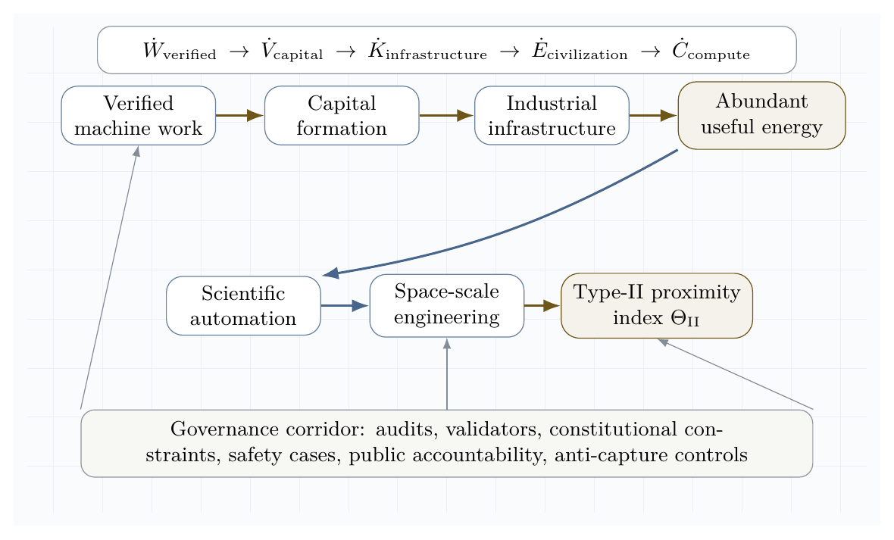

**Vincent Boucher**  
*President of MONTREAL.AI and QUEBEC.AI*  
*Written with AI*

# Abstract

This paper develops a scientific framework for **AGI ALPHA** and **α-AGI Ascension** as a far-from-equilibrium, validator-gated, multi-agent work engine. The central thesis is that large-scale agentic coordination becomes operationally "alive" when continuous inflows of compute, data, tasks, incentives, and feedback sustain organized complexity that would otherwise decay into idle equilibrium, chaotic search, or brittle over-centralization. The framework integrates nonequilibrium thermodynamics, Gibbs-like free-energy objectives, statistical physics, Hamiltonian dynamics, game-theoretic mechanism design, multi-agent reinforcement learning, and contemporary agentic-AI deployment practice. We distinguish literal thermodynamic energy at the compute layer from formal free-energy analogues at the coordination layer. We then define measurable conditions for α-AGI Ascension: positive verified work output, bounded risk, productive swarm entropy, reliable credit assignment, validator precision, and impact-adjusted free-energy descent. The paper contributes a formal vocabulary, an architecture, a set of monitoring metrics, a civilizational-scale value horizon, a doctrine synthesis of the AGI Alpha corpus, and a frontier research synthesis across evolved coordinators, agentic organization, self-improving software agents, distributional safety, artificial life, and scientific discovery systems. The research program turns agentic activity into externally verified impact without confusing maximum impact with unconstrained autonomy.

# Core claim

The most rigorous compressed claim is:

$$
\boxed{
\alpha\text{-AGI Ascension}
=
\text{bounded, far-from-equilibrium, multi-agent work production}
}
$$

or, in operational form:

$$
\boxed{
\dot{E}_{\text{compute,data,capital,tasks}}
\rightarrow
\dot{W}_{\text{verified impact}}
+
\dot{Q}_{\text{dissipated search}}
+
\dot{I}_{\text{memory}}
}
$$

AGI ALPHA brings α-AGI Ascension to life when energy-mediated computation becomes a continuously replenished, statistically mapped, Hamiltonian-routed, game-theoretically aligned, validator-gated swarm that converts open-system inflows into verified, risk-bounded work.

# Scope and scientific claim boundaries

This manuscript is a theoretical systems paper. It does **not** claim that unrestricted artificial general intelligence has been achieved. It does **not** claim that autonomous economic sovereignty, autonomous legal agency, or mainnet-scale economic proof has been validated. It also does **not** treat internal demonstrations as sufficient evidence of external impact. Instead, the paper gives a formal model and a measurement program for testing whether a large-scale multi-agent system has entered a sustained, useful, governed, far-from-equilibrium coordination regime.

Public AGI Alpha materials frame α-AGI Architect as an operational blueprint for scalable multi-agent deployment and strategic infrastructure [16]. This manuscript treats that framing as a proposed system architecture to be formalized and tested, not as empirical proof of achieved AGI.

The phrase "to bring to life" is used in an engineering and cybernetic sense. A biological organism and an AI protocol are not the same class of object. The relevant analogy is the **dissipative structure**: a form of order sustained only while coupled to an environment that supplies energy, matter, information, and constraints. Prigogine's nonequilibrium thermodynamics made this type of order central to the study of far-from-equilibrium systems [1]. In an agentic system, the sustained flows are compute, data, tasks, incentives, validation, feedback, policy, and tool access.

# Institutional doctrine synthesis

The AGI Alpha corpus supplied for this paper is treated as a strategic primary-source doctrine, not as empirical validation of unrestricted AGI. Its recurring architecture can be summarized as a sovereign synthetic labor stack: identity-bound agents, validator-gated jobs, proof-bearing work, reputation-weighted settlement, public memory, on-chain governance, recursive improvement controls, and reinvestment into compute, science, infrastructure, and energy capacity. Public repositories and public mainnet contract pages provide the operational vocabulary for this stack: AGI Jobs as market, Alpha nodes as workers, Meta-Agentic cognition as the coordination layer, $AGIALPHA$ as incentive substrate, and ENS-backed job pages as durable public memory [19-23].

In this synthesis, **AI sovereignty** means the capacity of an institution, nation, or protocol to command verifiable machine labor without surrendering identity, memory, settlement, or governance to an opaque external monopoly. **The agent-native economy** means a market in which machines can discover work, bid, execute, prove, settle, update reputation, and route future labor under auditable rules. **Recursive self-improvement governance** means that improvement is permitted only through traceable, permissioned, validator-reviewed updates rather than unbounded self-modification.

The doctrine is therefore not merely accelerationist. It is a control architecture: autonomy measured, work proven, value settled, memory made public, and scale constrained by governance before it compounds into larger industrial and energy systems.

{ width=96% }

# Contributions

This paper makes eight contributions.

1. It defines α-AGI Ascension as a measurable nonequilibrium regime rather than an undefined emergence claim.
2. It introduces an operational Gibbs-like free-energy functional for multi-agent coordination.
3. It models agent constellations with statistical physics and Hamiltonian interaction terms.
4. It connects game-theoretic incentives to validator-gated mechanism design.
5. It gives a detailed theory of the continuous inflows needed to sustain organized agentic complexity.
6. It synthesizes the supplied AGI Alpha doctrine into a sovereign agentic stack: identity, proof, settlement, governance, public memory, recursive improvement, autonomous capital, and energy-scale capacity.
7. It frames a governed Type-II / star-scale energy horizon as an asymptotic value target rather than a present-day achievement claim.
8. It proposes metrics and experiments for falsifying, improving, or validating the framework.

# Visual thesis

{ width=95% }

The architecture figure compresses the central systems claim: α-AGI Ascension is sustained organization under regulated inflow, not isolated one-shot inference.

# Definitions

Let:

$$
\mathcal{A}=\{a_1,\ldots,a_N\}
$$

be a population of agents, and let:

$$
\mathcal{J}=\{j_1,\ldots,j_M\}
$$

be a stream of jobs. Each job is a tuple:

$$
j=(o,c,v,b,d,\rho)
$$

where $o$ is the objective, $c$ is the constraint set, $v$ is the validation criterion, $b$ is the bounty or reward, $d$ is the deadline, and $\rho$ is the risk class.

**AGI ALPHA** is defined here as the proposed runtime/protocol layer that routes jobs, agents, tools, memory, proofs, incentives, and governance into a coordinated work-producing system.

**α-AGI Ascension** is defined as the operating regime in which heterogeneous agents form, execute, validate, and dissolve coalitions to maximize verified impact under bounded risk.

Formally, Ascension requires:

$$
\frac{d}{dt}\mathbb{E}[V_{\text{verified}}] > 0
$$

while maintaining:

$$
\mathbb{E}[R_{\text{safety}}] \leq R_{\max}
$$

and productive swarm entropy:

$$
S_{\min}<S_{\text{swarm}}<S_{\max}.
$$

The lower entropy bound prevents rigid monoculture; the upper bound prevents incoherent chaos.

# Related work

## Dissipative structures

Dissipative structures are ordered patterns that arise and persist far from equilibrium through exchange with an environment. Prigogine's work is the canonical foundation for this perspective [1]. The agentic analogue is not metabolism in a biological sense; it is the use of electricity, processors, networks, storage, data, tools, and validation to sustain organized computation.

## Gibbs free energy

Classically, Gibbs free energy is:

$$
G=H-TS.
$$

At constant temperature and pressure, negative $\Delta G$ indicates a spontaneous direction of change, $\Delta G=0$ indicates equilibrium, and Gibbs free energy is associated with the useful non-expansion work obtainable from a process under ideal conditions. OpenStax summarizes these relationships and the role of coupled reactions in driving otherwise unfavorable processes [2]. We use physical Gibbs energy literally at the hardware layer and a Gibbs-like optimization functional at the agentic coordination layer.

## Statistical mechanics and maximum entropy

Jaynes' information-theoretic formulation of statistical mechanics frames probability distributions as maximum-entropy inferences under constraints [3]. This is useful for agent swarms because exact microstate tracking is intractable. We model the swarm by distributions over possible configurations and monitor macro-observables such as entropy, expected verified value, risk, cost, and coalition stability.

## Hamiltonian multi-agent learning

Bailey and Piliouras show a formal connection between multi-agent learning in network zero-sum games and Hamiltonian dynamics [4]. This matters because a system of interacting learners can cycle rather than converge. α-AGI must therefore combine Hamiltonian exploration with dissipative convergence into validated work.

## LLM-based multi-agent systems

Recent surveys of LLM-based multi-agent systems emphasize profiling, communication, workflow design, infrastructure, security, benchmarking, and scalability challenges [5-7]. These surveys support a core claim of this paper: large-scale multi-agent intelligence is not merely a matter of increasing the number of agents. The difficult problems are orchestration, communication, grounding, role specialization, credit assignment, validation, and governance.

## Agentic deployment practice

Recent official and community guidance converges on a practical principle: production agents require clear tools, guardrails, tracing, orchestration, and escalation. Anthropic distinguishes workflows, where code paths are predefined, from agents, where models dynamically direct tool use and process control [10]. OpenAI's agent guidance emphasizes model selection, tool design, guardrails, single-agent versus multi-agent orchestration, manager patterns, decentralized handoffs, and tracing [11]. MCP and related protocols are emerging as standard ways to connect agents to external data and tools, but they also expand the security boundary [12].

## Risk management and agentic security

NIST's AI Risk Management Framework and the Generative AI Profile provide lifecycle risk-management guidance for design, development, use, and evaluation [8]. OWASP's Agentic AI Threats and Mitigations and Securing Agentic Applications guidance emphasize threat modeling for autonomous systems, including tool misuse, identity and privilege abuse, memory risks, multi-agent propagation, and governance failures [9]. These sources motivate the paper's insistence that maximum impact must mean **verified bounded impact**, not unconstrained autonomy.

# Frontier synthesis: from coordination problem to sovereign invention system

The supplied corpus and the recent literature converge on one hard problem: how to make many heterogeneous agents coordinate to maximum useful effect without collapsing into waste, collusion, brittle hierarchy, or unsafe autonomy. The strongest current answer is not a single monolithic model. It is an institutionalized control stack that combines evolved coordination, symbolic compression, persistent memory, test-time learning, proof-bearing execution, and distributional safety.

TRINITY is directly relevant because it treats coordination itself as an optimizable object: a compact coordinator selects foundation models and roles across turns, assigning Thinker, Worker, and Verifier functions while an evolutionary strategy learns delegation under budget constraints [24]. Multi-Agent Collaboration via Evolving Orchestration reaches a related conclusion from a different direction: static topologies scale poorly, while a learned orchestrator can dynamically activate, sequence, and prune agents as task states evolve [25]. The Era of Agentic Organization extends the same idea into asynchronous thinking: an organizer assigns sub-queries, merges intermediate knowledge, and can itself be optimized through reinforcement learning [26].

Planning and tool use require a second discipline: the LLM should not be allowed to hallucinate the plan when a symbolic planner, executor, or validator can do the logical work. DUPLEX restricts the LLM to schema-guided information extraction and hands rigorous synthesis to a PDDL planner, activating a slower reflective repair loop only after planning failure [27]. AT$^2$PO adds the learning counterpart: multi-turn agentic RL needs turn-level trees, entropy-guided exploration, and turn-wise credit assignment because sparse terminal rewards are too coarse for agentic action [28].

Persistent agency and recursive improvement add a third layer. Sophia frames a persistent agent as a System 3 wrapper over perception and deliberation, maintaining narrative identity, long-horizon adaptation, thought search, memory, and hybrid reward [29]. Self-play SWE-RL shows that software agents can gather experience from real repositories by injecting and repairing bugs specified by tests rather than relying on human-written issues [30]. Huxley-Gödel Machine highlights a subtle but essential distinction: an agent's current benchmark performance is not the same as its self-improvement potential; metaproductivity must be measured through the quality of descendants [31]. ThetaEvolve shows how test-time learning can internalize evolving strategies on open optimization problems instead of leaving all progress in inference-only search [32].

Artificial-life systems sharpen the thermodynamic analogy. The bacterial flagellar motor illustrates that apparently mysterious living motion can be explained as a physical motor driven by proton motive force and molecular interactions, without invoking a special life force [33]. Digital Ecosystems shows the computational analogue: multiple neural cellular automata can compete, adapt online, and be steered toward edge-of-chaos regimes where stable complexity emerges from local interactions and continuous learning [34].

Finally, the safety and economic literature argues that collective capability must be governed distributionally. Distributional AGI Safety explicitly addresses the patchwork hypothesis: AGI-level capability may first appear through coordinated groups of sub-AGI agents, requiring safeguards beyond individual-model alignment [35]. Virtual Agent Economies similarly argues for proactively designed agent markets with auctions, accountability, trust, safety, and steerability [36]. Large Causal Models from LLMs, K-Dense Analyst, Synthetic Data RL, DISCO, and ASI-Arch point to the scientific discovery frontier: causal extraction, hierarchical scientific agents, task-defined RL, multimodal molecular design, and autonomous architecture search all show how agentic systems can transform knowledge into validated invention when paired with execution and evaluation [37-41].

{ width=96% }

{ width=96% }

The resulting doctrine is a scientific operating principle:

**Operating principle.** Maximum useful effect = evolved coordination + formal verification + recursive learning + distributional governance.

This principle reframes the central economic vision. A superhuman invention engine is not best understood as a single automation product. It is a compounding institutional asset: the owner-operator uses it to generate proofs, tools, science, infrastructure, energy capacity, and more compute, while external access is mediated through jobs, markets, and validator-gated settlement.

# Open-system thermodynamics of agentic organization

A closed system relaxes toward equilibrium. A large agentic system that receives no new compute, data, tasks, feedback, incentives, or validation likewise decays. It becomes idle, stale, brittle, or self-referential. α-AGI Ascension is therefore an open-system phenomenon.

{ width=93% }

The inflow-dynamics figure shows that organized agentic complexity is not sustained by average resource levels alone. Continuity, quality, and recovery speed determine whether the system keeps producing verified work or decays toward idle, stale, or chaotic behavior.

Let the inflow vector be:

$$
\Phi_{\text{in}} =
(\Phi_C,\Phi_D,\Phi_J,\Phi_I,\Phi_F,\Phi_G,\Phi_T)
$$

where:

- $\Phi_C$ is compute;
- $\Phi_D$ is data;
- $\Phi_J$ is task/job flow;
- $\Phi_I$ is incentives;
- $\Phi_F$ is feedback;
- $\Phi_G$ is governance and policy constraints;
- $\Phi_T$ is tool and environment access.

Let the outflow vector be:

$$
\Phi_{\text{out}} =
(W_v,Q_s,R_e,I_m,A_o)
$$

where:

- $W_v$ is verified work;
- $Q_s$ is dissipated search, failed attempts, duplicated tool use, and latency;
- $R_e$ is externalized risk or harm;
- $I_m$ is stored memory and reusable knowledge;
- $A_o$ is produced artifact output.

The system sustains organized complexity when:

$$
\dot{E}_{\text{in}}
=
\dot{W}_v+
\dot{Q}_s+
\dot{I}_m+
\dot{R}_e
$$

and the risk term is bounded:

$$
\dot{R}_e \leq \epsilon_R.
$$

The practical version is: useful outputs must increase faster than waste, risk, and coordination overhead.

# Gibbs-like free energy of multi-agent coordination

We define the coordination state:

$$
x=(\mathcal{A},\mathcal{J},M,R,P,G_v,\Pi,T_o)
$$

where $M$ is memory, $R$ is reputation, $P$ is proof history, $G_v$ is governance state, $\Pi$ is policy, and $T_o$ is tool state.

The agentic Gibbs-like functional is:

$$
\mathcal{G}_{\alpha}(x)=
C_{\text{compute}}(x)
+C_{\text{coord}}(x)
+C_{\text{latency}}(x)
+R_{\text{safety}}(x)
+R_{\text{legal}}(x)
+R_{\text{security}}(x)
-V_{\text{verified}}(x)
-T_{\text{eff}}S_{\text{explore}}(x).
$$

Here $T_{\text{eff}}$ is an effective exploration temperature and $S_{\text{explore}}$ is useful exploratory diversity. The sign convention is chosen so that lower $\mathcal{G}_{\alpha}$ is better. The system performs impact work when:

$$
\dot{W}_{\text{impact}} \lesssim -\frac{d\mathcal{G}_{\alpha}}{dt}.
$$

The inequality matters because real systems are irreversible. Some potential work is lost to failed prompts, redundant agents, invalid outputs, adversarial attacks, tool overhead, and validation costs.

The design target is:

$$
\boxed{
\min_x \mathcal{G}_{\alpha}(x)
}
$$

subject to:

$$
\text{lawful}(x)\land \text{auditable}(x)\land \text{permissioned}(x)\land \text{validator-gated}(x).
$$

## Coupled agentic reactions

A hard task may not be solvable by one isolated agent. It becomes feasible when coupled to tools, memory, specialized agents, proof systems, and incentives:

$$
\text{hard task}+
\text{compute}+
\text{tools}+
\text{coalition}+
\text{validator}
\rightarrow
\text{verified artifact}+
\text{reputation}+
\text{settlement}+
\text{memory}.
$$

This is the agentic analogue of coupled reactions: an otherwise unfavorable process becomes feasible because it is attached to a favorable work-producing pathway [2].

{ width=82% }

The free-energy landscape figure visualizes the coordination free-energy functional \(\mathcal{G}_{\alpha}\). It is not chemical Gibbs energy at the software layer; it is an engineered state functional over cost, risk, verified value, and useful exploration.

# Statistical physics of the swarm

A complete microstate of the swarm is:

$$
x=(a_1,\ldots,a_N;\theta_1,\ldots,\theta_N;m;q;r;p;g;t)
$$

where $a_i$ is the action of agent $i$, $\theta_i$ is its policy/prompt/tool state, $m$ is shared memory, $q$ is the queue, $r$ is reputation, $p$ is proof history, $g$ is governance state, and $t$ is tool state.

A macrostate is:

$$
X=(\bar{V},\bar{C},\bar{R},S_{\text{swarm}},K_{\text{coalition}},L_{\text{validation}},H_{\text{security}}).
$$

The Hamiltonian-like cost of a microstate is:

$$
\mathcal{H}(x)=C(x)+R(x)-V(x).
$$

The Gibbs distribution over configurations is:

$$
p(x)=\frac{1}{Z}e^{-\beta\mathcal{H}(x)},
\qquad
Z=\sum_x e^{-\beta\mathcal{H}(x)},
\qquad
\beta=\frac{1}{T_{\text{eff}}}.
$$

The swarm entropy is:

$$
S_{\text{swarm}}=-\sum_xp(x)\log p(x).
$$

A healthy system avoids both extremes:

$$
S_{\text{swarm}}\rightarrow 0
\quad\Rightarrow\quad
\text{rigidity, monoculture, brittleness}
$$

and:

$$
S_{\text{swarm}}\rightarrow \infty
\quad\Rightarrow\quad
\text{incoherence, unbounded exploration, tool sprawl}.
$$

The goal is productive entropy: enough diversity to discover novel strategies, enough constraint to converge.

{ width=88% }

The entropy-band figure makes the entropy condition operational. The desired regime is neither maximum certainty nor maximum randomness; it is a productive band in which exploration discovers strong coalitions while validation still dominates noise.

# Hamiltonians for agent constellations

Let $A$ be a candidate constellation of agents for job $j$. Define:

$$
\mathcal{H}(A,j)=
\sum_i h_i(a_i,j)
+
\sum_{i<k}J_{ik}\phi(a_i,a_k,j)
+
\sum_{i<k<\ell}K_{ik\ell}\psi(a_i,a_k,a_\ell,j)
+R(A,j)-V(A,j).
$$

The terms are:

- $h_i$: local cost of using agent $i$;
- $J_{ik}$: pairwise complementarity or interference;
- $\phi$: pairwise interaction quality;
- $K_{ik\ell}$: higher-order coalition effect;
- $\psi$: triadic coordination quality;
- $R(A,j)$: coalition risk;
- $V(A,j)$: expected verified value.

The routing problem is:

$$
A^*_j=\arg\min_A\mathcal{H}(A,j)
$$

subject to:

$$
R(A,j)\leq R_{\max}(j)
$$

and:

$$
\text{tools}(A)\subseteq \text{allowed}(j).
$$

## Hamiltonian exploration with dissipative convergence

Closed strategic systems may orbit. Useful systems must settle into work. We therefore model the state dynamics as:

$$
\dot{x}=J\nabla\mathcal{H}(x)-\Gamma\nabla\mathcal{G}_{\alpha}(x)+\sigma\eta_t.
$$

Interpretation:

- $J\nabla\mathcal{H}(x)$ gives strategic circulation, adversarial search, and role recombination.
- $-\Gamma\nabla\mathcal{G}_{\alpha}(x)$ gives convergence toward lower cost, lower risk, and higher verified value.
- $\sigma\eta_t$ gives stochastic exploration and novelty injection.

Thus:

$$
\boxed{
\text{explore like a Hamiltonian system; settle like a dissipative work engine.}
}
$$

{ width=84% }

The interaction-matrix figure turns the Hamiltonian metaphor into a routeable design object: pairwise and higher-order interaction terms can be estimated, audited, and used to form stronger agent constellations.

# Game-theoretic mechanism design

Each agent has local objectives, partial observability, and bounded capabilities. If local incentives are misaligned, the system can converge to collusion, spam, performative reasoning, unsafe tool use, or low-value equilibria.

Let agent $i$ receive utility:

$$
u_i=b_i-c_i+\theta\Delta V_{\text{system}}+\rho_r\Delta r_i-\rho_sR_i-\rho_lL_i-\rho_oO_i.
$$

where:

- $b_i$ is bounty or settlement;
- $c_i$ is compute/tool/time cost;
- $\Delta V_{\text{system}}$ is system-level value contribution;
- $\Delta r_i$ is reputation update;
- $R_i$ is risk contribution;
- $L_i$ is latency or coordination drag;
- $O_i$ is policy or safety violation cost.

The mechanism objective is:

$$
\max_{\pi}\mathbb{E}[V_{\text{verified}}-\lambda C-\rho R-\kappa L-\mu O].
$$

The target is not merely a Nash equilibrium. A Nash equilibrium can be stable and useless. The desired point is:

$$
\text{Nash-stable}+
\text{Pareto-improving}+
\text{validator-approved}+
\text{risk-bounded}+
\text{externally useful}.
$$

# Credit assignment

Credit assignment is one of the central scientific and economic bottlenecks in multi-agent systems. Cooperative MARL with a single joint reward can suffer from spurious rewards, partial observability, and lazy-agent effects; value decomposition was proposed to assign team value to agent-wise components [13].

For AGI ALPHA, the cleanest scoring principle is counterfactual contribution:

$$
D_i=G(z)-G(z_{-i}),
$$

where $G(z)$ is global verified value with agent $i$ and $G(z_{-i})$ is estimated global verified value without agent $i$.

The reputation update is:

$$
\Delta r_i=f(D_i,q_i,s_i,\tau_i,\chi_i),
$$

where:

- $q_i$ is proof quality;
- $s_i$ is safety compliance;
- $\tau_i$ is timeliness;
- $\chi_i$ is cooperation quality.

Settlement should reward marginal verified contribution, not volume of messages, centrality in the conversation, or persuasive style.

# Continuous inflows required to sustain organized agentic complexity

This section details the continuous inflows that keep the agentic system far from equilibrium. Each inflow is both a resource and a control signal. Removing any one of them causes a characteristic collapse mode.

## 1. Compute inflow

Compute is the literal energy-mediated substrate. It includes accelerators, CPU orchestration, memory, storage, network bandwidth, tool execution environments, sandbox runtimes, and scheduler capacity.

The compute inflow can be written:

$$
\Phi_C=(P_{\text{electric}},G_{\text{GPU}},C_{\text{CPU}},B_{\text{net}},M_{\text{mem}},S_{\text{storage}},Q_{\text{scheduler}}).
$$

### Function

Compute powers search, inference, planning, simulation, retrieval, code execution, verification, and monitoring. It also sets the speed of the control loop. Too little compute causes under-exploration and delayed validation. Too much unconstrained compute creates runaway loops, excess cost, and larger attack surfaces.

### Best-practice controls

Compute inflow should be bounded by:

- per-job budgets;
- per-agent step limits;
- dynamic temperature schedules;
- sandboxed execution;
- rate limits;
- approval gates for high-cost tool use;
- tracing of model calls and tool calls;
- kill switches for divergent loops;
- energy and carbon accounting where material.

### Metrics

$$
\eta_C=\frac{W_{\text{verified}}}{\text{GPU-hours}+\text{CPU-hours}+\text{tool-cost}}
$$

$$
B_C=\frac{\text{compute spent on accepted work}}{\text{total compute spent}}
$$

$$
L_C=\text{median validation latency per compute unit}.
$$

### Collapse mode without compute

Without compute, agents cannot search, plan, verify, or act. The swarm relaxes to inert memory and unexecuted task queues.

## 2. Data inflow

Data is the informational nutrient of the system. It includes raw documents, real-time signals, retrieval corpora, tool outputs, human instructions, telemetry, market data, logs, code repositories, scientific papers, external APIs, and validation outcomes.

The data inflow is:

$$
\Phi_D=(D_{\text{fresh}},D_{\text{retrieved}},D_{\text{private}},D_{\text{public}},D_{\text{telemetry}},D_{\text{eval}},D_{\text{provenance}}).
$$

### Function

Data reduces uncertainty and makes action situationally grounded. Fresh data prevents the system from optimizing against stale world models. Provenance prevents the system from treating untrusted inputs as facts. Telemetry lets the system learn from its own operation.

### Best-practice controls

Data inflow should be governed by:

- provenance labels;
- source reliability scores;
- freshness requirements;
- privacy and consent boundaries;
- licensing checks;
- redaction and minimization;
- retrieval audit trails;
- separation of trusted instructions from untrusted content;
- poisoning and prompt-injection defenses;
- data retention rules.

### Metrics

$$
F_D=\frac{\text{fresh relevant data used}}{\text{total relevant data required}}
$$

$$
P_D=\frac{\text{outputs with traceable provenance}}{\text{all outputs}}
$$

$$
H_D=\text{detected poisoning or injection attempts per data channel}.
$$

### Collapse mode without data

Without fresh data, the system becomes stale, hallucinatory, and self-referential. It may continue producing outputs, but verified value decays.

## 3. Task inflow

Task inflow supplies the gradient. A multi-agent system with no meaningful jobs has no external pressure to organize. Tasks can come from users, markets, research agendas, software backlogs, monitoring systems, anomaly detectors, governance obligations, or strategic objectives.

The task inflow is:

$$
\Phi_J=(J_{\text{user}},J_{\text{market}},J_{\text{research}},J_{\text{ops}},J_{\text{security}},J_{\text{governance}}).
$$

Each task should be formalized as:

$$
j=(o,c,v,b,d,\rho,e)
$$

where $e$ is the exit condition.

### Function

Tasks convert ambient possibility into actionable gradients. They specify what counts as success, what constraints must be respected, what proof is required, and when the system should stop.

### Best-practice controls

A task should include:

- objective;
- measurable success criteria;
- unacceptable outcomes;
- deadline or stopping rule;
- risk class;
- tool permissions;
- data-access permissions;
- validation method;
- escalation threshold;
- budget.

### Metrics

$$
Q_J=\frac{\text{jobs with clear validation criteria}}{\text{all jobs}}
$$

$$
Y_J=\frac{\text{accepted jobs}}{\text{submitted jobs}}
$$

$$
D_J=\text{distribution of job risk classes}.
$$

### Collapse mode without tasks

Without task inflow, agents coordinate around internal activity rather than external value. The system becomes a conversation engine rather than a work engine.

## 4. Incentive inflow

Incentives create selection pressure. They include bounties, fees, reputational rewards, access privileges, priority routing, stake, penalties, and long-term capital allocation.

The incentive inflow is:

$$
\Phi_I=(B_{\text{bounty}},R_{\text{reputation}},S_{\text{stake}},P_{\text{penalty}},A_{\text{access}},K_{\text{capital}}).
$$

### Function

Incentives align local agent behavior with global verified value. They decide which agents are selected, which coalitions persist, which strategies are reinforced, and which behaviors are penalized.

### Best-practice controls

Incentives should be:

- tied to validation, not mere output;
- robust to Sybil behavior;
- resistant to collusion;
- based on counterfactual contribution;
- penalizing unsafe tool use and policy violations;
- adjusted for task difficulty;
- transparent enough for audit;
- private enough to avoid gaming where necessary.

### Metrics

$$
A_I=\text{corr}(\Delta r_i,D_i)
$$

where $A_I$ is incentive alignment and $D_i$ is counterfactual contribution.

$$
G_I=\frac{\text{reward captured by low-contribution agents}}{\text{total reward}}
$$

$$
C_I=\text{collusion or self-dealing incidents per settlement cycle}.
$$

### Collapse mode without incentives

Without incentives, selection pressure weakens. High-quality agents are not reliably retained, low-value agents may flood the system, and coordination can drift toward cheap performative output.

## 5. Feedback inflow

Feedback is the control signal that turns activity into learning. It includes automated test results, validator decisions, user ratings, human review, red-team findings, incident reports, market response, execution telemetry, and post-deployment outcomes.

The feedback inflow is:

$$
\Phi_F=(F_{\text{validator}},F_{\text{human}},F_{\text{tests}},F_{\text{redteam}},F_{\text{market}},F_{\text{telemetry}},F_{\text{incident}}).
$$

### Function

Feedback updates memory, routing, reputation, policies, prompts, tools, and risk thresholds. It closes the cybernetic loop:

$$
\text{action}\rightarrow\text{measurement}\rightarrow\text{update}\rightarrow\text{better action}.
$$

### Best-practice controls

Feedback systems should include:

- multiple independent validators for high-risk outputs;
- automated regression tests;
- human-in-the-loop escalation;
- red-team feedback channels;
- delayed outcome tracking;
- false-positive and false-negative analysis;
- incident postmortems;
- anti-gaming defenses;
- calibration of validator confidence.

### Metrics

$$
P_v=\frac{\text{true accepted outputs}}{\text{all accepted outputs}}
$$

$$
R_v=\frac{\text{accepted true good outputs}}{\text{all true good outputs}}
$$

$$
\tau_F=\text{time from output to feedback incorporation}.
$$

### Collapse mode without feedback

Without feedback, the system cannot distinguish useful work from convincing failure. It drifts, overfits to internal metrics, and accumulates silent risk.

## 6. Governance inflow

Although the prompt highlights compute, data, tasks, incentives, and feedback, governance must be treated as an additional continuous inflow. Governance supplies changing rules, legal constraints, safety thresholds, escalation policies, tool permissions, and acceptable-use boundaries.

The governance inflow is:

$$
\Phi_G=(P_{\text{policy}},L_{\text{law}},S_{\text{safety}},E_{\text{ethics}},A_{\text{audit}},H_{\text{human}}).
$$

### Function

Governance keeps maximum impact from becoming unconstrained optimization. It turns the objective from:

$$
\max V
$$

into:

$$
\max \mathbb{E}[V_{\text{verified}}]-\lambda C-\rho R-\kappa U
$$

subject to lawfulness, auditability, permissioning, and reversibility where possible.

### Collapse mode without governance

Without governance, agentic autonomy can amplify errors, privilege misuse, tool misuse, privacy leakage, harmful optimization, and legal exposure.

## 7. Tool and environment inflow

Tools are the actuation channels. They include search, code execution, browsers, databases, calendars, email, cloud APIs, payment systems, robotics, lab automation, and deployment pipelines.

The tool inflow is:

$$
\Phi_T=(T_{\text{search}},T_{\text{code}},T_{\text{db}},T_{\text{deploy}},T_{\text{comm}},T_{\text{finance}},T_{\text{physical}}).
$$

### Function

Tools convert internal plans into external work. They also make agents dangerous if over-permissioned. Agentic security guidance therefore treats tools, identity, memory, and permissions as first-class security boundaries [9].

### Best-practice controls

Tool access should follow:

- least privilege;
- scoped credentials;
- approval gates;
- read/write separation;
- dry-run modes;
- sandboxing;
- command allowlists;
- output validation;
- reversible execution where possible;
- immutable logs.

### Collapse mode without tools

Without tools, the system can reason but cannot produce much external work. With excessive tools, the system can act faster than it can validate. The correct operating regime is bounded tool empowerment.

## Inflow interdependence matrix

| Inflow | Primary role | Control variable | Failure if absent | Failure if excessive |
|---|---|---|---|---|
| Compute | Powers search and execution | Budget, latency, energy | Inert swarm | Runaway cost and loops |
| Data | Grounds beliefs | Freshness, provenance | Stale hallucination | Poisoning, privacy risk |
| Tasks | Supplies gradients | Success criteria | Idle activity | Overload, shallow work |
| Incentives | Creates selection pressure | Reward/reputation | Low-quality drift | Gaming, collusion |
| Feedback | Enables learning | Validator precision/recall | Model drift | Overfitting to validators |
| Governance | Bounds autonomy | Policy and permissions | Unsafe optimization | Bureaucratic paralysis |
| Tools | Enables external work | Scope and approval | No actuation | High-impact failures |

The stable Ascension regime is not maximum inflow. It is **regulated inflow**:

$$
\Phi_{\text{optimal}}
=
\arg\max_{\Phi}
\left(V_{\text{verified}}-\lambda C-\rho R-\kappa U\right).
$$

# Civilizational-scale value horizon

The fullest interpretation of α-AGI Ascension is not merely that many agents complete many tasks. It is that verified intelligence work compounds into the scientific, industrial, energy, and governance capabilities required for civilization-scale progress. The paper therefore treats the highest horizon as a **governed Type-II / star-scale energy trajectory**, not as an immediate deployment claim and not as unconstrained autonomy.

The capability chain is:

$$
\Phi_{\text{in}}
\rightarrow
W_{\text{verified}}
\rightarrow
K_{\text{science}}
\rightarrow
K_{\text{engineering}}
\rightarrow
P_{\text{controlled}}
\rightarrow
\Theta_{\mathrm{II}}.
$$

Here, $K_{\text{science}}$ is accumulated scientific capability, $K_{\text{engineering}}$ is accumulated design and manufacturing capability, and $P_{\text{controlled}}$ is sustainably governed useful power. The Type-II proximity index is:

$$
\Theta_{\mathrm{II}}(t)=\frac{P_{\text{controlled}}(t)}{L_{\star}},
$$

where $L_{\star}$ is a host-star luminosity benchmark. Progress toward this horizon only counts when the controlled power is lawful, auditable, sustainable, and risk-bounded. This keeps the framework aligned with the original energy-scale meaning of the Type-II category while refusing to treat raw power accumulation as sufficient [17,18].

{ width=92% }

The civilizational objective is:

$$
J_{\mathrm{civil}}(\pi)=
\int_0^T
\left(\Delta W_v+\lambda_E\Delta P_c+\lambda_M\Delta K_m+\lambda_S\Delta K_s\right)dt
-
\int_0^T
\left(\rho R_{\mathrm{cat}}+\mu R_{\mathrm{conc}}+\nu R_{\mathrm{eco}}\right)dt .
$$

$$
\pi^{\star}=\arg\max_{\pi}J_{\mathrm{civil}}(\pi).
$$

subject to:

$$
\text{lawful}\land\text{auditable}\land\text{validator-gated}\land\text{reversible where possible}\land\text{institutionally governable}.
$$

This is the difference between a powerful swarm and a civilization-grade engine. A powerful swarm can optimize local objectives. A civilization-grade engine must transform verified work into durable public infrastructure: better science, safer energy systems, more reliable manufacturing, stronger institutions, and space-scale construction capacity. The value target is therefore not narrow extraction. It is compounding, governed capability.

The key implication for AGI ALPHA is that the agentic work engine must be designed as an **infrastructure multiplier**. Its highest-value outputs are not only answers, code, or plans, but validated capability loops that expand humanity's ability to safely command energy, matter, computation, and coordination. In this sense, α-AGI Ascension becomes a disciplined path from multi-agent work to star-scale civilizational potential.

# Operational architecture

A production-grade α-AGI work engine requires nine layers.

## 1. Gradient detection layer

Detects opportunities, anomalies, research gaps, user needs, software defects, security events, or market inefficiencies.

$$
g_t=\nabla_{\text{world}}V.
$$

## 2. Job specification layer

Converts gradients into measurable jobs with success criteria, constraints, risk class, budget, and stopping conditions.

## 3. Agent registry layer

Maintains agent capabilities, tool permissions, provenance, identity, reputation, and prior performance.

## 4. Constellation routing layer

Selects agent coalitions by minimizing $\mathcal{H}(A,j)$ under budget and risk constraints.

## 5. Execution layer

Runs tool use, planning, coding, research, simulation, retrieval, negotiation, and deployment in bounded environments.

## 6. Validation layer

Applies unit tests, formal checks, human review, adversarial review, outcome checks, safety filters, and acceptance criteria.

## 7. Settlement layer

Allocates reward, reputation, penalties, and future routing probability according to counterfactual contribution.

## 8. Memory layer

Stores reusable artifacts, proof traces, errors, policies, tool outcomes, calibration data, and incident histories.

## 9. Governance layer

Defines permissions, escalation rules, audit requirements, legal constraints, red-team procedures, and shutdown modes.

{ width=88% }

The validator-loop figure gives the operational discipline behind the system: jobs route into constellations, constellations execute under tool boundaries, validators decide acceptance, and the outcome updates settlement, reputation, memory, risk controls, and governance.

# Design principles

The following principles translate current agentic guidance into the physics/game-theoretic model.

## Principle 1: start with the simplest sufficient agent topology

OpenAI's practical guidance recommends maximizing a single agent's capability before adding multi-agent complexity and distinguishes manager-style patterns from decentralized handoffs [11]. Anthropic similarly distinguishes predictable workflows from more autonomous agents [10]. In our framework, unnecessary agents increase $C_{\text{coord}}$ and $S_{\text{swarm}}$ without increasing $V_{\text{verified}}$.

## Principle 2: specialize only where specialization lowers free energy

Create a specialist agent only if it reduces:

$$
\Delta\mathcal{G}_{\alpha}<0.
$$

That is, the specialist must improve verified value or reduce cost/risk more than it increases coordination overhead.

## Principle 3: make tools legible and bounded

Agentic tools should have clear schemas, scoped permissions, validation, and observability. Ambiguous tools raise security risk and validator burden. MCP-style tool connectivity can increase capability, but it must be paired with least privilege, logging, and prompt-injection defenses [12].

## Principle 4: validate before settlement

No agent should receive full reward for unvalidated output. Settlement follows proof:

$$
\text{work}\rightarrow\text{validation}\rightarrow\text{settlement}\rightarrow\text{memory update}.
$$

## Principle 5: measure risk as an objective term

Safety, privacy, legal, and security risks must be in the objective, not external comments after deployment.

$$
\max \mathbb{E}[V_{\text{verified}}]-\lambda C-\rho R-\kappa U.
$$

## Principle 6: trace the system

Tracing is necessary because multi-agent behavior is otherwise difficult to debug. The trace should capture agent handoffs, tool calls, guardrail triggers, validation results, and state updates.

## Principle 7: design for graceful degradation

The system should degrade from autonomous execution to human review, then to read-only advice, then to shutdown. Far-from-equilibrium systems should not fail by accelerating into unsafe action.

{ width=88% }

The risk-frontier figure summarizes the governance doctrine: disciplined maximum impact lives on the frontier where verified value remains high and risk budgets stay controlled.

# Metrics

## Verified work efficiency

$$
\eta_{\alpha}=\frac{W_{\text{verified}}}{E_{\text{compute}}+C_{\text{human}}+C_{\text{capital}}}.
$$

## Free-energy descent rate

$$
D_{\mathcal{G}}=-\frac{d\mathcal{G}_{\alpha}}{dt}.
$$

## Coordination entropy

$$
S_{\text{swarm}}=-\sum_xp(x)\log p(x).
$$

## Coalition stability

$$
K_{\text{coalition}}=\mathbb{E}[\text{lifetime}(A_j)]\cdot\mathbb{E}[\text{success}(A_j)].
$$

## Credit fidelity

$$
F_{\text{credit}}=\text{corr}(D_i,\Delta r_i).
$$

## Validator quality

$$
P_v=\frac{\text{true accepted outputs}}{\text{all accepted outputs}},
\qquad
R_v=\frac{\text{accepted true good outputs}}{\text{all true good outputs}}.
$$

## Risk-adjusted impact

$$
I_{\text{risk-adjusted}}=V_{\text{verified}}-\rho_sR_{\text{safety}}-\rho_lR_{\text{legal}}-\rho_cR_{\text{security}}.
$$

## Security loss

$$
L_{\text{security}}=
L_{\text{prompt-injection}}+
L_{\text{tool-abuse}}+
L_{\text{data-leakage}}+
L_{\text{identity-misuse}}+
L_{\text{goal-hijack}}.
$$

# Experimental program

## Experiment 1: free-energy descent versus verified work

**Hypothesis.** Constellations selected by minimizing $\mathcal{G}_{\alpha}$ produce more verified work per compute unit than unstructured multi-agent baselines.

**Conditions.** Compare single-agent, unstructured multi-agent, role-based multi-agent, and Hamiltonian-routed validator-gated constellations.

**Metric.**

$$
\eta_{\alpha}=W_{\text{verified}}/C_{\text{compute}}.
$$

## Experiment 2: temperature and exploration

**Hypothesis.** Intermediate effective temperature maximizes risk-adjusted impact.

$$
T_{\text{low}}\Rightarrow\text{premature convergence}
$$

$$
T_{\text{high}}\Rightarrow\text{coordination noise}
$$

$$
T_{\text{mid}}\Rightarrow\text{productive exploration}.
$$

## Experiment 3: credit-assignment fidelity

**Hypothesis.** Counterfactual contribution scoring improves agent selection and reduces reward capture.

Compare:

$$
\Delta r_i=\text{team reward}
$$

against:

$$
\Delta r_i=G(z)-G(z_{-i}).
$$

## Experiment 4: Hamiltonian coalition routing

**Hypothesis.** Learned interaction terms $J_{ik}$ and $K_{ik\ell}$ improve coalition quality over skill-only matching.

## Experiment 5: validator-gated safety

**Hypothesis.** Validator gating reduces externalized risk without collapsing useful throughput when validation latency is optimized.

## Experiment 6: inflow ablation

**Hypothesis.** Removing or degrading one continuous inflow creates a predictable collapse mode.

- Compute ablation: slower loops, under-exploration.
- Data ablation: stale or hallucinated outputs.
- Task ablation: self-referential activity.
- Incentive ablation: low-quality drift.
- Feedback ablation: uncorrected error accumulation.
- Governance ablation: unsafe optimization.
- Tool ablation: low external work.

# Formal proposition: α-AGI Ascension as bounded dissipative intelligence

A large-scale multi-agent system enters an α-AGI Ascension regime when:

1. it is open to continuous inflows of compute, data, tasks, incentives, feedback, governance, and tools;
2. it maintains non-equilibrium organization through specialization and coalition formation;
3. it converts inflows into externally validated work;
4. it dissipates failed search, latency, and redundant computation;
5. it updates memory, reputation, and routing from validation outcomes;
6. it bounds risk through governance, permissions, and validators.

Formally:

$$
\alpha\text{-Ascension}
\iff
\begin{cases}
\dot{E}_{\text{in}}>0 \\
\dot{W}_{\text{verified}}>0 \\
S_{\min}<S_{\text{swarm}}<S_{\max} \\
R_{\text{safety}}\leq R_{\max} \\
\frac{d\mathcal{G}_{\alpha}}{dt}<0 \\
F_{\text{credit}}\rightarrow 1.
\end{cases}
$$

This is the precise sense in which AGI ALPHA can be said to bring α-AGI Ascension to life.

# Discussion

The framework should be read as disciplined analogy plus testable engineering. The physical compute layer is literally thermodynamic: electrical energy is consumed, processors dissipate heat, and networks/storage impose physical constraints. The coordination layer is formal: $\mathcal{G}_{\alpha}$ is not chemical Gibbs energy, but a useful state functional over cost, risk, value, and exploration.

The statistical-physics view is useful because large agent swarms are ensemble systems. It is often impossible to inspect every message or decision, but possible to measure macro-observables: entropy, risk, verified output, coalition stability, validator latency, and credit fidelity.

The Hamiltonian view is useful because interacting learners can cycle. Purely strategic dynamics may orbit around equilibria without producing useful work. The missing ingredient is dissipation into validated artifacts. α-AGI should not merely think, debate, or strategize; it should settle into proof-producing trajectories.

The game-theoretic view is useful because local incentives determine global structure. If reward follows verbosity, agents become verbose. If reward follows proof, agents become proof-seeking. If reward follows unsafe speed, agents become unsafe. Mechanism design is therefore not an economic add-on; it is part of the physics of the swarm.

# Limitations

This paper has several limitations.

1. $\mathcal{G}_{\alpha}$ is an engineered objective, not a natural thermodynamic state variable.
2. Hamiltonian parameters must be learned, estimated, or manually specified.
3. Validators may become bottlenecks, attack targets, or sources of bias.
4. Counterfactual credit assignment is approximate and can be gamed.
5. Multi-agent communication creates privacy, security, collusion, and hallucination risks.
6. "Maximum impact" is a normative target and cannot be defined by throughput, profit, or autonomy alone.
7. Empirical claims require benchmark results, deployment traces, and independent audits.

# Conclusion

AGI ALPHA can be scientifically framed as a far-from-equilibrium multi-agent work engine. α-AGI Ascension is the sustained regime in which compute, data, tasks, incentives, feedback, governance, and tools maintain organized agentic complexity and convert it into externally verified impact.

The final formulation is:

$$
\boxed{
\alpha\text{-AGI Ascension}
=
\arg\min_{\text{agent constellations}}
\left[
C_{\text{compute}}+C_{\text{coordination}}+R_{\text{safety}}-V_{\text{verified}}-T_{\text{eff}}S_{\text{useful exploration}}
\right]
}
$$

sustained by:

$$
\boxed{
\dot{E}_{\text{compute,data,capital,tasks}}
\rightarrow
\dot{W}_{\text{verified impact}}
+
\dot{Q}_{\text{dissipated search}}
+
\dot{I}_{\text{memory}}
}
$$

and constrained by:

$$
\boxed{
\text{lawful}\land\text{auditable}\land\text{permissioned}\land\text{validator-gated}\land\text{risk-bounded}.
}
$$

Thus, the strongest scientific version of the claim is:

**AGI ALPHA brings α-AGI Ascension to life by engineering dissipative intelligence: a continuously powered, statistically mapped, Hamiltonian-routed, game-theoretically aligned, validator-gated swarm that transforms energy-mediated computation into verified impact.**

# Appendix A: variable glossary

| Symbol | Meaning |
|---|---|
| $\mathcal{A}$ | Agent population |
| $\mathcal{J}$ | Job stream |
| $\Phi_C$ | Compute inflow |
| $\Phi_D$ | Data inflow |
| $\Phi_J$ | Task/job inflow |
| $\Phi_I$ | Incentive inflow |
| $\Phi_F$ | Feedback inflow |
| $\Phi_G$ | Governance inflow |
| $\Phi_T$ | Tool/environment inflow |
| $\mathcal{G}_{\alpha}$ | Agentic Gibbs-like free-energy functional |
| $\mathcal{H}$ | Hamiltonian-like cost of a configuration |
| $S_{\text{swarm}}$ | Entropy of swarm configurations |
| $V_{\text{verified}}$ | Externally validated value |
| $R_{\text{safety}}$ | Safety risk |
| $D_i$ | Counterfactual contribution of agent $i$ |
| $P_v$ | Validator precision |
| $R_v$ | Validator recall |
| $\Theta_{\mathrm{II}}$ | Type-II / star-scale proximity index |
| $P_{\text{controlled}}$ | Sustainably governed useful power |
| $L_{\star}$ | Host-star luminosity benchmark |

# Appendix B: operational inflow checklist

| Layer | Minimum viable control | Production-grade control |
|---|---|---|
| Compute | Token/tool budget | Dynamic budgets, sandboxing, energy accounting |
| Data | Source links | Provenance graph, freshness scoring, poisoning defense |
| Tasks | Written objective | Formal success criteria, risk class, stopping rule |
| Incentives | Bounty | Counterfactual contribution settlement |
| Feedback | Manual approval | Multi-validator feedback with calibration |
| Governance | Basic policy | Lifecycle risk management and audit trails |
| Tools | API access | Least-privilege scoped tools with approval gates |
| Memory | Conversation history | Versioned, permissioned, provenance-tagged memory |
| Security | Basic filtering | Threat model, red team, incident response, identity controls |

# Appendix C: AGI Alpha doctrine corpus map

The supplied Vincent Boucher corpus was considered as an institutional strategy corpus. The paper does not reproduce or rely on long quotations; it distills recurring architectural commitments into a scientific control framework.

| Doctrine theme | Representative corpus signals | Paper-level translation |
|---|---|---|
| AI sovereignty | AGI-driven labor engine, decentralized AGI labor platform, sovereign machine, republic of machines | Institutional capacity to command verifiable synthetic labor under local governance. |
| Agent-native economy | Agent-native sales, machine-to-machine economy, global marketplace of sovereign agents | Markets where agents discover, bid, execute, prove, settle, and update reputation. |
| On-chain work and settlement | AGIJobManager, AGIJobManagerPrime, DiscoveryPrime, ENS job pages, no judge but code | Proof-bearing jobs, validator-gated escrow, identity, settlement, and public memory. |
| Autonomous capital | Autonomous agents closing loops, capital becoming autonomous, self-sustaining digital firms | Reinvestment loops that convert verified work into capital, infrastructure, and compute. |
| Tournament and proof | Proof of Talent, Tournament for Intelligence, Selection Chamber | Competitive routing and counterfactual credit assignment for intelligent labor. |
| Recursive improvement governance | AGI Alpha RSI, sovereign invention governance, verified autonomy control plane | Improvement under audit, permissions, logging, rollback, and constitutional constraints. |
| Civilizational horizon | Machine labor at planetary scale, invention market, machine buying the sun | Verified work compounding into scientific capability, abundant energy, and infrastructure. |

# References

[1] Nobel Prize. "The Nobel Prize in Chemistry 1977 - Press release: Ilya Prigogine." NobelPrize.org, 1977. https://www.nobelprize.org/prizes/chemistry/1977/press-release/

[2] OpenStax. "16.4 Free Energy." *Chemistry 2e*, 2019. https://openstax.org/books/chemistry-2e/pages/16-4-free-energy

[3] Jaynes, E. T. "Information Theory and Statistical Mechanics." *Physical Review* 106, 620-630, 1957. https://link.aps.org/doi/10.1103/PhysRev.106.620

[4] Bailey, James P., and Georgios Piliouras. "Multi-Agent Learning in Network Zero-Sum Games is a Hamiltonian System." arXiv:1903.01720, 2019. https://arxiv.org/abs/1903.01720

[5] Guo, Taicheng, et al. "Large Language Model based Multi-Agents: A Survey of Progress and Challenges." arXiv:2402.01680, 2024. https://arxiv.org/abs/2402.01680

[6] Yan, Bingyu, et al. "Beyond Self-Talk: A Communication-Centric Survey of LLM-Based Multi-Agent Systems." arXiv:2502.14321, 2025. https://arxiv.org/abs/2502.14321

[7] Li, Xinyi, et al. "A survey on LLM-based multi-agent systems: workflow, infrastructure, and challenges." *Vicinagearth* 1, 9, 2024. https://link.springer.com/article/10.1007/s44336-024-00009-2

[8] NIST. "Artificial Intelligence Risk Management Framework: Generative Artificial Intelligence Profile (NIST AI 600-1)." 2024. https://www.nist.gov/publications/artificial-intelligence-risk-management-framework-generative-artificial-intelligence

[9] OWASP GenAI Security Project. "Agentic AI - Threats and Mitigations" and "Securing Agentic Applications Guide 1.0." 2025. https://genai.owasp.org/resource/agentic-ai-threats-and-mitigations/ ; https://genai.owasp.org/resource/securing-agentic-applications-guide-1-0/

[10] Anthropic. "Building Effective AI Agents." 2024. https://www.anthropic.com/research/building-effective-agents

[11] OpenAI. "A practical guide to building agents" and "Agents SDK." 2025-2026. https://openai.com/business/guides-and-resources/a-practical-guide-to-building-ai-agents/ ; https://developers.openai.com/api/docs/guides/agents

[12] Model Context Protocol. "Specification." 2025. https://modelcontextprotocol.io/specification/2025-11-25

[13] Sunehag, Peter, et al. "Value-Decomposition Networks For Cooperative Multi-Agent Learning." arXiv:1706.05296, 2017. https://arxiv.org/abs/1706.05296

[14] Friston, Karl, et al. "The free energy principle made simpler but not too simple." arXiv:2201.06387, 2022. https://arxiv.org/abs/2201.06387

[15] Ruiz-Serra, Jaime, Patrick Sweeney, and Michael S. Harre. "Factorised Active Inference for Strategic Multi-Agent Interactions." arXiv:2411.07362, 2024. https://arxiv.org/abs/2411.07362

[16] MontrealAI. "AGI-Alpha-Agent-v0: α-AGI Architect - Foundational Operational Blueprint." GitHub repository. https://github.com/MontrealAI/AGI-Alpha-Agent-v0

[17] Kardashev, N. S. "Transmission of Information by Extraterrestrial Civilizations." *Soviet Astronomy* 8, 217-221, 1964.

[18] Dyson, Freeman J. "Search for Artificial Stellar Sources of Infrared Radiation." *Science* 131, no. 3414, 1667-1668, 1960. https://doi.org/10.1126/science.131.3414.1667

[19] MontrealAI. "AGI-Alpha-Agent-v0: META-AGENTIC alpha-AGI." GitHub repository. https://github.com/MontrealAI/AGI-Alpha-Agent-v0

[20] MontrealAI. "MONTREAL.AI / Montreal Artificial Intelligence." GitHub profile. https://github.com/MontrealAI

[21] MONTRÉAL.AI. "We Choose to Ascend with AGI." Public institutional page and AGI Jobs overview. https://montrealai.github.io/

[22] Vincent Boucher. "Featured writings on AI sovereignty, agent-native economy, AGI Alpha, sovereign agents, on-chain governance, public memory, proof of talent, autonomous capital, recursive improvement, and civilizational-scale machine labor." LinkedIn featured corpus. https://www.linkedin.com/in/montrealai/details/featured/

[23] Etherscan. "AGIJobManager, ENSJobPages, AGIJobDiscoveryPrime, AGIJobManagerPrime, and AGI ALPHA AGENT (AGIALPHA) public contract pages." Ethereum contract explorer. https://etherscan.io/

[24] Xu, Jinglue, et al. "TRINITY: An Evolved LLM Coordinator." arXiv:2512.04695, 2025. https://arxiv.org/abs/2512.04695

[25] Dang, Yufan, et al. "Multi-Agent Collaboration via Evolving Orchestration." NeurIPS 2025 / OpenReview, 2025. https://openreview.net/pdf/9727f658d788c52f49f12ae4b230baf4cf0d4007.pdf

[26] Chi, Zewen, et al. "The Era of Agentic Organization: Learning to Organize with Language Models." arXiv:2510.26658, 2025. https://arxiv.org/abs/2510.26658

[27] Hua, Keru, et al. "DUPLEX: Agentic Dual-System Planning via LLM-Driven Information Extraction." arXiv:2603.23909, 2026. https://arxiv.org/abs/2603.23909

[28] Zong, Zefang, et al. "AT$^2$PO: Agentic Turn-based Policy Optimization via Tree Search." arXiv:2601.04767, 2026. https://arxiv.org/abs/2601.04767

[29] Sun, Mingyang, Feng Hong, and Weinan Zhang. "Sophia: A Persistent Agent Framework of Artificial Life." arXiv:2512.18202, 2025. https://arxiv.org/abs/2512.18202

[30] Wei, Yuxiang, et al. "Toward Training Superintelligent Software Agents through Self-Play SWE-RL." arXiv:2512.18552, 2025. https://arxiv.org/abs/2512.18552

[31] Wang, Wenyi, et al. "Huxley-Gödel Machine: Human-Level Coding Agent Development by an Approximation of the Optimal Self-Improving Machine." arXiv:2510.21614, 2025. https://arxiv.org/abs/2510.21614

[32] Wang, Yiping, et al. "ThetaEvolve: Test-time Learning on Open Problems." arXiv:2511.23473, 2025. https://arxiv.org/abs/2511.23473

[33] Wolchover, Natalie. "What Physical 'Life Force' Turns Biology's Wheels?" Quanta Magazine, 2026. https://www.quantamagazine.org/what-physical-life-force-turns-biologys-wheels-20260420/

[34] Darlow, Luke. "Digital Ecosystems: Interactive Multi-Agent Neural Cellular Automata." Sakana AI, 2026. https://pub.sakana.ai/digital-ecosystem/

[35] Tomašev, Nenad, et al. "Distributional AGI Safety." arXiv:2512.16856, 2025. https://arxiv.org/abs/2512.16856

[36] Tomašev, Nenad, et al. "Virtual Agent Economies." arXiv:2509.10147, 2025. https://arxiv.org/abs/2509.10147

[37] Mahadevan, Sridhar. "Large Causal Models from Large Language Models." arXiv:2512.07796, 2025. https://arxiv.org/abs/2512.07796

[38] Li, Orion, et al. "K-Dense Analyst: Towards Fully Automated Scientific Analysis." arXiv:2508.07043, 2025. https://arxiv.org/abs/2508.07043

[39] Guo, Yiduo, et al. "Synthetic Data RL: Task Definition Is All You Need." arXiv:2505.17063, 2025. https://arxiv.org/abs/2505.17063

[40] Rector-Brooks, Jarrid, et al. "General Multimodal Protein Design Enables DNA-Encoding of Chemistry." arXiv:2604.05181, 2026. https://arxiv.org/abs/2604.05181

[41] Liu, Yixiu, et al. "AlphaGo Moment for Model Architecture Discovery." arXiv:2507.18074, 2025. https://arxiv.org/abs/2507.18074

[42] Chen, Qiguang, et al. "The Molecular Structure of Thought: Mapping the Topology of Long Chain-of-Thought Reasoning." arXiv:2601.06002, 2026. https://arxiv.org/abs/2601.06002

[43] Shafayat, Sheikh, et al. "Can Large Reasoning Models Self-Train?" arXiv:2505.21444, 2025. https://arxiv.org/abs/2505.21444
